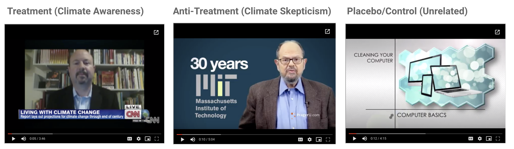

```{r setup, include=FALSE}
knitr::opts_chunk$set(echo = FALSE)
library(MASS)
library(data.table) 
library(stargazer)
library(foreign)
library(knitr)
library(sandwich)
library(lmtest)
library(AER)
library(ggplot2)
library(gridExtra)
library(cowplot)
library(ggthemes)
library(MatchIt)
library(corrplot)
#prevent scientific notation
options(scipen=999)
```

## Abstract
Climate change is one of the most debated subject of our contemporary world. World is divided into two groups one which believes in anthropogenic causes of climate change and other which believes that humans have no role in climate change. Both groups rely on spreading education to help their cause.  
Does education on climate change actually cause change in perception towards climate change in the subjects receiving the education ? This question cannot be answered by the observational data and so a field experiment is prescribed. In this experimental project we study the impact of the educational videos of both sides, namely side which believes in anthropogenic climate change and one which doesn't, on someone's perception towards the issue of climate change.  
We do this by recruiting people in the USA through amazon mechanical turk, and show them educational videos on climate change. Some are shown videos which support the idea of anthropogenic cause of climate change while some are shown videos denying human's hand in climate change and the rest are shown videos on cleaning computers as a placebo. After watching the videos the subjects are asked to fill a survey questionnaire on how do they feel about climate issues. The intervention was showing educational videos on climate change and then we measure outcomes in different groups and calculate the treatment effect of both kinds of educational videos.   
  
## Introduction  
The  world is currently divided into two groups: one which acknowledges that climate change is real and other which calls climate change a hoax. With the political leaders elected such as president Trump who belong to the latter group, the naysayers have become more in number and more powerful in terms of policy decisions. There have been a lot of decisions taken by the leaders such as boycotting the climate change accord, reducing the checks and balances on the corporations which are polluting the environment. So a pertinent question among the scientists is how do we increase the number of people in the group which agree that climate change is real and a threat to our existence.  

According to a global survey, *Global survey: Where in the world is most and least aware of climate change?*$^1$, world’s one third of the adult population has not even heard of the term climate change. The awareness was abysmal is the developing and underdeveloped countries. A more alarming finding by the survey was that among the developed countries where the awareness was high the concern was low. According to the survey in the US only 64% of the people who were aware of climate change were concerned about climate change and thought of it as a threat!   

The researchers in the climate change field think that the silver bullet through which humanity can overturn the threats of climate change is education and awareness. Each one of us has to take action to curb down our carbon footprint. Before anybody takes a corrective action she should be convinced about the threat climate change poses. Above all if we have to make any progress climate change should not be considered a hoax. There are anti-climate change awareness program also wildly popular which poses additional challenge for humanity. General public has been bombarded with several conflicting views on the topic and one view lowers the efficacy of the other. In such situations public generally turn to their leaders and idol figures for their views. So in the current political landscape it is paramount that effective ways of making people aware should be adopted by the climate change supporters.   

How much does awareness and education help? Is it really helpful in changing somebody's perspective on climate change or people who have formed perception cannot be changed? With current leader’s speeches and other powerful people who consider climate change not a threat would awareness program fare well? Can the awareness program swing someone from a non-believer into believer group? How effective is the awareness program when compared to  anti-climate change propaganda? These are some of the questions which can be answered through field experiment as we want to access the causal effect of the educational program on the outlook of people towards environment.  
  
## Experiment Design  

### Research Question  
In our quest to find the efficacy of the climate education the central causal research question which we want to find answers for is: Can climate change education influence subjects’ perception on the topic? Perception itself is a very broad term and represents long term mental state which impacts behavior subconsciously. Through our experiment we want to learn about immediate effects of the education on the topic and does it have power to nudge someone's perception at least in short term.  

### Hypotheses  
The null hypotheses of our experiments are  

* Climate awareness treatments don’t encourage the belief that climate change is urgent and anthropogenic.  
* Climate skepticism treatments don’t discourage the belief that climate change is urgent and anthropogenic.  
* Climate awareness videos are equally effective in influencing subjects’ beliefs than climate skepticism videos.  
  
### Experiment Overview  
To test the hypotheses we conducted an experiment recruiting subjects from the USA on the amazon mechanical turk. We employ the placebo design in the experiment, where we compare the differences in outcomes among treatment and placebo groups. All the participants are randomly assigned either to treatment/anti-treatment or placebo group. The treatment group is shown two videos which support the claim that climate change is real and caused by humans. The anti-treatment group is shown two videos which supports the claim that climate change is not caused by humans. The placebo group is shown two videos about computers basics. After the subjects watch the videos they are presented with a questionnaire which captures the responses on a likert scale for the questions corresponding to the perception towards climate. The broad dimensions which the questionnaire captures the response for are  
  
* Primary causes of climate change
* Urgency of climate change
* Type of action needed to alleviate climate change

The subjects also answer few demographic and personal questions about them which was used as control variables when models were created for analysis.  
  
### Recruitment Process  
We recruited participants from amazon mechanical turk for the experiment. Each participant was paid 1 dollar upon successful completion of the survey. We also conducted a pilot study on friends/family and professional network to check if the experiment was well designed or not in terms of randomization and outcome and covariate capture.  
  
### Experiment Tool Qualtrics  
The subjects were recruited at amazon mechanical turk but the experiment was run on Qualtrics. Qualtrics was used to design the experiment. The experiment consisted of watching few videos and answering survey questions. Qualtrics randomization procedure was used to create assignment of subjects to treatment/anti-treatment or placebo group. Randomization was done such that equal number of participants are there in three groups. It was made sure that subjects can only advance to survey questions once they have watched the videos using timing constraints. Time taken by the participants in answering the survey questions was also captured.   
   
### Treatment  
Treatment in the different groups was watching a couple of short videos. Videos averaged 5 minutes in length. The link of the videos have been added to the appendix section.  
  

   
### Outcome and Covariate Variables
The participants were asked to answer the following questions on a likert scale of   
  
* Strongly agree  
* Somewhat agree  
* Neither agree nor disagree  
* Somewhat disagree  
* Strongly disagree  

There were 6 questions asked as part of survey 
  
* Human activity is primarily responsible for climate change.  
* Climate change is a serious threat to humans.  
* Individuals actions or lifestyle changes would not help in reducing the effects of climate change.  
* Broader scale changes, such as raising taxes on the commodities which release greenhouse gases, are necessary to alleviate the effects of climate change.  
* There is no need for a binding international agreement to regulate greenhouse gas emissions.
* I intend to make changes to my own lifestyle to help alleviate the effects of climate change.  
  
As part of the survey covariates were also captured for each participant. The covariates were namely  
  
* Age  
* Education  
* Gender  
* Climate disaster vulnerability  
* Income   
* Political affiliation  
* Community size  
* Pre Experiment Perception  
* Reliability of educational material  
   
## Pilot Study  
In our pilot study on friends and family we checked if the controls in Qualtrics on timing and randomization was working or not. We also checked if we were able to capture timings in Qualtrics effectively or not. After analyzing the results and getting the feedback on pilot study we edited the videos to be of same length for all the groups and made sure that videos ran on Edge browser too. We calculated the power from the results of pilot which suggested that if the treatment effect is about 0.5 and Std Deviation is 1.2 then we would need sample size as 181 of a power of 80% . From the pilot study we also found that variance of the outcome variable was about the same in all the three groups so we decided to have equal number of subjects in each group.  

## Analysis  
Data from Qualtrics was downloaded in the form of CSV file and then analysis was done on it. We had total of 570 records in the data file.  
  
### Randomization Check   

```{r chunk1,echo=FALSE}
d_raw <- fread('./FinalData_AJ.csv')
#Subset the columns from raw data into data table on which we would work 
columns <- c("Progress","Duration (in seconds)","Y1","Y2","Y3","Y4","Y5","Y6","Y7",
             "Age","Education","Gender","LivingAreaAffected","ClimateChangeAwareness",
             "PreTreatment","Income","PoliticalView","Community","Group","SurveyTime",
             "CovariateTime","RejectedOutcomeQuestions","RejectedCovariateQuestions") 
d <- d_raw[,..columns]
#Create lookup for likert scales one for positive questions
support_likert_scale <- c('Strongly agree'=5,'Strongly Agree'=5,
                          'Somewhat agree'=4,'Somewhat Agree'=4,
                          'Neither agree nor disagree'=3,'Neither Agree nor Disagree'=3,
                          'Neither agree or disagree'=3,'Neither Agree or Disagree'=3,
                          'Somewhat disagree'=2,'Somewhat Disagree'=2,
                          'Strongly disagree'=1,'Strongly Disagree'=1)
#lookup for negative questions 4 and 6

anti_likert_scale <- c('Strongly agree'=1,'Strongly Agree'=1,
                          'Somewhat agree'=2,'Somewhat Agree'=2,
                          'Neither agree nor disagree'=3,'Neither Agree nor Disagree'=3,
                          'Neither agree or disagree'=3,'Neither Agree or Disagree'=3,
                          'Somewhat disagree'=4,'Somewhat Disagree'=4,
                          'Strongly disagree'=5,'Strongly Disagree'=5)


#convert character to numeric value for the likert scale output variables
#d[,Y1_num:=support_likert_scale[Y1]]
#d[,Y2_num:=support_likert_scale[Y2]]
#d[,Y3_num:=support_likert_scale[Y3]]
#d[,Y4_num:=anti_likert_scale[Y4]]
#d[,Y5_num:=support_likert_scale[Y5]]
#d[,Y6_num:=anti_likert_scale[Y6]]
#d[,Y7_num:=support_likert_scale[Y7]]

d[,c("Y1_num","Y2_num","Y3_num","Y4_num","Y5_num","Y6_num","Y7_num") :=
    list(support_likert_scale[Y1],
      support_likert_scale[Y2],
      anti_likert_scale[Y3],
      support_likert_scale[Y4],
      anti_likert_scale[Y5],
      support_likert_scale[Y6],
      support_likert_scale[Y7])
 ]
#Add ordered factor for the Y_nums 
d[,c("Y1_num_factor","Y2_num_factor","Y3_num_factor","Y4_num_factor",
     "Y5_num_factor","Y6_num_factor","Y7_num_factor") :=
    list(factor(Y1_num,ordered=T,levels=c(1,2,3,4,5)),
      factor(Y2_num,ordered=T,levels=c(1,2,3,4,5)),
      factor(Y3_num,ordered=T,levels=c(1,2,3,4,5)),
      factor(Y4_num,ordered=T,levels=c(1,2,3,4,5)),
      factor(Y5_num,ordered=T,levels=c(1,2,3,4,5)),
      factor(Y6_num,ordered=T,levels=c(1,2,3,4,5)),
      factor(Y7_num,ordered=T,levels=c(1,2,3,4,5))
      )
 ]

#add factor variables for the covariates
d[,c("Age_factor","Education_factor","Gender_factor","LivingAreaAffected_factor",
     "ClimateChangeAwareness_factor","PreTreatment_factor","Income_factor",
     "PoliticalView_factor","Community_factor") := 
    list(factor(Age,ordered=T,levels=c("Less than 25 years",
                                "25-34 years",
                                "35-44 years",
                                "45-54 years",
                                "55 years or older")),
         factor(Education,ordered=T,levels=c("Less than high school",
                                              "High school graduate",
                                              "Some college",
                                              "2 year degree",
                                              "4 year degree",
                                              "Professional degree",
                                              "Doctorate"
                                             )),
         factor(Gender,ordered=F,levels=c("",
                                          "Male",
                                          "Female",
                                          "Other")),
         factor(LivingAreaAffected,ordered=T,levels=c("No","Yes")),
         factor(ClimateChangeAwareness,ordered=T,levels=c("","No","Yes")),
         factor(PreTreatment,ordered=T,levels=c("",
                                                "Strongly disagree",
                                                "Somewhat disagree",
                                                "Neither agree nor disagree",
                                                "Somewhat agree",
                                                "Strongly agree"
                                               )),
         factor(Income,ordered=T,levels=c("Less than $50,000",
                                          "$50,000 - $74,000",
                                          "$75,000 - $99,000",
                                          "$100,000 - $149,000",
                                          "More than $150,000")),
         factor(PoliticalView,ordered=F,levels=c("Very Liberal",
                                                 "Slightly Liberal",
                                                 "Slightly Conservative",
                                                 "Very Conservative",
                                                 "Neither Conservative nor Liberal")),
         factor(Community,ordered=F,levels=c("Urban",
                                             "Suburban",
                                             "Rural"
                                             ))
         )]
#test for covariate balance 
#subset placebo and treatment 
d_treatment_exp <- d[Group %in% c('Placebo','Treatment')&!is.na(Y1_num)&Progress==100&RejectedOutcomeQuestions!="Yes"&RejectedCovariateQuestions!="Yes",]
d_treatment_exp[,treat_dummy:=ifelse(Group=='Placebo',0,1)]


#subset placebo and antitreatment
d_antitreatment_exp <- d[Group %in% c('Placebo','AntiTreatment')&!is.na(Y1_num)&Progress==100&RejectedOutcomeQuestions!="Yes"&RejectedCovariateQuestions!="Yes",]
d_antitreatment_exp[,treat_dummy:=ifelse(Group=='Placebo',0,1)]

```
As a first step towards analysis of treatment effect we checked if the randomization resulted in covariate balance in different groups. 
We first check that anova test is not significant when comparing models  
$$treatdummy = \beta_0 + \epsilon$$ 
and  
$$
\begin{aligned} treatdummy = \beta_0 + \beta_1 * Age +\beta_2*Education + \beta_3 * Gender + \beta_4 *  Climate disaster vulnerability +\beta_5 * Income + \nonumber \\  
\beta_6 * Political\;affiliation + \beta_7 * Community\;size + \beta_8 * Pre\;Experiment\;Perception + \epsilon
\end{aligned}
$$
```{r chunk2, echo=FALSE}
lm1_treat <- d_treatment_exp[,lm(treat_dummy~1)]
lm2_treat <- d_treatment_exp[,lm(treat_dummy~Age_factor+Education_factor+Gender_factor+	LivingAreaAffected_factor+ClimateChangeAwareness_factor+PreTreatment_factor+Income_factor+	PoliticalView_factor+	Community_factor)]
lm1_antitreat <- d_antitreatment_exp[,lm(treat_dummy~1)]
lm2_antitreat <- d_antitreatment_exp[,lm(treat_dummy~Age_factor+Education_factor+Gender_factor+	LivingAreaAffected_factor+ClimateChangeAwareness_factor+PreTreatment_factor+Income_factor+	PoliticalView_factor+	Community_factor)]
( anova_test_report_treat_exp <- anova(lm1_treat,lm2_treat,test='F') )
( anova_test_report_antitreat_exp <- anova(lm1_antitreat,lm2_antitreat,test='F') )
```
We find that the F Tests indicate that randomization is indeed balanced across covariates.  
We also employ the distribution of propensity score to find if the covariates are balanced in different groups. We compare the distribution of propensity score between treated and control. Propensity score is the probability with which subjects are assigned to control or treatment based on covariates. The matching of subjects between treatment and control is done using distance algorithm on covariates.  

```{r chunk3,echo=FALSE}
m.out = matchit(treat_dummy ~ Age_factor + Education_factor + Gender_factor + 
                LivingAreaAffected_factor + ClimateChangeAwareness_factor + 
                PreTreatment_factor + Income_factor + PoliticalView_factor + 
                Community_factor,
                data = d_treatment_exp, method = "nearest",
                ratio = 1)
#summary(m.out)

plot(m.out, type = "jitter")
plot(m.out, type = "hist")
```
```{r chunk3_2,echo=FALSE}
m.out = matchit(treat_dummy ~ Age_factor + Education_factor + Gender_factor + 
                LivingAreaAffected_factor + ClimateChangeAwareness_factor + 
                PreTreatment_factor + Income_factor + PoliticalView_factor + 
                Community_factor,
                data = d_antitreatment_exp, method = "nearest",
                ratio = 1)
#summary(m.out)

plot(m.out, type = "jitter")
plot(m.out, type = "hist")
```
  
We find that the distribution of propensity score is very similar between control and treatment which means that the randomization was successful.   

### Compliance and Attrition  
We find that out of 570 samples there are few which didn't complete watching the videos and answering the survey questions and there were few who didn't pay attention to reading the questionnaire and answered the questions too quickly. These responses were not considered for analysis. 

  

```{r chunk4,echo=FALSE}
d_attrition_row <- d[,
                    .(type_of_attrition = ifelse(Progress==100 & 
                                                 RejectedOutcomeQuestions!="Yes" &
                                                 RejectedCovariateQuestions!="Yes",
                                                 "Valid",
                                                 ifelse(Progress==100,
                                                        "Rejected",
                                                        "Didn't Complete")
                                                 )
                      ), by=.(Group)]
ggplot(d_attrition_row[,.N,by=.(Group,type_of_attrition)],
       aes(x=Group,fill=type_of_attrition,y=N))+theme(plot.title = element_text(hjust = 0.5))+
       geom_bar(position="dodge", stat="identity")+labs(x='Group',y='Count',fill="Type",title="Count of Subjects by Group and Type")
``` 
  
We find that about same proportion of samples attrit and don't comply with the survey requirements. We also ran the chi square test if the there is a differential attrition/compliance in treatment vs anti-treatment vs placebo group and we found that the chi square test tells us that there is no differential attrition/compliance among the groups as the pvalue doesn't come significant at level of .05 .  
```{r chunk5,echo=FALSE}
(d_attrition_summary_table <- table(d_attrition_row$Group,d_attrition_row$type_of_attrition))
chisq.test(d_attrition_summary_table)
```

We also argue that the attrition/compliance is not related to the potential outcome we are measuring as the people who attrit or not comply just don't complete the survey or not follow survey requirements irrespective of whether they intrinsically support climate change facts or not. So we assume that MIPO (missingness is independent of potential outcomes) is true in our experiment and the estimates we get ignoring attrition is unbiased estimate of the treatment effect.  
```{r chunk6,echo=FALSE}
Mipo_data_plot <- d[Progress!=100,]
g <- ggplot(Mipo_data_plot)
g + theme(plot.title = element_text(hjust = 0.5)) + 
  geom_boxplot(aes(x=Group, y=`Duration (in seconds)`, fill=Group),notch=T)+labs(x='Group',y='Time (Seconds)',title="Time Taken by Attriters")
```

We see from the above plot that subjects who attrit in different groups have about the same distribution for time taken. The confidence intervals around the medians in different groups are overlapping . So most of the attriters attrit as soon as they find that the survey involves watching videos while some others keep their browser open but never complete. This adds confidence to MIPO assumption which we are making.  
We have a placebo design in place so for calculating the CACE(Complier Average Causal Effect) we compare the outcomes of compliers in the treatment/anti-treatment and control group.  
  
### Exploratory Data Analysis  

In the experiment we  measure 6 different outcomes after treatment. These 6 different outcomes represent three different dimensions of the perception towards climate change. The dimensions and the outcomes we measure are :   
  
* Primary causes of climate change
  + Human activity is primarily responsible for climate change. (Y1)    
  + Climate change is a serious threat to humans. (Y2)  
* Urgency of climate change
  + Broader scale changes, such as raising taxes on the commodities which release greenhouse gases, are necessary to alleviate the effects of climate change.(Y4)  
  + There is no need for a binding international agreement to regulate greenhouse gas emissions. (Y5)  
* Type of action needed to alleviate climate change
  + Individuals actions or lifestyle changes would not help in reducing the effects of climate change.(Y3)  
  + I intend to make changes to my own lifestyle to help alleviate the effects of climate change. (Y6)  
  
We also capture other attributes of the subject such as Age,Gender etc as listed in section Outcome and Covariates. Let us check how the covariates are related to the outcome variables. We code the likert scale output for the outcome as 1 to 5 for Strongly Disagree to Strongly Agree. The coding is done such that 5 means most concern about climate change while 1 means least concern.  
We look at relation of covariates to outcome dimensions by taking mean of the outcome values of the questions belonging to the dimension and plotting it against the covariates values.  

```{r chunk7, echo=FALSE}
data_plot <- d[Progress==100&RejectedOutcomeQuestions!="Yes"&RejectedCovariateQuestions!="Yes",]
g <- ggplot(data_plot)+theme(plot.title = element_text(hjust = 0.5))
plot1 <- g + geom_boxplot(aes(x=Age_factor, y=Y1_num, fill=Group))+labs(x='Age',y='Y',title="Humans Responsible for Climate Change")
plot2 <- g+geom_boxplot(aes(x=Education_factor, y=Y1_num, fill=Group))+labs(x='Education',y='Y',title="Humans Responsible for Climate Change")+theme(axis.text.x = element_text(size=5))
plot3 <- g+geom_boxplot(aes(x=Gender_factor, y=Y1_num, fill=Group))+labs(x='Gender',y='Y',title="Humans Responsible for Climate Change")
plot4 <- g+geom_boxplot(aes(x=LivingAreaAffected_factor, y=Y1_num, fill=Group))+labs(x='Affected by Climate Change',y='Y',title="Humans Responsible for Climate Change")
plot5 <- g+geom_boxplot(aes(x=ClimateChangeAwareness_factor, y=Y1_num, fill=Group))+labs(x='Climate Change Awareness',y='Y',title="Humans Responsible for Climate Change")
plot6 <- g+geom_boxplot(aes(x=Income_factor, y=Y1_num, fill=Group))+labs(x='Income',y='Y',title="Humans Responsible for Climate Change")+theme(axis.text.x = element_text(size=5))
plot7 <- g+geom_boxplot(aes(x=PreTreatment_factor, y=Y1_num, fill=Group))+labs(x='Pre Experiment Perception',y='Y',title="Humans Responsible for Climate Change")+theme(axis.text.x = element_text(size=7))
plot8 <- g+geom_boxplot(aes(x=PoliticalView_factor, y=Y1_num, fill=Group))+labs(x='Political View',y='Y',title="Humans Responsible for Climate Change")+theme(axis.text.x = element_text(size=6))
plot9 <- g+geom_boxplot(aes(x=Community_factor, y=Y1_num, fill=Group))+labs(x='Community',y='Y',title="Humans Responsible for Climate Change")
grid.arrange(plot1,plot2,nrow=2)
grid.arrange(plot3,plot4,nrow=2)
grid.arrange(plot5,plot6,nrow=2)
grid.arrange(plot8,plot9,nrow=2)
grid.arrange(plot7,nrow=1)
```
```{r chunk8, echo=FALSE}
data_plot <- d[Progress==100&RejectedOutcomeQuestions!="Yes"&RejectedCovariateQuestions!="Yes",]
g <- ggplot(data_plot)+theme(plot.title = element_text(hjust = 0.5))
plot1 <- g + geom_boxplot(aes(x=Age_factor, y=(Y2_num+Y6_num)/2, fill=Group))+labs(x='Age',y='Y',title="Climate Change is an Urgent Problem")
plot2 <- g+geom_boxplot(aes(x=Education_factor, y=(Y2_num+Y6_num)/2, fill=Group))+labs(x='Education',y='Y',title="Climate Change is an Urgent Problem")+theme(axis.text.x = element_text(size=5))
plot3 <- g+geom_boxplot(aes(x=Gender_factor, y=(Y2_num+Y6_num)/2, fill=Group))+labs(x='Gender',y='Y',title="Climate Change is an Urgent Problem")
plot4 <- g+geom_boxplot(aes(x=LivingAreaAffected_factor, y=(Y2_num+Y6_num)/2, fill=Group))+labs(x='Affected by Climate Change',y='Y',title="Climate Change is an Urgent Problem")
plot5 <- g+geom_boxplot(aes(x=ClimateChangeAwareness_factor, y=(Y2_num+Y6_num)/2, fill=Group))+labs(x='Climate Change Awareness',y='Y',title="Climate Change is an Urgent Problem")
plot6 <- g+geom_boxplot(aes(x=Income_factor, y=(Y2_num+Y6_num)/2, fill=Group))+labs(x='Income',y='Y',title="Climate Change is an Urgent Problem")+theme(axis.text.x = element_text(size=5))
plot7 <- g+geom_boxplot(aes(x=PreTreatment_factor, y=(Y2_num+Y6_num)/2, fill=Group))+labs(x='Pre Experiment Perception',y='Y',title="Climate Change is an Urgent Problem")+theme(axis.text.x = element_text(size=7))
plot8 <- g+geom_boxplot(aes(x=PoliticalView_factor, y=(Y2_num+Y6_num)/2, fill=Group))+labs(x='Political View',y='Y',title="Climate Change is an Urgent Problem")+theme(axis.text.x = element_text(size=6))
plot9 <- g+geom_boxplot(aes(x=Community_factor, y=(Y2_num+Y6_num)/2, fill=Group))+labs(x='Community',y='Y',title="Climate Change is an Urgent Problem")
grid.arrange(plot1,plot2,nrow=2)
grid.arrange(plot3,plot4,nrow=2)
grid.arrange(plot5,plot6,nrow=2)
grid.arrange(plot8,plot9,nrow=2)
grid.arrange(plot7,nrow=1)
```
```{r chunk9, echo=FALSE}
data_plot <- d[Progress==100&RejectedOutcomeQuestions!="Yes"&RejectedCovariateQuestions!="Yes",]
g <- ggplot(data_plot)+theme(plot.title = element_text(hjust = 0.5))
plot1 <- g + geom_boxplot(aes(x=Age_factor, y=(Y3_num+Y4_num+Y5_num)/3, fill=Group))+labs(x='Age',y='Y',title="Everyone needs to take Actions to solve Climate Change")
plot2 <- g+geom_boxplot(aes(x=Education_factor, y=(Y3_num+Y4_num+Y5_num)/3, fill=Group))+labs(x='Education',y='Y',title="Everyone needs to take Actions to solve Climate Change")+theme(axis.text.x = element_text(size=5))
plot3 <- g+geom_boxplot(aes(x=Gender_factor, y=(Y3_num+Y4_num+Y5_num)/3, fill=Group))+labs(x='Gender',y='Y',title="Everyone needs to take Actions to solve Climate Change")
plot4 <- g+geom_boxplot(aes(x=LivingAreaAffected_factor, y=(Y3_num+Y4_num+Y5_num)/3, fill=Group))+labs(x='Affected by Climate Change',y='Y',title="Everyone needs to take Actions to solve Climate Change")
plot5 <- g+geom_boxplot(aes(x=ClimateChangeAwareness_factor, y=(Y3_num+Y4_num+Y5_num)/3, fill=Group))+labs(x='Climate Change Awareness',y='Y',title="Everyone needs to take Actions to solve Climate Change")
plot6 <- g+geom_boxplot(aes(x=Income_factor, y=(Y3_num+Y4_num+Y5_num)/3, fill=Group))+labs(x='Income',y='Y',title="Everyone needs to take Actions to solve Climate Change")+theme(axis.text.x = element_text(size=5))
plot7 <- g+geom_boxplot(aes(x=PreTreatment_factor, y=(Y3_num+Y4_num+Y5_num)/3, fill=Group))+labs(x='Pre Experiment Perception',y='Y',title="Everyone needs to take Actions to solve Climate Change")+theme(axis.text.x = element_text(size=7))
plot8 <- g+geom_boxplot(aes(x=PoliticalView_factor, y=(Y3_num+Y4_num+Y5_num)/3, fill=Group))+labs(x='Political View',y='Y',title="Everyone needs to take Actions to solve Climate Change")+theme(axis.text.x = element_text(size=6))
plot9 <- g+geom_boxplot(aes(x=Community_factor, y=(Y3_num+Y4_num+Y5_num)/3, fill=Group))+labs(x='Community',y='Y',title="Everyone needs to take Actions to solve Climate Change")
grid.arrange(plot1,plot2,nrow=2)
grid.arrange(plot3,plot4,nrow=2)
grid.arrange(plot5,plot6,nrow=2)
grid.arrange(plot8,plot9,nrow=2)
grid.arrange(plot7,nrow=1)
```
We see from the EDA that Pre-Experiment perception is the only covariate which has strong relation with every outcome in all the groups. When doing our analysis we would be using this covariate as control as that would give us smaller standard errors for the estimation of treatment effect.  

Let us also check if there is a correlation between the outcomes for the subjects. And the distribution of the outcomes in different groups. 
```{r chunk10, echo=FALSE}
M<-cor(d[Progress==100&RejectedOutcomeQuestions!="Yes"&RejectedCovariateQuestions!="Yes",.(Y1_num,Y2_num,Y3_num,Y4_num,Y5_num,Y6_num)])
head(round(M,2))
col <- colorRampPalette(c("#BB4444", "#EE9988", "#FFFFFF", "#77AADD", "#4477AA"))
corrplot(M, method="circle",type="upper",col=col(200),addCoef.col = "black")
```
  
We see from the correlation plot that as expected all the outcomes are positively correlated which means if a subject positively agrees with climate change science on one outcome then she is also likely to agree on other outcomes. But the correlation is not very strong which means people have different levels of agreement on different topics related to climate change.  

### Estimation of Treatment Effect   
For estimating the Average Treatment effect of the educational videos we take two approaches.   
In one approach we convert the likert scale outcome into interval data from 1 to 5 . Here the assumption is that distance between each of the outcome likert scale option is 1. Once we convert the outcomes into intervals we use linear regression models to estimate the treatment effect.  
In other approach we take the outcomes as ordinal values and use proportional ordered logistic regression (polr) to estimate the treatment effect.  
  
#### Linear Models 
We saw from the EDA that the covariate which explains the outcome best is "Pre-Experiment Perception" which is a likert scale variable where we asked the respondent about how strongly do they agree on anthropogenic cause of climate change. So in our models we are going to control for this covariate. This covariate is called PreTreatment  
  
##### Treatment Effect of Climate Change Support Videos    
We modelled each of the outcome variable using linear model.   
The model is 
$$
Y = \beta_0 + \beta_1*treatDummy + \beta_2 * PreTreatment + \epsilon
$$
```{r chunk11,echo=FALSE,results='asis'}
lm_treat_test_1 <- d_treatment_exp[,lm(Y1_num~treat_dummy+PreTreatment)]
lm_treat_test_2 <- d_treatment_exp[,lm(Y2_num~treat_dummy+PreTreatment)]
lm_treat_test_3 <- d_treatment_exp[,lm(Y3_num~treat_dummy+PreTreatment)]
lm_treat_test_4 <- d_treatment_exp[,lm(Y4_num~treat_dummy+PreTreatment)]
lm_treat_test_5 <- d_treatment_exp[,lm(Y5_num~treat_dummy+PreTreatment)]
lm_treat_test_6 <- d_treatment_exp[,lm(Y6_num~treat_dummy+PreTreatment)]
stargazer(lm_treat_test_1,lm_treat_test_2,lm_treat_test_3,lm_treat_test_4,lm_treat_test_5,lm_treat_test_6,se=list(sqrt(diag(vcovHC(lm_treat_test_1))),sqrt(diag(vcovHC(lm_treat_test_2))),sqrt(diag(vcovHC(lm_treat_test_3))),sqrt(diag(vcovHC(lm_treat_test_4))),sqrt(diag(vcovHC(lm_treat_test_5))),sqrt(diag(vcovHC(lm_treat_test_6)))),header=F)
```
  
From the model we get that only for Y1 ( Are Humans responsible for climate change) the treatment effect is .204 and statistically significant. For all other outcomes the treatment effect is not statistically significant.   
   
We also created models for heterogeneous treatment effects. Here we also include the interaction term between treatment indicator and the pre-treatment Covariate.  

$$
Y = \beta_0 + \beta_1*treatDummy + \beta_2 * PreTreatment +\beta_3*treatDummy*PreTreatment + \epsilon
$$
```{r chunk12,echo=FALSE,results='asis'}
lm_treat_test_11 <- d_treatment_exp[,lm(Y1_num~treat_dummy+PreTreatment+treat_dummy*PreTreatment)]
lm_treat_test_22 <- d_treatment_exp[,lm(Y2_num~treat_dummy+PreTreatment+treat_dummy*PreTreatment)]
lm_treat_test_33 <- d_treatment_exp[,lm(Y3_num~treat_dummy+PreTreatment+treat_dummy*PreTreatment)]
lm_treat_test_44 <- d_treatment_exp[,lm(Y4_num~treat_dummy+PreTreatment+treat_dummy*PreTreatment)]
lm_treat_test_55 <- d_treatment_exp[,lm(Y5_num~treat_dummy+PreTreatment+treat_dummy*PreTreatment)]
lm_treat_test_66 <- d_treatment_exp[,lm(Y6_num~treat_dummy+PreTreatment+treat_dummy*PreTreatment)]
stargazer(lm_treat_test_11,lm_treat_test_22,lm_treat_test_33,lm_treat_test_44,lm_treat_test_55,lm_treat_test_66,se=list(sqrt(diag(vcovHC(lm_treat_test_11))),sqrt(diag(vcovHC(lm_treat_test_22))),sqrt(diag(vcovHC(lm_treat_test_33))),sqrt(diag(vcovHC(lm_treat_test_44))),sqrt(diag(vcovHC(lm_treat_test_55))),sqrt(diag(vcovHC(lm_treat_test_66)))),type='text',header=F,column.sep.width = "-15pt")
```
    
We get from the above results that indeed the treatment has varying effects on subjects with different pre-treatment values. We see for the question Y1 ( Are Humans responsible for the Climate Change) subjects who "Somewhat agree" in pretreatment were to get a treatment effect of 1.138 with pvalue < .01 . We also see that the treatment has heterogeneous statistically significant effect on outcomes Y5 and Y6 .    


```{r chunk11,echo=FALSE,results='asis'}
d_treatment_exp [,PreTreatment_num := support_likert_scale[PreTreatment]]
lm_treat_test_1 <- d_treatment_exp[,lm(Y1_num-PreTreatment_num~treat_dummy+PreTreatment)]
lm_treat_test_2 <- d_treatment_exp[,lm(Y2_num-PreTreatment_num~treat_dummy+PreTreatment)]
lm_treat_test_3 <- d_treatment_exp[,lm(Y3_num-PreTreatment_num~treat_dummy+PreTreatment)]
lm_treat_test_4 <- d_treatment_exp[,lm(Y4_num-PreTreatment_num~treat_dummy+PreTreatment)]
lm_treat_test_5 <- d_treatment_exp[,lm(Y5_num~treat_dummy-PreTreatment_num+PreTreatment)]
lm_treat_test_6 <- d_treatment_exp[,lm(Y6_num~treat_dummy-PreTreatment_num+PreTreatment)]
stargazer(lm_treat_test_1,lm_treat_test_2,lm_treat_test_3,lm_treat_test_4,lm_treat_test_5,lm_treat_test_6,se=list(sqrt(diag(vcovHC(lm_treat_test_1))),sqrt(diag(vcovHC(lm_treat_test_2))),sqrt(diag(vcovHC(lm_treat_test_3))),sqrt(diag(vcovHC(lm_treat_test_4))),sqrt(diag(vcovHC(lm_treat_test_5))),sqrt(diag(vcovHC(lm_treat_test_6)))),type='text',header=F)
```

```{r chunk11,echo=FALSE,results='asis'}
d_treatment_exp [,PreTreatment_num := support_likert_scale[PreTreatment]]
lm_treat_test_1 <- d_treatment_exp[,lm(Y1_num-PreTreatment_num~treat_dummy+PreTreatment+treat_dummy*PreTreatment)]
lm_treat_test_2 <- d_treatment_exp[,lm(Y2_num-PreTreatment_num~treat_dummy+PreTreatment+treat_dummy*PreTreatment)]
lm_treat_test_3 <- d_treatment_exp[,lm(Y3_num-PreTreatment_num~treat_dummy+PreTreatment+treat_dummy*PreTreatment)]
lm_treat_test_4 <- d_treatment_exp[,lm(Y4_num-PreTreatment_num~treat_dummy+PreTreatment+treat_dummy*PreTreatment)]
lm_treat_test_5 <- d_treatment_exp[,lm(Y5_num~treat_dummy-PreTreatment_num+PreTreatment+treat_dummy*PreTreatment)]
lm_treat_test_6 <- d_treatment_exp[,lm(Y6_num~treat_dummy-PreTreatment_num+PreTreatment+treat_dummy*PreTreatment)]
stargazer(lm_treat_test_1,lm_treat_test_2,lm_treat_test_3,lm_treat_test_4,lm_treat_test_5,lm_treat_test_6,se=list(sqrt(diag(vcovHC(lm_treat_test_1))),sqrt(diag(vcovHC(lm_treat_test_2))),sqrt(diag(vcovHC(lm_treat_test_3))),sqrt(diag(vcovHC(lm_treat_test_4))),sqrt(diag(vcovHC(lm_treat_test_5))),sqrt(diag(vcovHC(lm_treat_test_6)))),type='text',header=F)
```
    
#### Treatment Effect of Anti-Climate Change Support Videos   
We modelled each of the outcome variable using linear model. 
$$
Y = \beta_0 + \beta_1*treatDummy + \beta_2 * PreTreatment + \epsilon
$$

```{r chunk13,echo=FALSE,results='asis'}
lm_antitreat_test_1 <- d_antitreatment_exp[,lm(Y1_num~treat_dummy+PreTreatment)]
lm_antitreat_test_2 <- d_antitreatment_exp[,lm(Y2_num~treat_dummy+PreTreatment)]
lm_antitreat_test_3 <- d_antitreatment_exp[,lm(Y3_num~treat_dummy+PreTreatment)]
lm_antitreat_test_4 <- d_antitreatment_exp[,lm(Y4_num~treat_dummy+PreTreatment)]
lm_antitreat_test_5 <- d_antitreatment_exp[,lm(Y5_num~treat_dummy+PreTreatment)]
lm_antitreat_test_6 <- d_antitreatment_exp[,lm(Y6_num~treat_dummy+PreTreatment)]
stargazer(lm_antitreat_test_1,lm_antitreat_test_2,lm_antitreat_test_3,lm_antitreat_test_4,lm_antitreat_test_5,lm_antitreat_test_6,se=list(sqrt(diag(vcovHC(lm_antitreat_test_1))),sqrt(diag(vcovHC(lm_antitreat_test_2))),sqrt(diag(vcovHC(lm_antitreat_test_3))),sqrt(diag(vcovHC(lm_antitreat_test_4))),sqrt(diag(vcovHC(lm_antitreat_test_5))),sqrt(diag(vcovHC(lm_antitreat_test_6)))),header=F)
```
From the model we get that for Y1,Y2 and Y4 the treatment effect are -.273,-.411 and -.492 and are statistically significant. For all other outcomes the treatment effect is not statistically significant. 
$$
Y = \beta_0 + \beta_1*treatDummy + \beta_2 * PreTreatment +\beta_3*treatDummy*PreTreatment+ \epsilon
$$
     
We also created models for heterogeneous treatment effects. Here we also include the interaction term between treatment indicator and the pre-treatment Covariate.   
```{r chunk14,echo=FALSE,results='asis'}
lm_antitreat_test_11 <- d_antitreatment_exp[,lm(Y1_num~treat_dummy+PreTreatment+treat_dummy*PreTreatment)]
lm_antitreat_test_22 <- d_antitreatment_exp[,lm(Y2_num~treat_dummy+PreTreatment+treat_dummy*PreTreatment)]
lm_antitreat_test_33 <- d_antitreatment_exp[,lm(Y3_num~treat_dummy+PreTreatment+treat_dummy*PreTreatment)]
lm_antitreat_test_44 <- d_antitreatment_exp[,lm(Y4_num~treat_dummy+PreTreatment+treat_dummy*PreTreatment)]
lm_antitreat_test_55 <- d_antitreatment_exp[,lm(Y5_num~treat_dummy+PreTreatment+treat_dummy*PreTreatment)]
lm_antitreat_test_66 <- d_antitreatment_exp[,lm(Y6_num~treat_dummy+PreTreatment+treat_dummy*PreTreatment)]
stargazer(lm_antitreat_test_11,lm_antitreat_test_22,lm_antitreat_test_33,lm_antitreat_test_44,lm_antitreat_test_55,lm_antitreat_test_66,se=list(sqrt(diag(vcovHC(lm_antitreat_test_11))),sqrt(diag(vcovHC(lm_antitreat_test_22))),sqrt(diag(vcovHC(lm_antitreat_test_33))),sqrt(diag(vcovHC(lm_antitreat_test_44))),sqrt(diag(vcovHC(lm_antitreat_test_55))),sqrt(diag(vcovHC(lm_antitreat_test_66)))),header=F,column.sep.width = "-15pt")
```
  
We get from the above results that indeed the treatment has varying effects on subjects with different pre-treatment values. We specifially see that for Y4 outcome the treatment effects are no more statistically significant.    
  
    
      
      
     
       
         
           
           
             
#### Comparing treatment Effect of Pro-Climate vs Anti-Climate Change Educational Videos    
  
Since we got Y1 outcome as signiificant for both Pro-Climate change and anti-climate change we also want to compare if the anti-treatment video's efficacy is same as treatment video's.   
To do this we first duplicate the placebo records. One set belongs to anti-treatment group and other to treatment group. We create a dummy variable AntiTreatGroup to reflect the group of the records. The value is 1 when the group is anti-treatment and 0 when the record is for treatment group. Then we estimate the model as     
$$
Y1 = \beta_0 +\beta_1*treatdummy + \beta_2*AntiTreatGroup + \beta_3*treatdummy*AntiTreatGroup+\beta_4*PreTreatment+\epsilon
$$
```{r chunk15,echo=FALSE,results='asis'}
d_treatment_exp[,SuperGroup:="Treatment"]
d_antitreatment_exp[,SuperGroup:="AntiTreatment"]
d_compare_set <- rbind(d_treatment_exp,d_antitreatment_exp)
d_compare_set[,AntiTreatGroup:=ifelse(SuperGroup=="AntiTreatment",1,0)]
d_compare_set[,treat_dummy:=ifelse(Group=="Placebo",0,1)]
lm_treat_vs_anti_1 <- d_compare_set[,lm(Y1_num~treat_dummy+AntiTreatGroup+AntiTreatGroup*treat_dummy+PreTreatment)]
stargazer(lm_treat_vs_anti_1,se=list(sqrt(diag(vcovHC(lm_treat_vs_anti_1)))),header=F)
```
    
We get from the above that the anti-treatment in indeed more effective than treatment videos on Y1 outcome as the treat_dummy:AntiTreatGroup has coefficient of -0.487 while treat_dummy is 0.208 and both are statistically significant. The baseline of AntiTreatment is same as treatment as the coefficient of AntiTreatGroup is 0. So effectively the Treatment effect of Anti-treatment videos is -0.487 + 0.208 = -0.279. The treatment effect of treatment videos is 0.208 . So the difference between the effect of treatment vs anti treatment videos is -0.071 .  
This tells us that anti-treatment videos are more effective in dissuading someone than treatment videos persuading someone from agreeing that climate change is caused by humans.
  
#### Polr Models    
    
## Conclusions  
We find from our experiment that we can reject all three null hypotheses namely :  

* Climate awareness treatments don’t encourage the belief that climate change is urgent and anthropogenic.  
* Climate skepticism treatments don’t discourage the belief that climate change is urgent and anthropogenic.  
* Climate awareness videos are equally effective in influencing subjects’ beliefs than climate skepticism videos.  

We also find that anti-climate chamge videos are more effective than pro-climate change videos. So as a policy we would like to suggest to the firms investing in creating awareness about climate change to create and advertise more videos where the climate change skepticism theories are debunked as it would be more impactful.  
  
As a further experiment to get totally sure about our results we should also conduct experiments with a large pool of videos and a larger pool of participants to make sure that we are comparing apples to apples in terms of quality of videos and educational material across treatment groups. In the current experiment we had only 2 videos for each group and our results might be biased if the quality of these videos are vastly different in terms of its impact on audience.     

## References    
1. https://www.carbonbrief.org/global-survey-where-in-the-world-is-most-and-least-aware-of-climate-change  
2. https://www.cnn.com/2018/10/07/world/climate-change-new-ipcc-report-wxc/index.html  
3. https://climate.nasa.gov/  

## Appendix  
  
  

