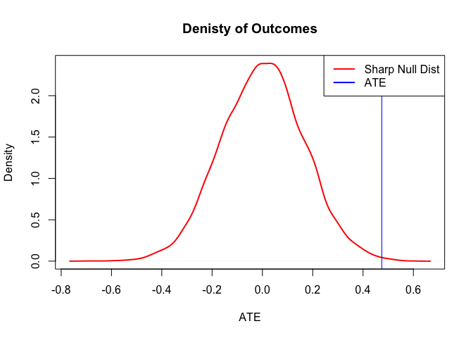
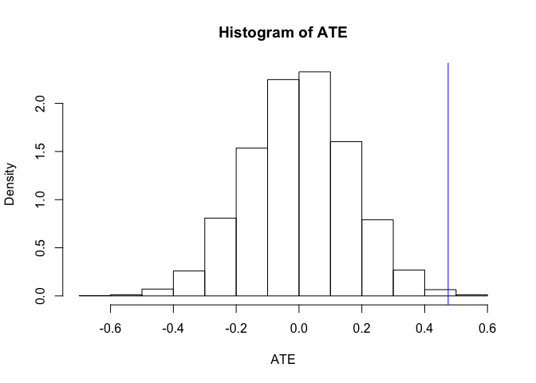
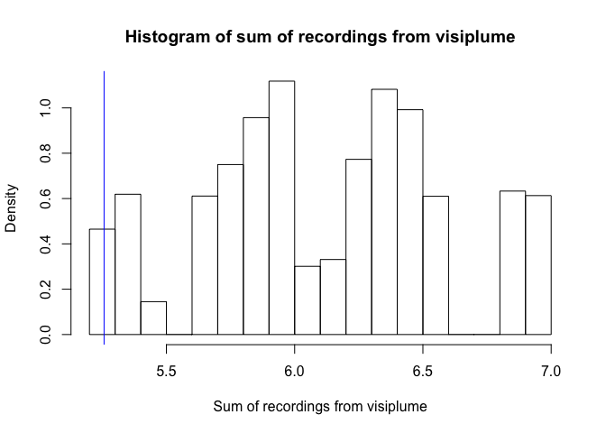
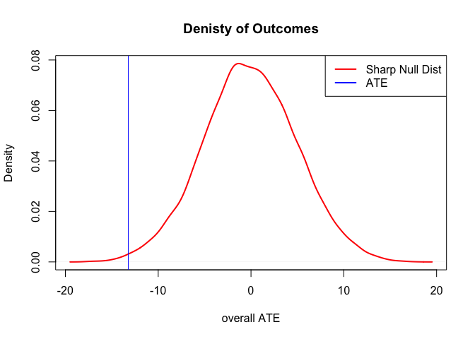
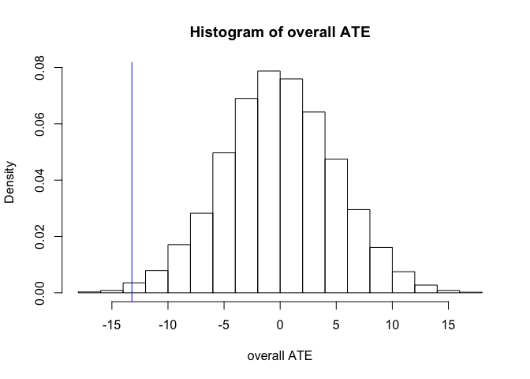
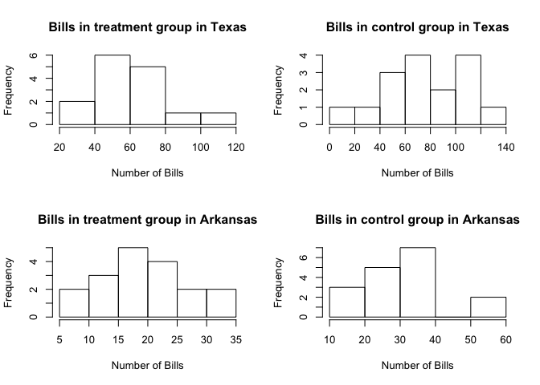
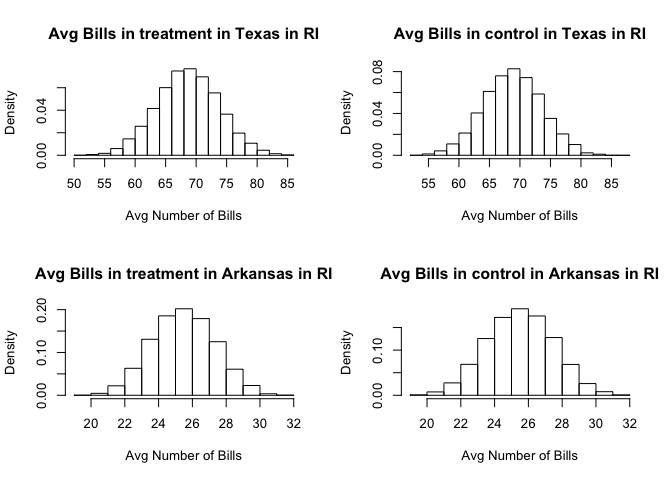
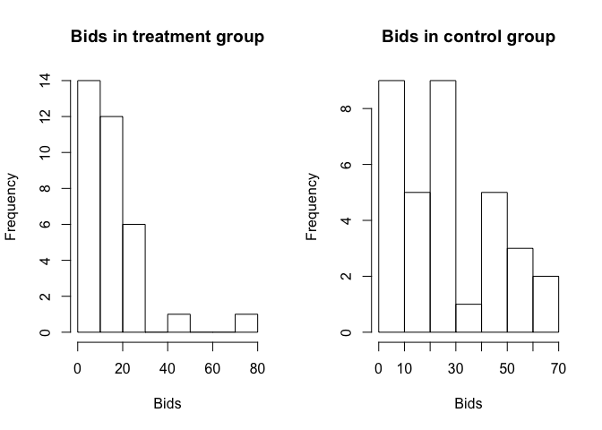
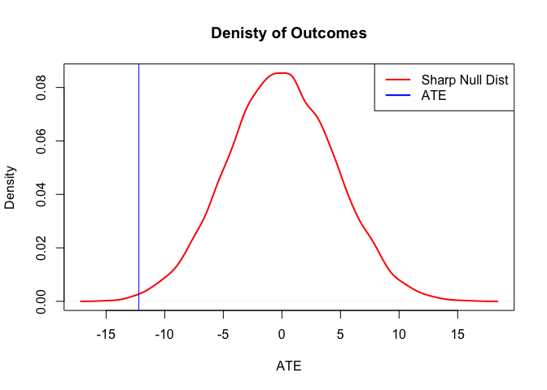
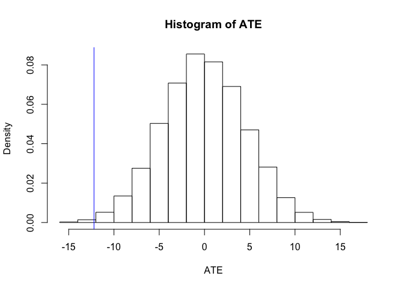

Problem Set 2
================
Anup Jha

# 1\. What happens when pilgrims attend the Hajj pilgrimage to Mecca?

On the one hand, participating in a common task with a diverse group of
pilgrims might lead to increased mutual regard through processes
identified in *Contact Theories*. On the other hand, media narritives
have raised the spectre that this might be accompanied by “antipathy
toward non-Muslims”. [Clingingsmith, Khwaja and Kremer
(2009)](https://dash.harvard.edu/handle/1/3659699) investigates the
question.

Using the data here, test the sharp null hypothesis that winning the
visa lottery for the pilgrimage to Mecca had no effect on the views of
Pakistani Muslims toward people from other countries. Assume that the
Pakistani authorities assigned visas using complete random assignment.
Use, as your primary outcome the `views` variable, and as your treatment
feature `success`. If you’re ambitious, write your fucntion generally so
that you can also evaluate feeligns toward specific nationalities.

``` r
d <- fread("./data/clingingsmith_2009.csv")
```

1.  Using either `dplyr` or `data.table`, group the data by `success`
    and report whether views toward others are generally more positive
    among lottery winners or lottery non-winners.

<!-- end list -->

``` r
d[,mean(views),by=success]
```

    ##    success       V1
    ## 1:       0 1.868304
    ## 2:       1 2.343137

**Ans: We see that in this dataset the views towards others are
generally more positive among lottery winners than non-winners. But this
might just be by chance. Specifically the ATE is 0.4748337 . We will
test whether this is by random chance or its statistically significant
in below sections**

2.  But is this a meaningful difference, or could it just be
    randomization noise? Conduct 10,000 simulated random assignments
    under the sharp null hypothesis to find out. (Don’t just copy the
    code from the async, think about how to write this yourself.)

<!-- end list -->

``` r
#calculate the actual estimate of ATE
ATE <- d[success==1,mean(views)] - d[success==0,mean(views)]
#randomize function to randomize the success variable
randomize <- function(){
  sample(d[,success])
}

#function to calculate the ATE for each randomization
est_ate <- function(outcome, treat) { 
  mean(outcome[treat==1]) - mean(outcome[treat==0])
}

#Function to do one study with one randomization
sim_random_study <- function(){
  po_control <- d[,views]
  po_treatment <- po_control # under sharp null treatment same as control
  treatment <- randomize()
  outcomes <- po_treatment * treatment + po_control * (1 - treatment)
  ate <- est_ate(outcomes, treatment)
  return(ate)
}

#generate the distribution under sharp null by replicating the study

distribution_under_sharp_null <- replicate(10000, sim_random_study())
#plot density of randomizations under sharp null 

plot(density(distribution_under_sharp_null), 
     main = "Denisty of Outcomes", 
     xlab = "ATE",
     lwd = 2, col="red")

#plot ATE as vertical line
abline(v = ATE, col = "blue")

#plot the legend
legend("topright", legend = c("Sharp Null Dist", "ATE"), 
       lwd = c(2,2), lty = c(1,1), col = c("red","blue"))
```

<!-- -->

``` r
#Plot the histogram
hist(distribution_under_sharp_null, 
     main = "Histogram of ATE", 
     xlab = "ATE",
     freq = FALSE)

#plot ATE as vertical line
abline(v = ATE, col = "blue")
```

<!-- -->

**Ans: From the above distribution under sharp null of no treatment
effect it seems that the calculated ATE from the experiment is indeed
not by chance and is quite rare. We will calculate the exact p values
below but from the graph it seems the ATE calculated from the experiment
seems significant and we can reject the null hypothesis of no treatment
effect **

3.  How many of the simulated random assignments generate an estimated
    ATE that is at least as large as the actual estimate of the ATE?

<!-- end list -->

``` r
num_larger <- sum(ATE <= distribution_under_sharp_null) 
num_larger
```

    ## [1] 20

Please, make sure that you include your result into the printed space
using the **20** inline code idiom for this, and all other answers.

**Ans: The number of simulated random assignments that has an estimated
ATE is atleast as large as the actual estimated ATE is 20 **

4.  What is the implied *one-tailed* p-value?

<!-- end list -->

``` r
p_value_one_tailed <- mean(ATE <= distribution_under_sharp_null)
p_value_one_tailed
```

    ## [1] 0.002

**Ans: So the implied one-tailed test p-value is 0.002**

5.  How many of the simulated random assignments generate an estimated
    ATE that is at least as large *in absolute value* as the actual
    estimate of the ATE?

<!-- end list -->

``` r
number_more_extreme <- sum(ATE <= abs(distribution_under_sharp_null))
number_more_extreme
```

    ## [1] 42

**Ans: Number of simulated random assignments generate an estimated ATE
that is at least as large in absolute value as the actual estimate of
the ATE is 42 **

6.  What is the implied two-tailed p-value?

<!-- end list -->

``` r
p_value_two_tailed <- mean(ATE <= abs(distribution_under_sharp_null))
p_value_two_tailed
```

    ## [1] 0.0042

**Ans: So the implied two-tailed p-value is 0.0042 **

# 2\. Randomization Inference Practice

McElhoe and Conner (1986) suggest using a *new* instrument called a
“Visiplume” measure pollution. The EPA has a standard method for
measuring pollution. Because they’re good scientists, McElhoe and Conner
want to validate that their instrument is measuring the same levels of
pollution as the EPA instrument.

To do so, they take six readings – one with each instrument – at a
single site. The recorded response is the ratio of the Visiplume reading
to the EPA standard reading, and the values that are recorded are:
0.950, 0.978, 0.762, 0.733, 0.823, and 1.011.

Suppose that we want to test the question, “Do the Visiplume readings
and the EPA standard readings produce similar enough estimates?”

> (The point of this question is to demonstrate that randomization
> inference works as a general inferrential paradigm, without
> *necessairily* being tied to an experiment.)

1.  How would you structure the sharp-null hypothesis – that Visiplume
    and the EPA reaings are the same – in this case?  
    **Ans: To test this sharp-null we can assume that the probability of
    getting the values which was reported by the device is same as
    probability of getting 1/reported\_value. This is because the values
    given are ratios of measured/(EPA reading) . So probability of
    getting 0.95 is same as probability of getting 1/0.95 if the
    readings in this new device is same as EPA standard. To test this
    hypothesis with the values given to us we can create another set of
    6 values with 1/reported\_values. Then we can do randomization
    inference by taking sum of sample of 6 values. The sample would be
    created such that either the original value is used or its
    reciprocal is used . In total we can have \(2^6 = 64\) unique random
    assignments. But we can create 10000 simulations . To calculate the
    p value of one tailed test we will take the ratio of number of
    instances which had score less than 5.257 to total number of
    simulations. For calculating the two tailed test we would take ratio
    of number of instances which had score less than 5.257 multiply by 2
    as our null hypothesis is that the distribution would be symmetric
    around the mean value of 6 .This is because under sharp null the
    expected value of sum of 6 readings should be 6 **

2.  Suppose that our summary of the data is the sum of the ratios. That
    is, in the test that we conducted, we obsered
    \(0.95 + ... + 1.011 = 5.257\). Using randomization inference, test
    the sharp-null hypothesis that you formed in the first part of the
    question. Produce a histogram of the test statistic under the sharp
    null that compares against the 5.257 value from the test, and also
    produce a two-sided p-value.

<!-- end list -->

``` r
#vector of readings given
readings <- c(0.950, 0.978, 0.762, 0.733, 0.823, 1.011)
#calculate the ATE here which is sum of values
ATE_value_visiplume <- sum(readings)
#create fictitious values which are equally probable to occur under sharp null
extra_readings <- 1/readings
#function to create randomization this mimics flipping of coin 6 times and noting down the 
#results each time
randomize_visiplume <- function(){
  sample(c(0,1),6,rep=T)
}

#function to calculate the ATE(sum of readings) for one random sample
est_sum_visiplume <- function(treat) { 
  est_sum <- 0
  for (i in 1:6) {
    if (treat[i] == 0) {
      est_sum <- est_sum + readings[i]
    }
    else {
      est_sum <- est_sum + extra_readings[i]
    }
  }
  return (est_sum)
}

#function to do study on one randomization
sim_visiplume_random_study <- function(){
  treatment <- randomize_visiplume()
  ate <- est_sum_visiplume(treatment)
  return(ate)
}

#call study 10000 times using replicate to generate distribution under sharp null
visiplume_distribution_under_sharp_null <- replicate(10000, sim_visiplume_random_study())

#Plot the histogram
hist(visiplume_distribution_under_sharp_null, 
     main = "Histogram of sum of recordings from visiplume", 
     freq = FALSE,
     xlab="Sum of recordings from visiplume")

#plot ATE as vertical line
abline(v = ATE_value_visiplume, col = "blue")
```

<!-- -->

``` r
p_value <- mean(ATE_value_visiplume >= visiplume_distribution_under_sharp_null)
paste("P-Value-One-Tailed: ", p_value)
```

    ## [1] "P-Value-One-Tailed:  0.0147"

``` r
p_value_two_tailed_test <- 2*mean(ATE_value_visiplume >= visiplume_distribution_under_sharp_null)

paste("P-Value-Two-Tailed: ",p_value_two_tailed_test)
```

    ## [1] "P-Value-Two-Tailed:  0.0294"

**Ans: So under sharp null we can reject the null hypothesis that
visiplume and EPA standards readings are similar as two tailed test has
p-value \< 0.05**

# 3\. Term Limits Aren’t Good.

Naturally occurring experiments sometimes involve what is, in effect,
block random assignment. For example, [Rocio
Titiunik](https://sites.google.com/a/umich.edu/titiunik/publications) ,
in [this
paper](http://www-personal.umich.edu/~titiunik/papers/Titiunik2016-PSRM.pdf)
studies the effect of lotteries that determine whether state senators in
TX and AR serve two-year or four-year terms in the aftermath of
decennial redistricting. These lotteries are conducted within each
state, and so there are effectively two distinct experiments on the
effects of term length.

The “thoery” in the news (such as it is), is that legislators who serve
4 year terms have more time to slack off and not produce legislation. If
this were true, then it would stand to reason that making terms shorter
would increase legislative production.

One way to measure legislative production is to count the number of
bills (legislative proposals) that each senator introduces during a
legislative session. The table below lists the number of bills
introduced by senators in both states during 2003.

``` r
library(foreign)

d <- read.dta("./data/titiunik_2010.dta")
d <- data.table(d)
```

1.  Using either `dplyr` or `data.table`, group the data by state and
    report the mean number of bills introduced in each state. Does Texas
    or Arkansas seem to be more productive? Then, group by two- or
    four-year terms (ignoring states). Do two- or four-year terms seem
    to be more productive? **Which of these effects is causal, and which
    is not?** Finally, using `dplyr` or `data.table` to group by state
    and term-length. How, if at all, does this change what you learn?

<!-- end list -->

``` r
d[,mean(bills_introduced),by=texas0_arkansas1]
```

    ##    texas0_arkansas1       V1
    ## 1:                0 68.77419
    ## 2:                1 25.51429

**Ans: From the above we see that Texas is more productive as the
legislators in Texas on an average introduce more number of bills than
Arkansas irrespective of term being 2 years or 4 years**

``` r
d[,mean(bills_introduced),by=term2year]
```

    ##    term2year       V1
    ## 1:         0 53.09091
    ## 2:         1 38.57576

**Ans: From the above we see that 4 year term seems to be more
productive as we have more in average number of bills introduced by the
legislators having 4 year term than 2 years. The causal effect would be
term length while the state would be blocking variable. Since random
assignment of terms was done within each state so term length can be
studied for causing the number of bills introduced. The states have not
been assigned by lottery so states would be blocking or covariate
variable **

``` r
d[,mean(bills_introduced),by=.(term2year,texas0_arkansas1)]
```

    ##    term2year texas0_arkansas1       V1
    ## 1:         0                0 76.87500
    ## 2:         1                0 60.13333
    ## 3:         0                1 30.70588
    ## 4:         1                1 20.61111

**Ans: We see that both in Texas and Arkansas the average number of
bills introduced by legislators on 4 year terms is more than that of 2
years term. Though the baseline for the state of Texas is higher the
shorter term length seems to effect the performance in terms of number
of bills introduced negatively on both the states. Through the above
data we learn that we should block on the state when doing the ATE
calculations so that our ATE estimates are more precise and unbiased**

2.  For each state, estimate the standard error of the estimated ATE.

<!-- end list -->

``` r
#using the equation 3.6 from the FE book
se_ate <- d[,.(se=var(bills_introduced)/.N),by=.(term2year,texas0_arkansas1)][,.(std_error=sqrt(sum(se))),by=texas0_arkansas1]
se_ate
```

    ##    texas0_arkansas1 std_error
    ## 1:                0  9.345871
    ## 2:                1  3.395979

**Ans: We use the equation 3.6 from the FE book to calulate the std
error of the estimated ATE for each state. For texas we get std error as
9.3458711 and for Arkansas we get the std\_error as 3.3959792 **  
c. Use equation (3.10) to estimate the overall ATE for both states
combined.

``` r
#total records
n_total <- d[,.N]
#total texas
n_texas <-  d[texas0_arkansas1==0,.N]
#total arkansas
n_arkansas <- d[texas0_arkansas1==1,.N]
#means table by term and state
means_tb <- d[,.(means=mean(bills_introduced)),by=.(term2year,texas0_arkansas1)]
#ate arkansas
ate_arkansas <- means_tb[texas0_arkansas1==1&term2year==1,means] - means_tb[texas0_arkansas1==1&term2year==0,means]
#ate texas
ate_texas <- means_tb[texas0_arkansas1==0&term2year==1,means] - means_tb[texas0_arkansas1==0&term2year==0,means]
#overall ate
overall_ate <- (n_texas/n_total)*ate_texas + (n_arkansas/n_total)*ate_arkansas
overall_ate
```

    ## [1] -13.2168

**Ans: We see that overall ATE for both states combined is -13.2167979
**

4.  Explain why, in this study, simply pooling the data for the two
    states and comparing the average number of bills introduced by
    two-year senators to the average number of bills introduced by
    four-year senators leads to biased estimate of the overall ATE.

**Ans: In this study the probability of a subject to be in treatment is
not same across the blocks. As we see below that in texas the
probability of being in treatment group is 15/31 while in arkansas is
18/35. Also the potential outcomes of arkansas and texas are different
on average so we will have biased ATE if we just pool data from two
states and take an average. This is because any sample would reflect the
ATE biased towards the block which has higher probability of being
assigned to treatment **

``` r
d[,.N,by=.(term2year,texas0_arkansas1)]
```

    ##    term2year texas0_arkansas1  N
    ## 1:         0                0 16
    ## 2:         1                0 15
    ## 3:         0                1 17
    ## 4:         1                1 18

5.  Insert the estimated standard errors into equation (3.12) to
    estimate the stand error for the overall
ATE.

<!-- end list -->

``` r
se_overall_ate <- sqrt((se_ate[texas0_arkansas1==0,std_error]**2) * ((n_texas/n_total) **2) + (se_ate[texas0_arkansas1==1,std_error]**2) * ((n_arkansas/n_total) **2))
se_overall_ate
```

    ## [1] 4.74478

**Ans: We see that the std error for the overall ATE in the blocked
design in 4.7447803 **  
f. Use randomization inference to test the sharp null hypothesis that
the treatment effect is zero for senators in both states. Here we mean:
estimate the *overall ate* (which is, the weighted average of the block
ate) as the internal part of your RI loop.

``` r
#function to produce randmization by blocked variable on state
randomize_blocked <- function(state){
  if(state == 'Texas'){
    return (sample(d[texas0_arkansas1==0,term2year]))
  } else {
    return (sample(d[texas0_arkansas1==1,term2year]))
  }
}

#function to calculate ate for one randomization using blocked formula
est_blocked_ate <- function(outcomes_texas, treatment_texas,outcomes_arkansas,treatment_arkansas) { 
 
  avg_bills_texas_control <- mean(outcomes_texas[treatment_texas==0])
  avg_bills_texas_treatment <- mean(outcomes_texas[treatment_texas==1])
  avg_bills_arkansas_control <- mean(outcomes_arkansas[treatment_arkansas==0])
  avg_bills_arkansas_treatment <- mean(outcomes_arkansas[treatment_arkansas==1])
  total_ate <- (avg_bills_texas_treatment - avg_bills_texas_control) * length(outcomes_texas)/(length(outcomes_texas) + length(outcomes_arkansas)) + (avg_bills_arkansas_treatment - avg_bills_arkansas_control) * length(outcomes_arkansas)/(length(outcomes_texas) + length(outcomes_arkansas))
return(list(total_ate = total_ate,avg_bills_texas_control =avg_bills_texas_control, avg_bills_texas_treatment=avg_bills_texas_treatment,avg_bills_arkansas_control=avg_bills_arkansas_control,avg_bills_arkansas_treatment=avg_bills_arkansas_treatment))
}

#function to simulate the experiment on one randomization
sim_random_block_study <- function(){
  po_control_texas <- d[texas0_arkansas1==0,bills_introduced]
  po_control_arkansas <- d[texas0_arkansas1==1,bills_introduced]
  po_treatment_texas <- po_control_texas # under sharp null treatment same as control
  po_treatment_arkansas <- po_control_arkansas # under sharp null treatment same as control
  treatment_texas <- randomize_blocked('Texas')
  treatment_arkansas <- randomize_blocked('Arkansas')
  outcomes_texas <- po_treatment_texas * treatment_texas + po_control_texas * (1 - treatment_texas)
  outcomes_arkansas <- po_treatment_arkansas * treatment_arkansas + po_control_arkansas * (1 - treatment_arkansas)
  results <- est_blocked_ate(outcomes_texas, treatment_texas,outcomes_arkansas,treatment_arkansas)
  return(results)
}

#call replicate and transpose to get distribution under sharp null as matrix 
blocked_distribution_under_sharp_null <- t(replicate(10000, sim_random_block_study()))
#plot density of randomizations under sharp null 

plot(density(as.numeric(blocked_distribution_under_sharp_null[,"total_ate"])), 
     main = "Denisty of Outcomes", 
     xlab = "overall ATE",
     lwd = 2, col="red")

#plot ATE as vertical line
abline(v = overall_ate, col = "blue")

#plot the legend
legend("topright", legend = c("Sharp Null Dist", "ATE"), 
       lwd = c(2,2), lty = c(1,1), col = c("red","blue"))
```

<!-- -->

``` r
#Plot the histogram
hist(as.numeric(blocked_distribution_under_sharp_null[,"total_ate"]), 
     main = "Histogram of overall ATE", 
     xlab = "overall ATE",
     freq = FALSE)

#plot ATE as vertical line
abline(v = overall_ate, col = "blue")
```

<!-- -->

``` r
p_value <- mean(overall_ate >= as.numeric(blocked_distribution_under_sharp_null[,"total_ate"]))
p_value
```

    ## [1] 0.0041

``` r
p_value_two_tailed <- mean(abs(overall_ate)<=abs(as.numeric(blocked_distribution_under_sharp_null[,"total_ate"])))
p_value_two_tailed
```

    ## [1] 0.0077

**Ans: We see that one sided tail test p-value is 0.0041 . Which means
that the treatment effect is less than 0 and hence rejecting the null
that treatment effect is 0 . Since p-value of 0.0041 is less than 0.05
so we can reject the null in favor of treatment effect being negative at
alpha of .05. The two tailed test has p\_value of 0.0077 which means we
can reject the null hypothesis of treatment effect being 0 while
alternate being treatment effect is not 0 at alpha 5%**  
g. **IN Addition:** Plot histograms for both the treatment and control
groups in each state (for 4 histograms in total).

``` r
par(mfrow=c(2,2))
#plot the histogram of actual experiment for Texas and Arkansas for treatment and control
hist(d[texas0_arkansas1==0&term2year==1,bills_introduced], 
     main = "Bills in treatment group in Texas", 
     xlab = "Number of Bills")

hist(d[texas0_arkansas1==0&term2year==0,bills_introduced], 
     main = "Bills in control group in Texas", 
     xlab = "Number of Bills")

hist(d[texas0_arkansas1==1&term2year==1,bills_introduced], 
     main = "Bills in treatment group in Arkansas", 
     xlab = "Number of Bills")

hist(d[texas0_arkansas1==1&term2year==0,bills_introduced], 
     main = "Bills in control group in Arkansas", 
     xlab = "Number of Bills")
```

<!-- -->

``` r
par(mfrow=c(2,2))
#Plot the histogram for treatment in texas
hist(as.numeric(blocked_distribution_under_sharp_null[,"avg_bills_texas_treatment"]), 
     main = "Avg Bills in treatment in Texas in RI", 
     xlab = "Avg Number of Bills",
     freq = FALSE)
#Plot the histogram for control in texas
hist(as.numeric(blocked_distribution_under_sharp_null[,"avg_bills_texas_control"]), 
     main = "Avg Bills in control in Texas in RI", 
     xlab = "Avg Number of Bills",
     freq = FALSE)
#Plot the histogram for treatment in arkansas
hist(as.numeric(blocked_distribution_under_sharp_null[,"avg_bills_arkansas_treatment"]), 
     main = "Avg Bills in treatment in Arkansas in RI", 
     xlab = "Avg Number of Bills",
     freq = FALSE)
#Plot the histogram for control in arkansas
hist(as.numeric(blocked_distribution_under_sharp_null[,"avg_bills_arkansas_control"]), 
     main = "Avg Bills in control in Arkansas in RI", 
     xlab = "Avg Number of Bills",
     freq = FALSE)
```

<!-- -->

**Ans: We see from the histogram of number of bills introduced in
treatment and control groups in two staes in actual experiment is not
very far from normal distribution. We do have some outliers but in
general the distribution is close to normal. The histogram of average
number of bills for Random inference under sharp null for both the
states is very very close to normal distribution. And both treatment and
control have about the same expected value signifying the sharp null
hypothesis**  
\# 3. Cluster Randomization  
Use the data in the table below to explore the consequences of cluster
random assignment. (Assume that there are three clusters in treatment
and four clusters in control.) Note that there is no randomization
inference that is necessary to complete this problem because we have
observed the *impossible* **science table**.

``` r
## load data 
d <- fread("./data/clustering_data.csv")
```

1.  Suppose the clusters are formed by grouping observations {1,2},
    {3,4}, {5,6}, … , {13,14}. Use equation (3.22) to calculate the
    standard error. Note that, because we have the full schedule of
    potential outcomes – the science table – it is possible to estimate
    \(cov(\bar{Y}_{j}(0), \bar{Y}_{j}(1))\). If we did not posess this
    information, then we would need to work with equation 3.23.

<!-- end list -->

``` r
d[,cluster_id:=c(1,1,2,2,3,3,4,4,5,5,6,6,7,7)]
cluster_means <- d[,.(meanY0=mean(y0),meanY1=mean(y1)),by=cluster_id]
cluster_means
```

    ##    cluster_id meanY0 meanY1
    ## 1:          1    1.0    0.0
    ## 2:          2    3.0    2.5
    ## 3:          3    5.5    0.0
    ## 4:          4    8.0    3.0
    ## 5:          5   14.5   10.0
    ## 6:          6   16.5   11.5
    ## 7:          7   18.0   11.5

``` r
clustered_se <- function(cluster_vector) {
  ## tell us what you're doing 
  #create column signifying the cluster to which the row belongs to
  d[,cluster_id:=cluster_vector]
  #get cluster length 
  cluster_length = length(unique(cluster_vector))
  #calculate means of each cluster for potential outcomes
  cluster_means <- d[,.(meanY0=mean(y0),meanY1=mean(y1)),by=cluster_id]
  #calculate variance of the cluster means for both Y0 and Y1 
  # we multiply by (cluster_lnegth-1) / (cluster_lnegth) to the formula
  # to get population variance instead
  # of estimate from the function which divides by n-1 
  varYj0 <- cluster_means[,var(meanY0)] * (cluster_length-1) / (cluster_length)
  varYj1 <- cluster_means[,var(meanY1)] * (cluster_length-1) / (cluster_length)
  #print(varYj0)
  #print(varYj1)
  #calculate the covariance of meanY0 and meanY1 for the clusters
  # we multiply by (cluster_lnegth-1) / (cluster_lnegth) to the formula 
  # to get population variance instead
  # of estimate from the function which divides by n-1 
  covYj0Yj1 <- cluster_means[,cov(meanY0,meanY1)] * (cluster_length-1) / (cluster_length)
  #print(covYj0Yj1)
  #initialize number of clusters in treatment and control
  num_cluster_control <- 4
  num_cluster_treatment <- 3
  #initialize number of subjects in treatment and control 
  num_treat <- num_cluster_treatment * 2
  num_control <- num_cluster_control * 2
  clustered_se <- sqrt(1/(cluster_length-1)*(num_treat/num_control*varYj0 + num_control/num_treat*varYj1 + 2*covYj0Yj1) )
  return(clustered_se)  
  
} 

calculated_clustered_se <- clustered_se(c(1,1,2,2,3,3,4,4,5,5,6,6,7,7))
calculated_clustered_se
```

    ## [1] 4.494044

**Ans: We get the SE for the cluster scheme {1,2}, {3,4}, {5,6}, … ,
{13,14} as 4.4940437 **  
b. Suppose that clusters are instead formed by grouping observations
{1,14}, {2,13}, {3,12}, … , {7,8}. Use equation (3.22) to calculate the
standard error assuming half of the clusters are randomly assigned to
treatment.

``` r
#Call same function but with different cluster scheme
calculated_clustered_se_second_cluster <- clustered_se(c(1,2,3,4,5,6,7,7,6,5,4,3,2,1))
calculated_clustered_se_second_cluster
```

    ## [1] 1.09018

**Ans: We get the SE for the cluster scheme {1,14}, {2,13}, {3,12}, … ,
{7,8} as 1.0901798 **

3.  Why do the two methods of forming clusters lead to different
    standard errors? What are the implications for the design of cluster
    randomized experiments?  
    **Ans: We get smaller SE for the second clustering scheme because
    the variances of potential outcomes across clusters is small in
    second scheme than first scheme. From below code we can see that
    VarYj1,VarYj0 and cov(Yj0,Yj1) are smaller for scheme2 than scheme1
    of clustering. This implies that if clusters are made such that
    there are not much variations across clusters for mean of potential
    outcomes then clustering would give better precision and less
    standard errors. But in experiments the researchers don’t have much
    control over how clusters are created and hence clusters generally
    increase the standard error of estimnated ATE and thus decreases the
    power of the experiment **

<!-- end list -->

``` r
scheme1 = c(1,1,2,2,3,3,4,4,5,5,6,6,7,7)
scheme2 = c(1,2,3,4,5,6,7,7,6,5,4,3,2,1)

d[,cluster_id:=scheme1]
  #cluster_length 
  cluster_length = length(unique(scheme1))  
  #calculate means of each cluster for potential outcomes
  cluster_means <- d[,.(meanY0=mean(y0),meanY1=mean(y1)),by=cluster_id]
  #calculate variance of the cluster means for both Y0 and Y1 
  (varYj0Scheme1<- cluster_means[,var(meanY0)] * (cluster_length-1) / (cluster_length))
```

    ## [1] 39.85714

``` r
  (varYj1scheme1 <- cluster_means[,var(meanY1)] * (cluster_length-1) / (cluster_length))
```

    ## [1] 24

``` r
  #calculate the covariance of meanY0 and meanY1 for the clusters
  (covYj0Yj1scheme1 <- cluster_means[,cov(meanY0,meanY1)] * (cluster_length-1) / (cluster_length))
```

    ## [1] 29.64286

``` r
  #for scheme2
  d[,cluster_id:=scheme2]
  #cluster_length 
  cluster_length = length(unique(scheme2))
  #calculate means of each cluster for potential outcomes
  cluster_means <- d[,.(meanY0=mean(y0),meanY1=mean(y1)),by=cluster_id]
  #calculate variance of the cluster means for both Y0 and Y1 
  (varYj0Scheme2<- cluster_means[,var(meanY0)] * (cluster_length-1) / (cluster_length))
```

    ## [1] 0.4285714

``` r
  (varYj1scheme2 <- cluster_means[,var(meanY1)] * (cluster_length-1) / (cluster_length))
```

    ## [1] 4.357143

``` r
  #calculate the covariance of meanY0 and meanY1 for the clusters
  (covYj0Yj1scheme2 <- cluster_means[,cov(meanY0,meanY1)] * (cluster_length-1) / (cluster_length))
```

    ## [1] 0.5

# 4\. Sell Phones?

Suppose that you are working for a company that sells online display
advertisements. (The generation’s smartest minds, lost to chasing those
clicks…) On client, a consumer electronics company is considering using
your ad network to run a large campaign. In order to evaluate its
effectiveness, they want to run a smaller experiment to estimate the
causal impact of the ads on sales of one of their smartphones.

**The facts**

  - The experiment campaign will run for one week within a randomly
    samples sub-population of 800,000 users
  - The cost per *impression* – someone seeing the ad – is $0.20.
  - The client tells you that they make a profit of $100 every time
    someone purchases one of their smarphones (e.g. the device costs
    $400 to manufacture, and are sold for $500.)
  - When they are **not** running the advertising campaign, the historic
    rate of purchasing has been that 0.004 of the population (0.4%)
    makes a purchase of this smartphone.
  - Assume that everyone who is assigned to the treatment group actually
    sees the ad.
  - Suppose there are no long-run effects and all the effects are
    measured within that week.

<!-- end list -->

1.  How large does the treatment effect need to be in order for the
    campaign to have positive value for the company?

**Ans: let the treatment effect be TE . So the campaign to have positive
effect the total profits netted by the cost of campaign should be more
than current level of profits. So that means n\_population \* (.004+TE)
*100 - n\_population*0.2 \>n\_population*.004*100 which means TE \> .002
or treatment effect should be greater than 0.2 percentage point **

``` r
n_population <- 800000
current_rate <- .004
profit_per_phone <- 100
ad_cost <- 0.2
#So break even TE 
TE <- (current_rate * n_population * profit_per_phone + n_population * ad_cost)/ (n_population*profit_per_phone) - current_rate
TE
```

    ## [1] 0.002

2.  Suppose the measured effect were to be 0.3 percentage points. If
    users are split 50:50 between the treatment group (exposed to iPhone
    ads) and control group (exposed to unrelated advertising or nothing;
    something you can assume has no effect), what will be the confidence
    interval of your estimate on whether people purchase the
phone?

<!-- end list -->

``` r
#Since the measured effect is .3 percentage points or .003 rate and the control and treatment 
#group are same number 50% of n_population
effect <- .003
control_num <- n_population/2
treat_num <- n_population/2
p <- (control_num*current_rate + treat_num *(current_rate+effect))/(control_num + treat_num)
standardError <- sqrt(p*(1-p)*(1/control_num + 1/treat_num))
CI_effect_left <- effect - 1.96*standardError
CI_effect_right <- effect + 1.96*standardError
paste("95% Confidence Interval of effect of .003:(",CI_effect_left,",",CI_effect_right,")")
```

    ## [1] "95% Confidence Interval of effect of .003:( 0.0026758658333344 , 0.0033241341666656 )"

``` r
CI_left_rate <- current_rate+CI_effect_left
CI_right_rate <- current_rate+CI_effect_right
paste("95% Confidence Interval of whether people will purchase:(",CI_left_rate,",",CI_right_rate,")")
```

    ## [1] "95% Confidence Interval of whether people will purchase:( 0.0066758658333344 , 0.0073241341666656 )"

``` r
width <- CI_right_rate - CI_left_rate
paste("Width of interval:",width)
```

    ## [1] "Width of interval: 0.000648268333331191"

  - **Hint:** The standard error for a two-sample proportion test is
    \(\sqrt{p(1-p)*(\frac{1}{n_{1}}+\frac{1}{n_{2}})}\) where
    \(p=\frac{x_{1}+x_{2}}{n_{1}+n_{2}}\), where \(x\) and \(n\) refer
    to the number of “successes” (here, purchases) over the number of
    “trials” (here, site visits). The length of each tail of a 95%
    confidence interval is calculated by multiplying the standard error
    by 1.96.

**Ans: We see that 95% Confidence Interval of whether people will
purchase after ad campaign is: ( 0.0066758658333344 , 0.0073241341666656
) **

3.  Based on this confidence interval, if the effect were 0.3 percentage
    points, would you recommend running the production campaign among
    the whole population? Why or why not?

**Ans: Yes based on above confidence interval at 95% has lower value of
0.00667 which is greater than minimum required for break even. So we
should have good confidence about the efficacy of the campaign on whole
population**

4.  Your boss at the newspaper, worried about potential loss of revenue,
    says he is not willing to hold back a control group any larger than
    1% of users. What would be the width of the confidence interval for
    this experiment if only 1% of users were placed in the control group
    and 99% were placed in the treatment group?

<!-- end list -->

``` r
effect <- .003
control_num <- n_population*.01
treat_num <- n_population*.99
p <- (control_num*current_rate + treat_num *(current_rate+effect))/(control_num + treat_num)
standardError <- sqrt(p*(1-p)*(1/control_num + 1/treat_num))
CI_effect_left <- effect - 1.96*standardError
CI_effect_right <- effect + 1.96*standardError
paste("95% Confidence Interval of effect of .003:(",CI_effect_left,",",CI_effect_right,")")
```

    ## [1] "95% Confidence Interval of effect of .003:( 0.00116772332053229 , 0.00483227667946771 )"

``` r
CI_left_rate <- current_rate+CI_effect_left
CI_right_rate <- current_rate+CI_effect_right
paste("95% Confidence Interval of whether people will purchase:(",CI_left_rate,",",CI_right_rate,")")
```

    ## [1] "95% Confidence Interval of whether people will purchase:( 0.00516772332053229 , 0.00883227667946771 )"

``` r
width <- CI_right_rate - CI_left_rate
paste("Width of interval:",width)
```

    ## [1] "Width of interval: 0.00366455335893542"

**Ans: We see that the confidence interval width has increased now and
the lower end of the interval is actually below the break even mark.
Thus results of this test would not be strong marker to implement the
campaign for whole population as there is a bigger risk of actually
losing money than making more**

# 5\. Sports Cards

Here you will find a set of data from an auction experiment by John List
and David Lucking-Reiley
([2000](https://drive.google.com/file/d/0BxwM1dZBYvxBNThsWmFsY1AyNEE/view?usp=sharing)).

``` r
d <- fread('./data/list_data_2019.csv')
head(d)
```

    ##    bid uniform_price_auction
    ## 1:   5                     1
    ## 2:   5                     1
    ## 3:  20                     0
    ## 4:   0                     1
    ## 5:  20                     1
    ## 6:   0                     1

In this experiment, the experimenters invited consumers at a sports card
trading show to bid against one other bidder for a pair trading cards.
We abstract from the multi-unit-auction details here, and simply state
that the treatment auction format was theoretically predicted to produce
lower bids than the control auction format. We provide you a relevant
subset of data from the experiment.

In this question, we are asking you to produce p-values and confidence
intervals in three different ways: (1) Using a `t.test`, using a
regression, and using randomization inference.

1.  Using a `t.test`, compute a 95% confidence interval for the
    difference between the treatment mean and the control
mean.

<!-- end list -->

``` r
##Let us check if the data is distributed normally for the two groups Control and treatment to check
#if the t test would give valid results
par(mfrow=c(1,2))
hist(d[uniform_price_auction==1,bid], 
     main = "Bids in treatment group", 
     xlab = "Bids")
hist(d[uniform_price_auction==0,bid], 
     main = "Bids in control group", 
     xlab = "Bids")
```

<!-- -->

``` r
t_test_result <- t.test(d[uniform_price_auction==1,bid],d[uniform_price_auction==0,bid])
t_test_result$conf.int[1:2]
```

    ## [1] -20.854624  -3.557141

``` r
t_test_result
```

    ## 
    ##  Welch Two Sample t-test
    ## 
    ## data:  d[uniform_price_auction == 1, bid] and d[uniform_price_auction == 0, bid]
    ## t = -2.8211, df = 61.983, p-value = 0.006421
    ## alternative hypothesis: true difference in means is not equal to 0
    ## 95 percent confidence interval:
    ##  -20.854624  -3.557141
    ## sample estimates:
    ## mean of x mean of y 
    ##  16.61765  28.82353

**Ans: The 95% confidence interval for the difference in mean between
treatment and control is (-20.854624 , -3.557141 ). So we see that at
95% confidence interval the mean difference between treatment and
control is on the negative side and the pvalue is .006421 which makes us
believe that treatment has negative effect on bid value. We do see that
the bids are not exactly normally distributed in the groups but its also
not very far from normal and doesn’t have huge outliers .We have only 68
entries in total spanning over treatment and control the t.statistics
might not be that reliable but still acceptable as the data is not that
far off from normal distribution. t.tests for sampling distribution of
means are robust enough for some deviations from normality in underlying
data when sample size is big enough **

You should be able to look into `str(t_test_result)` to find the pieces
that you want to pull to include in your written results.

2.  In plain language, what does this confidence interval mean? (Put
    your answer in bold\!)

**Ans: Confidence interval at 95% means of a test statistic means that
if we do large number of experiments and draw samples and calculate the
confidence interval of the test statistic then 95% of the times the true
value of population statistic would lie in the confidence interval
calculated. In the above example it means if we did the experiment many
more times and calculated the Confidence interval the 95% of the times
the true difference in means would lie in the confidence interval we
calculated**

3.  Regression on a binary treatment variable turns out to give one the
    same answer as the standard analytic formula you just used.
    Demonstrate this by regressing the bid on a binary variable equal to
    0 for the control auction and 1 for the treatment auction.

<!-- end list -->

``` r
mod <- lm(bid ~ uniform_price_auction,data=d)
summary(mod)
```

    ## 
    ## Call:
    ## lm(formula = bid ~ uniform_price_auction, data = d)
    ## 
    ## Residuals:
    ##     Min      1Q  Median      3Q     Max 
    ## -28.824 -11.618  -3.221   8.382  58.382 
    ## 
    ## Coefficients:
    ##                       Estimate Std. Error t value Pr(>|t|)    
    ## (Intercept)             28.824      3.059   9.421 7.81e-14 ***
    ## uniform_price_auction  -12.206      4.327  -2.821  0.00631 ** 
    ## ---
    ## Signif. codes:  0 '***' 0.001 '**' 0.01 '*' 0.05 '.' 0.1 ' ' 1
    ## 
    ## Residual standard error: 17.84 on 66 degrees of freedom
    ## Multiple R-squared:  0.1076, Adjusted R-squared:  0.09409 
    ## F-statistic: 7.959 on 1 and 66 DF,  p-value: 0.006315

**Ans: We see that the coefficient for the uniform\_price\_auction is
-12.206 with std Error of 4.327 . This is quite similar to difference in
means we get from t.test **  
d. Calculate the 95% confidence interval you get from the regression.
There is a built in

``` r
confint(mod,"uniform_price_auction")
```

    ##                           2.5 %    97.5 %
    ## uniform_price_auction -20.84416 -3.567603

**Ans: We see from the regression test that the 95% confidence interval
is about the same reported by the the t.test **

5.  On to p-values. What p-value does the regression report? Note:
    please use two-tailed tests for the entire problem. (Should be able
    to pull this from the summary. And, you should try to do so with a
    call that *name* calls for the parameter you’re interested in, in
    this case, `uniform_price_auction`.)

<!-- end list -->

``` r
summary(mod)$coefficients["uniform_price_auction","Pr(>|t|)"]
```

    ## [1] 0.006314796

**Ans: Again we see that the p\_value calculated by regression for the
coefficient of uniform\_price\_auction is very similar to what t.test
also found**

6.  Now compute the same p-value using randomization inference.

<!-- end list -->

``` r
#calculate the ATE of the experiment
ATE_bid <- d[uniform_price_auction==1,mean(bid)] - d[uniform_price_auction==0,mean(bid)]

#function to create randomization from the variable uniform_price_actiopn
randomize_bid <- function(){
  sample(d[,uniform_price_auction])
}

#function to calculate ATE of one sample
est_ate_bid <- function(outcome, treat) { 
  mean(outcome[treat==1]) - mean(outcome[treat==0])
}

#function to estimate ATE for one randomization under sharp null
sim_random_study_bid <- function(){
  po_control <- d[,bid]
  po_treatment <- po_control # under sharp null treatment same as control
  treatment <- randomize_bid()
  outcomes <- po_treatment * treatment + po_control * (1 - treatment)
  ate <- est_ate_bid(outcomes, treatment)
  return(ate)
}

#call replicate to generate the distribution under sharp null
distribution_under_sharp_null_bid <- replicate(10000, sim_random_study_bid())
#plot density of randomizations under sharp null 

plot(density(distribution_under_sharp_null_bid), 
     main = "Denisty of Outcomes", 
     xlab = "ATE",
     lwd = 2, col="red")

#plot ATE as vertical line
abline(v = ATE_bid, col = "blue")

#plot the legend
legend("topright", legend = c("Sharp Null Dist", "ATE"), 
       lwd = c(2,2), lty = c(1,1), col = c("red","blue"))
```

<!-- -->

``` r
#Plot the histogram
hist(distribution_under_sharp_null_bid, 
     main = "Histogram of ATE", 
     xlab = "ATE",
     freq = FALSE)

#plot ATE as vertical line
abline(v = ATE_bid, col = "blue")
```

<!-- -->

``` r
p_value_one_tailed <- mean(ATE_bid >= distribution_under_sharp_null_bid)
p_value_one_tailed
```

    ## [1] 0.0031

``` r
p_value_two_tailed <- mean(abs(ATE_bid) <= abs(distribution_under_sharp_null_bid))
p_value_two_tailed
```

    ## [1] 0.0067

**Ans:We get the p\_value for two tailed test from RI as 0.0067. **

7.  Pull the same p-value from the `t.test`.

<!-- end list -->

``` r
t_test_result$p.value
```

    ## [1] 0.006420778

8.  Compare the two p-values in parts (e) and (f). Are they much
    different? Why or why not? How might your answer to this question
    change if the sample size were different?

**Ans: We got the p\_values about the same between regression and t.test
and randomization inference. The reason is because the underlying data
distribution is not very far from normal distribution and the sample
size is not too small we have 34 in each control and treatment. So the
t.test and regression can be effective too. If the sample size was low
or the data distribution was way far off from normal distribution then
we might have seen different p\_values for regression and the
randomization inference. In that case randomization inference would have
given us better estimate as its non parameteric and has little bearing
with the distribution of data itself being normal or not . In general
regression analysis would give about the same results when compared to
randomized inference when sample size is big**

``` r
d[,.N,by=uniform_price_auction]
```

    ##    uniform_price_auction  N
    ## 1:                     1 34
    ## 2:                     0 34
