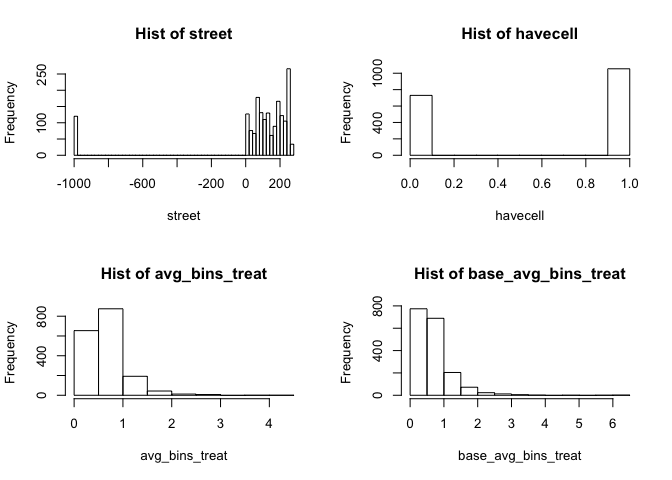
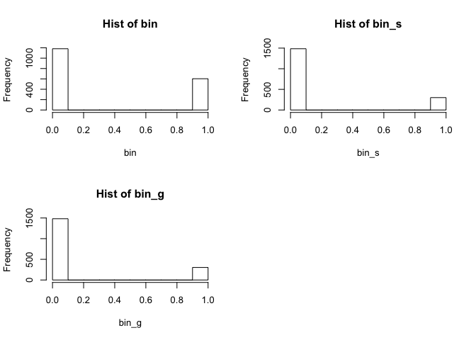
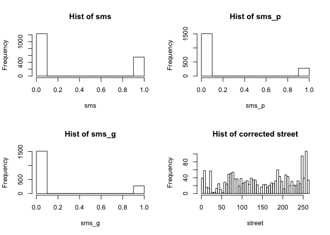

Problem Set 3
================
Anup Jha : Experiments and Causality

``` r
# load packages 
library(data.table)
library(foreign)
library(lmtest)
```

    ## Loading required package: zoo

    ## 
    ## Attaching package: 'zoo'

    ## The following objects are masked from 'package:base':
    ## 
    ##     as.Date, as.Date.numeric

``` r
library(sandwich)
library(stargazer)
```

    ## 
    ## Please cite as:

    ##  Hlavac, Marek (2018). stargazer: Well-Formatted Regression and Summary Statistics Tables.

    ##  R package version 5.2.2. https://CRAN.R-project.org/package=stargazer

# 0\. Write Functions

You’re going to be doing a few things a *number* of times – calculating
robust standard errors, calculating clustered standard errors, and then
calculating the confidence intervals that are built off these standard
errors.

*After* you’ve worked through a few of these questions, I suspect you
will see places to write a function that will do this work for you.
Include those functions here, if you write them.

``` r
add_std_errors <- function (model,clusters=NULL,regressor) {
  if(!is.null(clusters)){
  model$vcovCL_ <- vcovCL(model, cluster = clusters)
  model$cluster.se <- sqrt(diag(model$vcovCL_))  
  }
  
  model$vcovHC_ <- vcovHC(model)
  model$robust.se <-  sqrt(diag(model$vcovHC_))
  #print the estimate with OLS std errors
  print(paste("Coefficient test with OLS Homoskedastic Std Errors for variable:",regressor))
  print(coeftest(model)[regressor,])
  print(paste("Confidence Interval OLS Homoskedastic Std Errors for variable:",regressor))
  print(coefci(model)[regressor,])
  #Store the coeftest in the model 
  model$coeftest.ols_ <- coeftest(model)
  #print the estimate with robust std errors
  print(paste("Coefficient test with Robust Std Errors for variable:",regressor))
  print(coeftest(model,vcov. = model$vcovHC_)[regressor,])
  #print the confidence interval with robust std error
  print(paste("Confidence Interval With Robust Std Error for variable:",regressor))
  print(coefci(model,vcov. = model$vcovHC_)[regressor,])
  #Store the coeftest in the model 
  model$coeftest.robust_ <- coeftest(model,vcov. = model$vcovHC_)
  if(!is.null(clusters)){
  #print the estimate with clustered std error
  print(paste("Coefficient test with Clustered Std Error for variable:",regressor))
  print(coeftest(model,vcov. = model$vcovCL_)[regressor,])
  #print the confidence interval with clustered std error
  print(paste("Confidence Interval with Clustered Error for variable:",regressor))
  print(coefci(model,vcov. = model$vcovCL_)[regressor,])
  #Store the coeftest in the model 
  model$coeftest.cluster_ <- coeftest(model,vcov. = model$vcovCL_)
  }
  
  return (model)
}
```

# 1\. Replicate Results

Skim [Broockman and Green’s](./readings/brookman_green_ps3.pdf) paper on
the effects of Facebook ads and download an anonymized version of the
data for Facebook users only.

``` r
d <- fread("./data/broockman_green_anon_pooled_fb_users_only.csv")
```

1.  Using regression without clustered standard errors (that is,
    ignoring the clustered assignment), compute a confidence interval
    for the effect of the ad on candidate name recognition in Study 1
    only (the dependent variable is “name\_recall”).

<!-- end list -->

  - **Note**: Ignore the blocking the article mentions throughout this
    problem.
  - **Note**: You will estimate something different than is reported in
    the study.

<!-- end list -->

``` r
model1 <- d[studyno==1,lm(name_recall~treat_ad)]
#print the estimate
coeftest(model1)["treat_ad",]
```

    ##     Estimate   Std. Error      t value     Pr(>|t|) 
    ## -0.009797887  0.021012191 -0.466295336  0.641078683

``` r
#print the confidence interval
(confint_without_clustering <- confint(model1)["treat_ad",])
```

    ##       2.5 %      97.5 % 
    ## -0.05101765  0.03142188

**Ans: We see that the confidence interval without clustering is
-0.0510177, 0.0314219 **

2.  What are the clusters in Broockman and Green’s study? Why might
    taking clustering into account increase the standard errors?

**The study clusters the subjects on age,gender and town. More
specifically there are 18 age ranges for age between 30 and 75. The
ranges are 30-31,32-33,34-35,…62-63,64 and 65 and above. Two genders
namely Male and Female and 34 towns. Clustering generally increases the
standard errors because the subjects inside the clusters are more
correlated while the inter cluster variance is high. So the information
gain whithin clusters is small and if the inter cluster variance is high
the cluster variance would be high and hence the standard errors. The
formula for the clustered std error multiplies with the term
\(\sqrt{\frac{N}{k}}\) where N is the total number of observation and k
is the number of clusters. So if number of clusters is smaller than N
then in general the clustered std error would be more **

3.  Now estimate a regression that estimates the effect of the ad on
    candidate name recognition in Study 1, but this time take take
    clustering into account. (hint: The estimation of the *model* does
    not change, only the estimation of the standard errors.) If you’re
    not familiar with how to calculate these clustered and robust
    estimates, there is a demo worksheet that is available in our course
    repository:
    [`./week_05/cluster_and_robust.Rmd`](http://datahub.berkeley.edu/hub/user-redirect/git-pull?repo=https://github.com/UCB-MIDS/w241&urlpath=rstudio/).

<!-- end list -->

``` r
#add the stderrors both the robust and clustered
model_with_stderr <- add_std_errors(model1,d[studyno==1,cluster],"treat_ad")
```

    ## [1] "Coefficient test with OLS Homoskedastic Std Errors for variable: treat_ad"
    ##     Estimate   Std. Error      t value     Pr(>|t|) 
    ## -0.009797887  0.021012191 -0.466295336  0.641078683 
    ## [1] "Confidence Interval OLS Homoskedastic Std Errors for variable: treat_ad"
    ##       2.5 %      97.5 % 
    ## -0.05101765  0.03142188 
    ## [1] "Coefficient test with Robust Std Errors for variable: treat_ad"
    ##     Estimate   Std. Error      t value     Pr(>|t|) 
    ## -0.009797887  0.021112031 -0.464090188  0.642657297 
    ## [1] "Confidence Interval With Robust Std Error for variable: treat_ad"
    ##       2.5 %      97.5 % 
    ## -0.05121351  0.03161774 
    ## [1] "Coefficient test with Clustered Std Error for variable: treat_ad"
    ##     Estimate   Std. Error      t value     Pr(>|t|) 
    ## -0.009797887  0.023753626 -0.412479624  0.680052828 
    ## [1] "Confidence Interval with Clustered Error for variable: treat_ad"
    ##       2.5 %      97.5 % 
    ## -0.05639555  0.03679977

``` r
#print just the robust std error
robust_se <- model_with_stderr$robust.se["treat_ad"]
#print just the clustered std error
clustered_se <- model_with_stderr$cluster.se["treat_ad"]
# add the estimate to variable 
estimated_treatment_effect <- coeftest(model_with_stderr)["treat_ad","Estimate"]
```

**Ans: We see that the estimated treatment effect is -0.0097979 with the
robust std error as 0.021112 and the clusterd std error as 0.0237536 .
We also see that the pvalues are not significant**

4.  Again, run a regression to test for the effect of the ad on
    candidate name recognition using clustered standard errors, but this
    time conduct it only for Study 2. How can you employ some form of
    slicing to make the code you’ve written in parts (c) and (d) very
    similar?

<!-- end list -->

``` r
model2 <- d[studyno==2,lm(name_recall~treat_ad)]
#add the stderrors both the robust and clustered
model2_with_std_err <- add_std_errors(model2,d[studyno==2,cluster],"treat_ad")
```

    ## [1] "Coefficient test with OLS Homoskedastic Std Errors for variable: treat_ad"
    ##     Estimate   Std. Error      t value     Pr(>|t|) 
    ## -0.002803349  0.030874006 -0.090799637  0.927665420 
    ## [1] "Confidence Interval OLS Homoskedastic Std Errors for variable: treat_ad"
    ##      2.5 %     97.5 % 
    ## -0.0633702  0.0577635 
    ## [1] "Coefficient test with Robust Std Errors for variable: treat_ad"
    ##     Estimate   Std. Error      t value     Pr(>|t|) 
    ## -0.002803349  0.030946781 -0.090586111  0.927835058 
    ## [1] "Confidence Interval With Robust Std Error for variable: treat_ad"
    ##       2.5 %      97.5 % 
    ## -0.06351297  0.05790627 
    ## [1] "Coefficient test with Clustered Std Error for variable: treat_ad"
    ##     Estimate   Std. Error      t value     Pr(>|t|) 
    ## -0.002803349  0.035503252 -0.078960332  0.937076009 
    ## [1] "Confidence Interval with Clustered Error for variable: treat_ad"
    ##       2.5 %      97.5 % 
    ## -0.07245159  0.06684489

``` r
#print just the robust std error
robust_se <- model2_with_std_err$robust.se["treat_ad"]
#print just the clustered std error
clustered_se <- model2_with_std_err$cluster.se["treat_ad"]
# add the estimate to variable 
estimated_treatment_effect <- coeftest(model2_with_std_err)["treat_ad","Estimate"]
```

**Ans: We see that the estimated treatment effect is -0.0028033 with the
robust std error as 0.0309468 and the clusterd std error as 0.0355033 .
We also see that the p values are not significant**

5.  Run a regression to test for the effect of the ad on candidate name
    recognition, but this time the entire sample from both studies. Do
    not take into account which study the data is from (more on this in
    a moment), but just pool the data. What is the treatment effect
    estimate? Are you surprised of where it this estimate compared to
    the estimate on the two subsets of data? What is the p-value
    associated with this test?

<!-- end list -->

``` r
model3 <- d[,lm(name_recall~treat_ad)]
#add the stderrors both the robust and clustered
model3_with_std_err <- add_std_errors(model3,d[,cluster],"treat_ad")
```

    ## [1] "Coefficient test with OLS Homoskedastic Std Errors for variable: treat_ad"
    ##      Estimate    Std. Error       t value      Pr(>|t|) 
    ## -1.550732e-01  1.876226e-02 -8.265167e+00  2.160639e-16 
    ## [1] "Confidence Interval OLS Homoskedastic Std Errors for variable: treat_ad"
    ##      2.5 %     97.5 % 
    ## -0.1918631 -0.1182834 
    ## [1] "Coefficient test with Robust Std Errors for variable: treat_ad"
    ##      Estimate    Std. Error       t value      Pr(>|t|) 
    ## -1.550732e-01  1.852670e-02 -8.370257e+00  9.104337e-17 
    ## [1] "Confidence Interval With Robust Std Error for variable: treat_ad"
    ##      2.5 %     97.5 % 
    ## -0.1914012 -0.1187453 
    ## [1] "Coefficient test with Clustered Std Error for variable: treat_ad"
    ##      Estimate    Std. Error       t value      Pr(>|t|) 
    ## -1.550732e-01  2.673047e-02 -5.801366e+00  7.343835e-09 
    ## [1] "Confidence Interval with Clustered Error for variable: treat_ad"
    ##      2.5 %     97.5 % 
    ## -0.2074875 -0.1026590

``` r
#print just the robust std error
robust_se <- model3_with_std_err$robust.se["treat_ad"]
#print just the clustered std error
clustered_se <- model3_with_std_err$cluster.se["treat_ad"]
# add the estimate to variable 
estimated_treatment_effect <- coeftest(model3_with_std_err)["treat_ad","Estimate"]
# add the pvale to a variable
p_val_nonrobust <- coeftest(model3_with_std_err)["treat_ad","Estimate"]
p_val_robust <- coeftest(model3_with_std_err,vcov. = model3_with_std_err$vcovHC_)["treat_ad","Pr(>|t|)"]
p_val_clustered <- coeftest(model3_with_std_err,vcov. = model3_with_std_err$vcovCL_)["treat_ad","Pr(>|t|)"]
```

**Ans: We see that the estimated treatment effect is -0.1550732 with the
robust std error as 0.0185267 and the clusterd std error as 0.0267305 .
The p\_value associated with the treatment coefficient is -0.1550732 the
p\_val with robust std error is 9.104337410^{-17} and p\_val with the
clustered std error is 7.343834610^{-9} . These p values are highly
significant**

``` r
d[,.(.N,mean(name_recall,na.rm=T)),by=.(studyno,treat_ad)]
```

    ##    studyno treat_ad    N        V2
    ## 1:       2        0 1007 0.6057884
    ## 2:       2        1  335 0.6029851
    ## 3:       1        1  805 0.1726708
    ## 4:       1        0  559 0.1824687

``` r
d[,mean(name_recall,na.rm=T),by=treat_ad]
```

    ##    treat_ad        V1
    ## 1:        0 0.4541960
    ## 2:        1 0.2991228

**Ans: We see that if we pool the two studies the average treatment
effect about -0.155 so I am not surprised by the estimate given by the
regression. The reason is because the studies have different numbner of
subjects in treatment and control so we cannot assume that the average
treatment effect of pooled data would be simple mean of the two subsets
and the estimates we get by OLS regression would be biased instead we
should make use of weighted Least square regression **

6.  Now, the last question-part, but this time include a variable that
    identifies whether an observation was generated during Study 1 or
    Study 2. What is estimated in the “Study 1 Fixed Effect”? What is
    the treatment effect estimate and associated p-value? Think a little
    bit more about the treatment effect that you’ve estimated: can this
    treatment effect be *different* between Study 1 and Study 2? Why or
    why not?

<!-- end list -->

``` r
model4 <- d[,lm(name_recall~treat_ad+as.factor(studyno))]
#add the std errors
model4_with_std_err <- add_std_errors(model4,d[,cluster],"treat_ad")
```

    ## [1] "Coefficient test with OLS Homoskedastic Std Errors for variable: treat_ad"
    ##     Estimate   Std. Error      t value     Pr(>|t|) 
    ## -0.006775249  0.018176718 -0.372743231  0.709368837 
    ## [1] "Confidence Interval OLS Homoskedastic Std Errors for variable: treat_ad"
    ##       2.5 %      97.5 % 
    ## -0.04241695  0.02886645 
    ## [1] "Coefficient test with Robust Std Errors for variable: treat_ad"
    ##     Estimate   Std. Error      t value     Pr(>|t|) 
    ## -0.006775249  0.017947836 -0.377496691  0.705834215 
    ## [1] "Confidence Interval With Robust Std Error for variable: treat_ad"
    ##       2.5 %      97.5 % 
    ## -0.04196815  0.02841765 
    ## [1] "Coefficient test with Clustered Std Error for variable: treat_ad"
    ##     Estimate   Std. Error      t value     Pr(>|t|) 
    ## -0.006775249  0.020415411 -0.331869322  0.740013714 
    ## [1] "Confidence Interval with Clustered Error for variable: treat_ad"
    ##       2.5 %      97.5 % 
    ## -0.04680668  0.03325618

``` r
p_val_clustered <- coeftest(model4_with_std_err,vcov. = model4_with_std_err$vcovCL_)["treat_ad","Pr(>|t|)"]
treatment_eff <- coeftest(model4_with_std_err,vcov. = model4_with_std_err$vcovCL_)["treat_ad","Estimate"]
intercept <- coeftest(model4_with_std_err,vcov. = model4_with_std_err$vcovCL_)["(Intercept)","Estimate"]
Study1Fixed <- intercept
Study2Diff <- coeftest(model4_with_std_err,vcov. = model4_with_std_err$vcovCL_)["as.factor(studyno)2","Estimate"]
```

``` r
stargazer(model4_with_std_err,se=list(model4_with_std_err$cluster.se),type='text',header=F)
```

    ## 
    ## ===============================================
    ##                         Dependent variable:    
    ##                     ---------------------------
    ##                             name_recall        
    ## -----------------------------------------------
    ## treat_ad                      -0.007           
    ##                               (0.020)          
    ##                                                
    ## as.factor(studyno)2          0.426***          
    ##                               (0.021)          
    ##                                                
    ## Constant                     0.181***          
    ##                               (0.017)          
    ##                                                
    ## -----------------------------------------------
    ## Observations                   2,701           
    ## R2                             0.193           
    ## Adjusted R2                    0.193           
    ## Residual Std. Error      0.438 (df = 2698)     
    ## F Statistic          322.848*** (df = 2; 2698) 
    ## ===============================================
    ## Note:               *p<0.1; **p<0.05; ***p<0.01

**Ans: We see that the Study1 Fixed effect is 0.1806848 . The p\_val
associated with the treatment effect is 0.7400137 which is not
significant. The treatment effect cannot be different between Study1 and
Study2 as we have not included the interation term between treatment and
study variable. So the treatment effect is the same between two studies
but the baseline is different between Study1 and Study2. Study2 has
baseline of 0.4260988 different than the baseline of study1**

7.  Conduct a formal test – it must have a p-value associated with the
    test – for whether the treatment effects are different in Study 1
    than Study 2. If they are different, why do you suppose they differ?
    Is one of the results “biased”? Why or why not? (Hint: see pages
    75-76 of Gerber and Green, with more detailed discussion optionally
    available on pages 116-121.)

<!-- end list -->

``` r
model5_no_interaction <- d[,lm(name_recall~treat_ad+as.factor(studyno))]
model6_with_interaction <- d[,lm(name_recall~treat_ad+as.factor(studyno) + treat_ad*as.factor(studyno) )]
#get the coefficient for interaction term
(interaction_coeff <- model6_with_interaction$coefficients["treat_ad:as.factor(studyno)2"])
```

    ## treat_ad:as.factor(studyno)2 
    ##                  0.006994538

``` r
#anova test to check the pval for the interaction term
(p_val <- anova(model5_no_interaction,model6_with_interaction,test='F')$"Pr(>F)"[2])
```

    ## [1] 0.8488615

``` r
#probability of being assigned to treatment in the studies
(study1_prob <- d[studyno==1,mean(treat_ad)])
```

    ## [1] 0.590176

``` r
(study2_prob <- d[studyno==2,mean(treat_ad)])
```

    ## [1] 0.2496274

``` r
stargazer(model5_no_interaction,model6_with_interaction,header=F,type='text')
```

    ## 
    ## ================================================================================
    ##                                              Dependent variable:                
    ##                              ---------------------------------------------------
    ##                                                  name_recall                    
    ##                                         (1)                       (2)           
    ## --------------------------------------------------------------------------------
    ## treat_ad                              -0.007                    -0.010          
    ##                                       (0.018)                   (0.024)         
    ##                                                                                 
    ## as.factor(studyno)2                  0.426***                  0.423***         
    ##                                       (0.018)                   (0.023)         
    ##                                                                                 
    ## treat_ad:as.factor(studyno)2                                     0.007          
    ##                                                                 (0.037)         
    ##                                                                                 
    ## Constant                             0.181***                  0.182***         
    ##                                       (0.016)                   (0.019)         
    ##                                                                                 
    ## --------------------------------------------------------------------------------
    ## Observations                           2,701                     2,701          
    ## R2                                     0.193                     0.193          
    ## Adjusted R2                            0.193                     0.192          
    ## Residual Std. Error              0.438 (df = 2698)         0.438 (df = 2697)    
    ## F Statistic                  322.848*** (df = 2; 2698) 215.167*** (df = 3; 2697)
    ## ================================================================================
    ## Note:                                                *p<0.1; **p<0.05; ***p<0.01

**Ans: We see that the treatment effect is not different between study1
and study2 as the p\_val of the anova test for F test is not significant
and the estimate of additional treatment effect for study2 is 0.0069945
. The pvalue for anova test is 0.8488615 . The treatment effect in the
model without the inetraction term is biased as the probability of
subject being assigned to treatment is different in two studies.For
study1 the probability to be assigned to treatment is 0.590176 and for
Study2 the probability is 0.2496274 . Since we are not using the
weighted least squares regression we will get a biased estimate of the
treatment effect in this model. The saturated model with the interaction
term between treatment and studyno is basically different regression for
each block of study and hence is not biased. The staurated model would
estimate the treatment effect and control for each block separately and
hence would not have bias due to different probability of being assigned
to treatment in different blocks. **

# 2\. Peruvian Recycling

Look at [this article](./readings/recycling_peru.pdf) about encouraging
recycling in Peru. The paper contains two experiments, a “participation
study” and a “participation intensity study.” In this problem, we will
focus on the latter study, whose results are contained in Table 4 in
this problem. You will need to read the relevant section of the paper
(starting on page 20 of the manuscript) in order to understand the
experimental design and variables. (*Note that “indicator variable” is a
synonym for “dummy variable,” in case you haven’t seen this language
before.*)

1.  In Column 3 of Table 4A, what is the estimated ATE of providing a
    recycling bin on the average weight of recyclables turned in per
    household per week, during the six-week treatment period? Provide a
    95% confidence interval.

**Ans: From Column 3 we see that ATE of providing recycling bin is 0.187
Kg . The Std Error reported is 0.032 so the 95% confidence interval
under two tailed test would be (ATE-1.96*STDErr, ATE+1.96 * STDErr) that
is 0.12428, 0.24972 **

``` r
print(c(0.187-1.96*0.032,0.187+1.96*0.032))
```

    ## [1] 0.12428 0.24972

2.  In Column 3 of Table 4A, what is the estimated ATE of sending a text
    message reminder on the average weight of recyclables turned in per
    household per week? Provide a 95% confidence interval.

**Ans: From Column 3 we see that ATE of sending text message is -0.024
Kg . The Std Error reported is 0.039 so the 95% confidence interval
under two tailed test would be (ATE-1.96*STDErr, ATE+1.96 * STDErr) that
is -0.10044, 0.05244 **

``` r
print(c(-0.024-1.96*0.039,-0.024+1.96*0.039))
```

    ## [1] -0.10044  0.05244

3.  Which outcome measures in Table 4A show statistically significant
    effects (at the 5% level) of providing a recycling bin?

**Ans: The first four columns shows the statistically significant
effects (at 5%) of providing a recycling bin. The outcome measures
namely are : 1) Percentage of visits turned in bag 2) Avg no. of bins
turned in per week 3) Avg. weight(in kg) of recyclables turned in per
week 4) Avg. market value of recyclables given per week **

4.  Which outcome measures in Table 4A show statistically significant
    effects (at the 5% level) of sending text messages?

**Ans: None of the outcomes in table 4A show statistically significant
effects( at 5%) of sending text messages **

5.  Suppose that, during the two weeks before treatment, household A
    turns in 2kg per week more recyclables than household B does, and
    suppose that both households are otherwise identical (including
    being in the same treatment group). From the model, how much more
    recycling do we predict household A to have than household B, per
    week, during the six weeks of treatment? Provide only a point
    estimate, as the confidence interval would be a bit complicated.
    This question is designed to test your understanding of slope
    coefficients in regression.

\*\*Ans: We see from the column 3 that the coefficient associated with
Avg weight in Kg of recyclables per week baseline is 0.281 . So per
increase of 1 kg in baseline would mean .281 kg increase in the outcome
Avg weight of recyclables turned in per week. And since the two
households are similar in every aspect other than this we can predict
that hosuehold A would turn 2\*.281 = 0.562Kg of recyclables more than
household B \*\*

6.  Suppose that the variable “percentage of visits turned in bag,
    baseline” had been left out of the regression reported in Column 1.
    What would you expect to happen to the results on providing a
    recycling bin? Would you expect an increase or decrease in the
    estimated ATE? Would you expect an increase or decrease in the
    standard error? Explain your reasoning.

**Ans: Since providing bin is treatment and in the experiment
randomization was used to assign the household to get bin or not so we
will not have Omitted Variable Bias for the treatment variable. So the
ATE would remain the same. The standard error on the otherhand would
increase because we see that the baseline strongly predicts the outcome
so including the baseline as covariate decreases the standard error for
the ATE and if its not included in the regression model it would result
in increase in the Std Error of the estimate of ATE**

7.  In column 1 of Table 4A, would you say the variable “has cell phone”
    is a bad control? Explain your reasoning.

**Ans Has Cell phone is not a bad control as treatment doesn’t effect
the variable. Having a cell phone or not was recorded before the
experiment and treatment of getting a bin or SMS doesn’t really change
the status of having a cell phone as its very unlikely that subjects
would start buying phones to get the SMS message**

8.  If we were to remove the “has cell phone” variable from the
    regression, what would you expect to happen to the coefficient on
    “Any SMS message”? Would it go up or down? Explain your reasoning.

**Ans: If we were to remove the “has cell phone” then the coefficient of
“Any SMS message” would increase. This is because we see that “having
cell phone” is positively correlated with outcome variables and also we
can assume that having cell phone would be positively correlated with
“Any SMS message” as receiving SMS would require having cell phone. So
if we omit the variable “having cell phone” the positive effect of
“having cell phone” on outcome would be aborbed by the positively
correlated variable “Any SMS message” **

# 3\. Multifactor Experiments

Staying with the same experiment, now lets think about multifactor
experiments.

1.  What is the full experimental design for this experiment? Tell us
    the dimensions, such as 2x2x3. (Hint: the full results appear in
    Panel 4B.)

**Ans: This will be a 3 X 3 design. The dimensions being bin with three
levels: 1) Bin with stickers 2) Bin without stickers 3) No Bins and
another dimension being SMS message with three levels 1) Personalized
SMS Message 2) Generic SMS Message 3) No SMS Message **

2.  In the results of Table 4B, describe the baseline category. That is,
    in English, how would you describe the attributes of the group of
    people for whom all dummy variables are equal to zero?

**Ans: The baseline category people would be people in control who
didn’t receive any bins or messages. These people also don’t have any
cell phones. They just have the continous covariates . The average of
these would be given by the intercept of the regression line. The
regression intercept though has not been provided in Table 4B otherwise
we would have known the average of the control group. **

3.  In column (1) of Table 4B, interpret the magnitude of the
    coefficient on “bin without sticker.” What does it mean?

**Ans: The coefficient of “bin without sticker” is 0.035 which means
that people who were given “bin without stickers” saw an increase on an
average of 3.5 % visits to turn in bag for recycling. Since this is
causal experiment design we can also infer that providing people with
“bin without sticker” and keeping everything else constant can cause a
jump in 3.5% to the “Visit to turn in bag for recycling” **

4.  In column (1) of Table 4B, which seems to have a stronger treatment
    effect, the recycling bin with message sticker, or the recycling bin
    without sticker? How large is the magnitude of the estimated
    difference?

**Ans: From table 4B Bin with sticker has stonger treatment effect than
bin without the sticker. The coefficient of Bin with sticker is 0.055
and coefficient of Bin without sticker is 0.035. The magnitude of the
difference is 0.055 - 0.035 = 0.02 **

5.  Is this difference you just described statistically significant?
    Explain which piece of information in the table allows you to answer
    this question.

\*\*Ans: The difference described above is not statistically
significant. We can see this from footnote in Table 4B which has F-Test
p-value (1) = (2) and has value of 0.31 . Which means that we can’t
reject the null hypothesis of coefficient of (1) = (2) at .05% . We can
also have another approach to test whether the difference is
statistically significant or not we need to estimate the std error of
the difference. We see that the Std error of the coefficient for Bin
with sticker is .015 and for Bin without sticker is also 0.015. Assuming
these two variables have 0 correletion we can estimate the std error for
the difference as sqrt(SE1^2 + SE2 ^2) = sqrt(0.015^2 + 0.015^2) =
0.0212132 . Assuming the null hypothesis that two coefficients are the
same we would calculate if the difference in magnitude is greater tha
1.96 std errors from 0 . We see that diffference in magnitude was 0.02
and the Standard error for the difference is .0212132 so difference in
magnitude is not statistically significant as its not greater than
1.96\*.0212132\*\*

6.  Notice that Table 4C is described as results from “fully saturated”
    models. What does this mean? Looking at the list of variables in the
    table, explain in what sense the model is “saturated.”

**Ans: A fully saturated model means the model is estimating the
coefficient of all unique combinations of the regressors. In the table
4C we see that all combinations of treatment levels have been tabulated.
So this is a multifactor experiment table where we see the 3X3 treatment
levels being examined. Basically all the combinations of two dimensions
of the treatment with 3 levels each. Namely Bin treatment has 1) Bin
with stickers 2) Bin with no sticker 3) No Bin . SMS dimnension has
three levels 1) Personalized SMS message 2) Generic SMS message 3) No
SMS . We see from the table 4C that we have all 9 unique combinations of
these**

# 4\. Now\! Do it with data

Download the data set for the recycling study in the previous problem,
obtained from the authors. We’ll be focusing on the outcome variable
Y=“number of bins turned in per week” (avg\_bins\_treat).

``` r
d <- read.dta("./data/karlan_data_subset_for_class.dta")
d <- data.table(d)
head(d)
```

    ##    street havecell avg_bins_treat base_avg_bins_treat bin sms bin_s bin_g
    ## 1:      7        1      1.0416666               0.750   1   1     1     0
    ## 2:      7        1      0.0000000               0.000   0   1     0     0
    ## 3:      7        1      0.7500000               0.500   0   0     0     0
    ## 4:      7        1      0.5416667               0.500   0   0     0     0
    ## 5:      6        1      0.9583333               0.375   1   0     0     1
    ## 6:      8        0      0.2083333               0.000   1   0     0     1
    ##    sms_p sms_g
    ## 1:     0     1
    ## 2:     1     0
    ## 3:     0     0
    ## 4:     0     0
    ## 5:     0     0
    ## 6:     0     0

``` r
## Do some quick exploratory data analysis with this data. There are some values in this data that seem a bit strange. Determine what these are, and figure out what you would like to do with them. Also, notice what happens with your estimates vis-a-vis the estimates that are produced by the authors when you do something sensible with this strange values. 
```

``` r
 #lets get unique values of each of the dummy variables
d[,unique(street)]
```

    ##   [1]    7    6    8    5    9   10 -999   11   17    3   45   46   47   63
    ##  [15]   62   64   78   80   70   77   66   81   73   88   86   91   89  124
    ##  [29]  138  109  125  132  121  131  149  136  106  166  196  198  188  191
    ##  [43]  216  233  225  222  221  241  244  243  236    2   22   21   20   23
    ##  [57]   37   40   41   38   61   60   75   82   67   69   74   85   79   83
    ##  [71]   84   94   96   93  137  111  115  134  105  113  112  118  110  133
    ##  [85]  107  128  130  117  126  160  153  154  157  158  156  152  155  164
    ##  [99]  163  172  171  170  180  183  182  192  189  185  197  200  193  207
    ## [113]  203  206  208  213  209  202  230  232  223  240  242  253  254  263
    ## [127]  261  260  262    4   15   44   43   42   68   72   98  119  148  151
    ## [141]  147  120  122  175  187  186  190  229  228  217  235  238  255  250
    ## [155]  248  249  247  256  259  258  257   26   53   32   58   99  103  100
    ## [169]  102  101  127  129  168  165  179  215  210  220  227  246   NA

``` r
d[,unique(havecell)]
```

    ## [1]  1  0 NA

``` r
d[,unique(bin)]
```

    ## [1] 1 0

``` r
d[,unique(sms)]
```

    ## [1] 1 0

``` r
d[,unique(bin_s)]
```

    ## [1] 1 0

``` r
d[,unique(bin_g)]
```

    ## [1] 0 1

``` r
d[,unique(sms_p)]
```

    ## [1] 0 1

``` r
d[,unique(sms_g)]
```

    ## [1] 1 0

``` r
#plot histograms
par(mfrow=c(2,2))
hist(d[,street],main="Hist of street",xlab="street",breaks=50)
hist(d[,havecell],main="Hist of havecell",xlab="havecell")
hist(d[,avg_bins_treat],main="Hist of avg_bins_treat",xlab="avg_bins_treat")
hist(d[,base_avg_bins_treat],main="Hist of base_avg_bins_treat",xlab="base_avg_bins_treat")
```

<!-- -->

``` r
par(mfrow=c(2,2))
hist(d[,bin],main="Hist of bin",xlab="bin")
hist(d[,bin_s],main="Hist of bin_s",xlab="bin_s")
hist(d[,bin_g],main="Hist of bin_g",xlab="bin_g")
par(mfrow=c(2,2))
```

<!-- -->

``` r
hist(d[,sms],main="Hist of sms",xlab="sms")
hist(d[,sms_p],main="Hist of sms_p",xlab="sms_p")
hist(d[,sms_g],main="Hist of sms_g",xlab="sms_g")
#plot histogram of street after filtering negative street
hist(d[street>0,street],main="Hist of corrected street",xlab="street",breaks=50)
```

<!-- -->

**Ans: From the EDA we see that few street values have value -999 which
can be coding error when creating data . We would make these values as
NA in our copy of data . We also see that some of the values for
havecell is also NA**

``` r
#Copy the data.table
d.copy <- copy(d)
#replace street value < 0 as NA
d.copy[street<0,street := NA]
```

1.  For simplicity, let’s start by measuring the effect of providing a
    recycling bin, ignoring the SMS message treatment (and ignoring
    whether there was a sticker on the bin or not). Run a regression of
    Y on only the bin treatment dummy, so you estimate a simple
    difference in means. Provide a 95% confidence interval for the
    treatment effect.

<!-- end list -->

``` r
bin_model <- d.copy[,lm(avg_bins_treat~bin)]
bin_model_with_std_errs <- add_std_errors(bin_model,NULL,'bin')
```

    ## [1] "Coefficient test with OLS Homoskedastic Std Errors for variable: bin"
    ##     Estimate   Std. Error      t value     Pr(>|t|) 
    ## 1.353800e-01 2.029056e-02 6.672067e+00 3.355794e-11 
    ## [1] "Confidence Interval OLS Homoskedastic Std Errors for variable: bin"
    ##      2.5 %     97.5 % 
    ## 0.09558421 0.17517578 
    ## [1] "Coefficient test with Robust Std Errors for variable: bin"
    ##     Estimate   Std. Error      t value     Pr(>|t|) 
    ## 1.353800e-01 2.082296e-02 6.501476e+00 1.029692e-10 
    ## [1] "Confidence Interval With Robust Std Error for variable: bin"
    ##      2.5 %     97.5 % 
    ## 0.09454001 0.17621998

``` r
stargazer(bin_model_with_std_errs,
          se=list(bin_model_with_std_errs$robust.se),
          type="text")
```

    ## 
    ## ===============================================
    ##                         Dependent variable:    
    ##                     ---------------------------
    ##                           avg_bins_treat       
    ## -----------------------------------------------
    ## bin                          0.135***          
    ##                               (0.021)          
    ##                                                
    ## Constant                     0.635***          
    ##                               (0.011)          
    ##                                                
    ## -----------------------------------------------
    ## Observations                   1,785           
    ## R2                             0.024           
    ## Adjusted R2                    0.024           
    ## Residual Std. Error      0.405 (df = 1783)     
    ## F Statistic          44.516*** (df = 1; 1783)  
    ## ===============================================
    ## Note:               *p<0.1; **p<0.05; ***p<0.01

2.  Now add the pre-treatment value of Y as a covariate. Provide a 95%
    confidence interval for the treatment effect. Explain how and why
    this confidence interval differs from the previous
one.

<!-- end list -->

``` r
bin_model_with_pretreatment <- d.copy[,lm(avg_bins_treat~bin+base_avg_bins_treat)]
bin_model_with_pretreatment_with_std_errs <- add_std_errors(bin_model_with_pretreatment,NULL,'bin')
```

    ## [1] "Coefficient test with OLS Homoskedastic Std Errors for variable: bin"
    ##     Estimate   Std. Error      t value     Pr(>|t|) 
    ## 1.246930e-01 1.666714e-02 7.481365e+00 1.148786e-13 
    ## [1] "Confidence Interval OLS Homoskedastic Std Errors for variable: bin"
    ##      2.5 %     97.5 % 
    ## 0.09200378 0.15738218 
    ## [1] "Coefficient test with Robust Std Errors for variable: bin"
    ##     Estimate   Std. Error      t value     Pr(>|t|) 
    ## 1.246930e-01 1.719267e-02 7.252682e+00 6.065950e-13 
    ## [1] "Confidence Interval With Robust Std Error for variable: bin"
    ##      2.5 %     97.5 % 
    ## 0.09097306 0.15841290

``` r
stargazer(bin_model_with_pretreatment_with_std_errs,
          se=list(bin_model_with_pretreatment_with_std_errs$robust.se),
          type="text")
```

    ## 
    ## ===============================================
    ##                         Dependent variable:    
    ##                     ---------------------------
    ##                           avg_bins_treat       
    ## -----------------------------------------------
    ## bin                          0.125***          
    ##                               (0.017)          
    ##                                                
    ## base_avg_bins_treat          0.393***          
    ##                               (0.030)          
    ##                                                
    ## Constant                     0.350***          
    ##                               (0.021)          
    ##                                                
    ## -----------------------------------------------
    ## Observations                   1,785           
    ## R2                             0.342           
    ## Adjusted R2                    0.342           
    ## Residual Std. Error      0.333 (df = 1782)     
    ## F Statistic          463.891*** (df = 2; 1782) 
    ## ===============================================
    ## Note:               *p<0.1; **p<0.05; ***p<0.01

**Ans: We see that the confidence interval has become narrower after
adding the baseline as covariate. The reason is because the covariate is
able to explain the variation in the outcome variable which makes the
standard error of the treatment variable become smaller and hence give a
tighter confidence interval. We see from the stargazer report that the
Adjusted R2 has increased and the residual std error has decreased by
adding the covariate which means that the covariate is able to explain
the variation in the outcome**

3.  Now add the street fixed effects. (You’ll need to use the R command
    factor().) Provide a 95% confidence interval for the treatment
    effect.

<!-- end list -->

``` r
bin_model_with_street <- d.copy[,lm(avg_bins_treat~bin+base_avg_bins_treat+as.factor(street))]
bin_model_with_street_with_std_errs <- add_std_errors(bin_model_with_street,NULL,'bin')
```

    ## [1] "Coefficient test with OLS Homoskedastic Std Errors for variable: bin"
    ##     Estimate   Std. Error      t value     Pr(>|t|) 
    ## 1.162529e-01 1.758668e-02 6.610282e+00 5.338231e-11 
    ## [1] "Confidence Interval OLS Homoskedastic Std Errors for variable: bin"
    ##      2.5 %     97.5 % 
    ## 0.08175545 0.15075034 
    ## [1] "Coefficient test with Robust Std Errors for variable: bin"
    ##     Estimate   Std. Error      t value     Pr(>|t|) 
    ## 1.162529e-01 1.960264e-02 5.930472e+00 3.753267e-09 
    ## [1] "Confidence Interval With Robust Std Error for variable: bin"
    ##      2.5 %     97.5 % 
    ## 0.07780101 0.15470479

``` r
stargazer(bin_model_with_street_with_std_errs,
          se=list(bin_model_with_street_with_std_errs$robust.se),
          type="text",
          omit = 'street')
```

    ## 
    ## ===============================================
    ##                         Dependent variable:    
    ##                     ---------------------------
    ##                           avg_bins_treat       
    ## -----------------------------------------------
    ## bin                          0.116***          
    ##                               (0.020)          
    ##                                                
    ## base_avg_bins_treat          0.367***          
    ##                               (0.031)          
    ##                                                
    ## Constant                     0.276***          
    ##                               (0.054)          
    ##                                                
    ## -----------------------------------------------
    ## Observations                   1,662           
    ## R2                             0.442           
    ## Adjusted R2                    0.374           
    ## Residual Std. Error      0.323 (df = 1481)     
    ## F Statistic          6.523*** (df = 180; 1481) 
    ## ===============================================
    ## Note:               *p<0.1; **p<0.05; ***p<0.01

4.  Recall that the authors described their experiment as “stratified at
    the street level,” which is a synonym for blocking by street.
    Explain why the confidence interval with fixed effects does not
    differ much from the previous one.

**Ans: The reason why the confidence interval with fixed effects is not
much different is because the street effects are not able to explain the
variations in the outcome much and hence its not reducing the standard
error of the treatment variable. We can see that from the stargazer
report that the Adjusted R2 and the Residual std error have not changed
much after adding the street effects which confirms that the street
effects is not able to explain the variations in the outcome.Hence is
not able to reduce the standard error of the treatment coefficient**

5.  Perhaps having a cell phone helps explain the level of recycling
    behavior. Instead of “has cell phone,” we find it easier to
    interpret the coefficient if we define the variable " no cell
    phone." Give the R command to define this new variable, which equals
    one minus the “has cell phone” variable in the authors’ data set.
    Use “no cell phone” instead of “has cell phone” in subsequent
    regressions with this dataset.

<!-- end list -->

``` r
d.copy[,nocell:=1-havecell]
d[,nocell:=1-havecell]
```

6.  Now add “no cell phone” as a covariate to the previous regression.
    Provide a 95% confidence interval for the treatment effect. Explain
    why this confidence interval does not differ much from the previous
    one.

<!-- end list -->

``` r
bin_model_with_street_nocell <- d.copy[,lm(avg_bins_treat~bin+base_avg_bins_treat+as.factor(street)+nocell)]
bin_model_with_street_nocell_with_std_errs <- add_std_errors(bin_model_with_street_nocell,NULL,'bin')
```

    ## [1] "Coefficient test with OLS Homoskedastic Std Errors for variable: bin"
    ##     Estimate   Std. Error      t value     Pr(>|t|) 
    ## 1.171694e-01 1.758614e-02 6.662600e+00 3.784216e-11 
    ## [1] "Confidence Interval OLS Homoskedastic Std Errors for variable: bin"
    ##     2.5 %    97.5 % 
    ## 0.0826730 0.1516659 
    ## [1] "Coefficient test with Robust Std Errors for variable: bin"
    ##     Estimate   Std. Error      t value     Pr(>|t|) 
    ## 1.171694e-01 1.963637e-02 5.966962e+00 3.019939e-09 
    ## [1] "Confidence Interval With Robust Std Error for variable: bin"
    ##      2.5 %     97.5 % 
    ## 0.07865135 0.15568754

``` r
stargazer(bin_model_with_street_nocell_with_std_errs,
          se=list(bin_model_with_street_nocell_with_std_errs$robust.se),
          type="text",
          omit = 'street')
```

    ## 
    ## ===============================================
    ##                         Dependent variable:    
    ##                     ---------------------------
    ##                           avg_bins_treat       
    ## -----------------------------------------------
    ## bin                          0.117***          
    ##                               (0.020)          
    ##                                                
    ## base_avg_bins_treat          0.367***          
    ##                               (0.031)          
    ##                                                
    ## nocell                       -0.043**          
    ##                               (0.019)          
    ##                                                
    ## Constant                     0.288***          
    ##                               (0.054)          
    ##                                                
    ## -----------------------------------------------
    ## Observations                   1,661           
    ## R2                             0.444           
    ## Adjusted R2                    0.376           
    ## Residual Std. Error      0.323 (df = 1479)     
    ## F Statistic          6.535*** (df = 181; 1479) 
    ## ===============================================
    ## Note:               *p<0.1; **p<0.05; ***p<0.01

**Ans:Again the std error for the ATE was not much different than
previous one so the confidence interval is not much different. This can
be again because the variation in the outcome is not being explained
well by the nocell and hence its not reducing the standard error of the
treatment effect estimate. And again we see from the stargazer report
that the Adjusted R2 and the residual std errors are not much different
from the previous model which tells us that the covariate doesn’t
explain much variation in the outcome and hence is not able to reduce
the standard error of the treatment coefficient**

7.  Now let’s add in the SMS treatment. Re-run the previous regression
    with “any SMS” included. You should get the same results as in Table
    4A. Provide a 95% confidence interval for the treatment effect of
    the recycling bin. Explain why this confidence interval does not
    differ much from the previous
one.

<!-- end list -->

``` r
bin_model_with_street_nocell_sms <- d.copy[,lm(avg_bins_treat~bin+base_avg_bins_treat+as.factor(street)+nocell+sms)]
bin_model_with_street_nocell_sms_with_std_errs <- add_std_errors(bin_model_with_street_nocell_sms,NULL,'bin')
```

    ## [1] "Coefficient test with OLS Homoskedastic Std Errors for variable: bin"
    ##     Estimate   Std. Error      t value     Pr(>|t|) 
    ## 1.169678e-01 1.759005e-02 6.649659e+00 4.122683e-11 
    ## [1] "Confidence Interval OLS Homoskedastic Std Errors for variable: bin"
    ##     2.5 %    97.5 % 
    ## 0.0824637 0.1514719 
    ## [1] "Coefficient test with Robust Std Errors for variable: bin"
    ##     Estimate   Std. Error      t value     Pr(>|t|) 
    ## 1.169678e-01 1.964595e-02 5.953786e+00 3.267811e-09 
    ## [1] "Confidence Interval With Robust Std Error for variable: bin"
    ##      2.5 %     97.5 % 
    ## 0.07843089 0.15550473

``` r
stargazer(bin_model_with_street_nocell_sms_with_std_errs,
          se=list(bin_model_with_street_nocell_sms_with_std_errs$robust.se),
          type="text",
          omit = 'street')
```

    ## 
    ## ===============================================
    ##                         Dependent variable:    
    ##                     ---------------------------
    ##                           avg_bins_treat       
    ## -----------------------------------------------
    ## bin                          0.117***          
    ##                               (0.020)          
    ##                                                
    ## base_avg_bins_treat          0.367***          
    ##                               (0.031)          
    ##                                                
    ## nocell                        -0.033           
    ##                               (0.024)          
    ##                                                
    ## sms                            0.017           
    ##                               (0.025)          
    ##                                                
    ## Constant                     0.279***          
    ##                               (0.056)          
    ##                                                
    ## -----------------------------------------------
    ## Observations                   1,661           
    ## R2                             0.445           
    ## Adjusted R2                    0.376           
    ## Residual Std. Error      0.323 (df = 1478)     
    ## F Statistic          6.501*** (df = 182; 1478) 
    ## ===============================================
    ## Note:               *p<0.1; **p<0.05; ***p<0.01

**Now doing the same with the original data as table 4A gets replicated
with original data and not with the corrected data where change the
negative streets to
NA**

``` r
Orig.bin_model_with_street_nocell_sms <- d[,lm(avg_bins_treat~bin+base_avg_bins_treat+as.factor(street)+nocell+sms)]
Orig.bin_model_with_street_nocell_sms_with_std_errs <- add_std_errors(Orig.bin_model_with_street_nocell_sms,NULL,'bin')
```

    ## [1] "Coefficient test with OLS Homoskedastic Std Errors for variable: bin"
    ##     Estimate   Std. Error      t value     Pr(>|t|) 
    ## 1.150536e-01 1.705105e-02 6.747600e+00 2.095786e-11 
    ## [1] "Confidence Interval OLS Homoskedastic Std Errors for variable: bin"
    ##      2.5 %     97.5 % 
    ## 0.08160886 0.14849843 
    ## [1] "Coefficient test with Robust Std Errors for variable: bin"
    ##     Estimate   Std. Error      t value     Pr(>|t|) 
    ## 1.150536e-01 1.892133e-02 6.080633e+00 1.494771e-09 
    ## [1] "Confidence Interval With Robust Std Error for variable: bin"
    ##     2.5 %    97.5 % 
    ## 0.0779404 0.1521669

``` r
stargazer(Orig.bin_model_with_street_nocell_sms_with_std_errs,
          se=list(Orig.bin_model_with_street_nocell_sms_with_std_errs$robust.se),
          type="text",
          omit = 'street')
```

    ## 
    ## ===============================================
    ##                         Dependent variable:    
    ##                     ---------------------------
    ##                           avg_bins_treat       
    ## -----------------------------------------------
    ## bin                          0.115***          
    ##                               (0.019)          
    ##                                                
    ## base_avg_bins_treat          0.373***          
    ##                               (0.030)          
    ##                                                
    ## nocell                       -0.047**          
    ##                               (0.023)          
    ##                                                
    ## sms                            0.005           
    ##                               (0.024)          
    ##                                                
    ## Constant                     0.385***          
    ##                               (0.038)          
    ##                                                
    ## -----------------------------------------------
    ## Observations                   1,781           
    ## R2                             0.439           
    ## Adjusted R2                    0.375           
    ## Residual Std. Error      0.323 (df = 1597)     
    ## F Statistic          6.834*** (df = 183; 1597) 
    ## ===============================================
    ## Note:               *p<0.1; **p<0.05; ***p<0.01

**Ans: The addition of sms variable also doesn’t explain much variation
in the outcome so its not able to reduce the std error of the treatment
coefficient and hence the confidence interval is not much different from
previous model. We can look at the stargazer report and see not much
different Adjusted R2 and residual std error from previous model hence
the covariate sms is not able to reduce the std error and tighten the
confidence interval of the coefficient of treatment variable **

8.  Now reproduce the results of column 2 in Table 4B, estimating
    separate treatment effects for the two types of SMS treatments and
    the two types of recycling-bin treatments. Provide a 95% confidence
    interval for the effect of the unadorned recycling bin. Explain how
    your answer differs from that in part (g), and explain why you think
    it
differs.

<!-- end list -->

``` r
Orig.bin_model_with_street_nocell_sms_4b <- d[,lm(avg_bins_treat~bin_s+bin_g+base_avg_bins_treat+as.factor(street)+nocell+sms_p+sms_g)]
Orig.bin_model_with_street_nocell_sms_4b_with_std_errs <- add_std_errors(Orig.bin_model_with_street_nocell_sms_4b,NULL,'bin_g')
```

    ## [1] "Coefficient test with OLS Homoskedastic Std Errors for variable: bin_g"
    ##     Estimate   Std. Error      t value     Pr(>|t|) 
    ## 1.031902e-01 2.188886e-02 4.714281e+00 2.636923e-06 
    ## [1] "Confidence Interval OLS Homoskedastic Std Errors for variable: bin_g"
    ##      2.5 %     97.5 % 
    ## 0.06025627 0.14612416 
    ## [1] "Coefficient test with Robust Std Errors for variable: bin_g"
    ##     Estimate   Std. Error      t value     Pr(>|t|) 
    ## 1.031902e-01 2.506030e-02 4.117676e+00 4.023034e-05 
    ## [1] "Confidence Interval With Robust Std Error for variable: bin_g"
    ##      2.5 %     97.5 % 
    ## 0.05403562 0.15234481

``` r
stargazer(Orig.bin_model_with_street_nocell_sms_4b_with_std_errs,
          se=list(Orig.bin_model_with_street_nocell_sms_4b_with_std_errs$robust.se),
          type="text",
          omit = 'street')
```

    ## 
    ## ===============================================
    ##                         Dependent variable:    
    ##                     ---------------------------
    ##                           avg_bins_treat       
    ## -----------------------------------------------
    ## bin_s                        0.128***          
    ##                               (0.024)          
    ##                                                
    ## bin_g                        0.103***          
    ##                               (0.025)          
    ##                                                
    ## base_avg_bins_treat          0.374***          
    ##                               (0.030)          
    ##                                                
    ## nocell                       -0.046**          
    ##                               (0.023)          
    ##                                                
    ## sms_p                         -0.008           
    ##                               (0.028)          
    ##                                                
    ## sms_g                          0.020           
    ##                               (0.028)          
    ##                                                
    ## Constant                     0.385***          
    ##                               (0.038)          
    ##                                                
    ## -----------------------------------------------
    ## Observations                   1,781           
    ## R2                             0.440           
    ## Adjusted R2                    0.375           
    ## Residual Std. Error      0.323 (df = 1595)     
    ## F Statistic          6.769*** (df = 185; 1595) 
    ## ===============================================
    ## Note:               *p<0.1; **p<0.05; ***p<0.01

**Ans: We see that in this model the baseline and nocell retain their
estimate and statistical significance. We also see that the sms whether
personal or group still is not significant. But in this model we can see
the treatment effect of the variation in treatment of bins. We see that
bins with sticker have higher coefficient estimate than that of
unordained bin but the std errors are higher than of when we consider
just bin as treatment. So the confidence interval in this model is
bigger than the previous one in part(g) **

# 5\. A Final Practice Problem

Now for a fictional scenario. An emergency two-week randomized
controlled trial of the experimental drug ZMapp is conducted to treat
Ebola. (The control represents the usual standard of care for patients
identified with Ebola, while the treatment is the usual standard of care
plus the drug.)

Here are the (fake) data.

``` r
d <- fread("./data/Ebola_rct2.csv")
head(d)
```

    ##    temperature_day0 vomiting_day0 treat_zmapp temperature_day14
    ## 1:         99.53168             1           0          98.62634
    ## 2:         97.37372             0           0          98.03251
    ## 3:         97.00747             0           1          97.93340
    ## 4:         99.74761             1           0          98.40457
    ## 5:         99.57559             1           1          99.31678
    ## 6:         98.28889             1           1          99.82623
    ##    vomiting_day14 male
    ## 1:              1    0
    ## 2:              1    0
    ## 3:              0    1
    ## 4:              1    0
    ## 5:              1    0
    ## 6:              1    1

You are asked to analyze it. Patients’ temperature and whether they are
vomiting is recorded on day 0 of the experiment, then ZMapp is
administered to patients in the treatment group on day 1. Vomiting and
temperature is again recorded on day 14.

1.  Without using any covariates, answer this question with regression:
    What is the estimated effect of ZMapp (with standard error in
    parentheses) on whether someone was vomiting on day 14? What is the
    p-value associated with this estimate?

<!-- end list -->

``` r
modelZmapp1<- d[,lm(vomiting_day14~treat_zmapp)]
modelZmapp1_with_std_errors <- add_std_errors(modelZmapp1,NULL,'treat_zmapp')
```

    ## [1] "Coefficient test with OLS Homoskedastic Std Errors for variable: treat_zmapp"
    ##     Estimate   Std. Error      t value     Pr(>|t|) 
    ## -0.237701530  0.085631607 -2.775862069  0.006595412 
    ## [1] "Confidence Interval OLS Homoskedastic Std Errors for variable: treat_zmapp"
    ##       2.5 %      97.5 % 
    ## -0.40763467 -0.06776839 
    ## [1] "Coefficient test with Robust Std Errors for variable: treat_zmapp"
    ##    Estimate  Std. Error     t value    Pr(>|t|) 
    ## -0.23770153  0.09145949 -2.59898168  0.01079330 
    ## [1] "Confidence Interval With Robust Std Error for variable: treat_zmapp"
    ##       2.5 %      97.5 % 
    ## -0.41919990 -0.05620316

``` r
model1ZmappEstimate <- modelZmapp1_with_std_errors$coeftest.robust_["treat_zmapp","Estimate"]
model1ZmappStdErr <- modelZmapp1_with_std_errors$coeftest.robust_["treat_zmapp","Std. Error"]
print("Estimated effect of Zmapp(Std Error) using robust std error is : ")
```

    ## [1] "Estimated effect of Zmapp(Std Error) using robust std error is : "

``` r
print(paste(model1ZmappEstimate,"(",model1ZmappStdErr,")"))
```

    ## [1] "-0.237701529557668 ( 0.091459486242095 )"

``` r
print("p value associated with the coefficient estimate using robust std error is :")
```

    ## [1] "p value associated with the coefficient estimate using robust std error is :"

``` r
(p_val <- modelZmapp1_with_std_errors$coeftest.robust_["treat_zmapp","Pr(>|t|)"])
```

    ## [1] 0.0107933

**Ans: The estimated effect of ZMapp (with standard error in
parentheses) is -0.237701529557668 ( 0.091459486242095 ) and the p-value
associated with the estimate is 0.0107933 **

``` r
stargazer(modelZmapp1_with_std_errors,
          se=list(modelZmapp1_with_std_errors$robust.se),
          type="text")
```

    ## 
    ## ===============================================
    ##                         Dependent variable:    
    ##                     ---------------------------
    ##                           vomiting_day14       
    ## -----------------------------------------------
    ## treat_zmapp                  -0.238***         
    ##                               (0.091)          
    ##                                                
    ## Constant                     0.847***          
    ##                               (0.048)          
    ##                                                
    ## -----------------------------------------------
    ## Observations                    100            
    ## R2                             0.073           
    ## Adjusted R2                    0.063           
    ## Residual Std. Error       0.421 (df = 98)      
    ## F Statistic            7.705*** (df = 1; 98)   
    ## ===============================================
    ## Note:               *p<0.1; **p<0.05; ***p<0.01

2.  Add covariates for vomiting on day 0 and patient temperature on day
    0 to the regression from part (a) and report the ATE (with standard
    error). Also report the
p-value.

<!-- end list -->

``` r
modelZmapp2<- d[,lm(vomiting_day14~treat_zmapp+vomiting_day0+temperature_day0)]
modelZmapp2_with_std_errors <- add_std_errors(modelZmapp2,NULL,'treat_zmapp')
```

    ## [1] "Coefficient test with OLS Homoskedastic Std Errors for variable: treat_zmapp"
    ##    Estimate  Std. Error     t value    Pr(>|t|) 
    ## -0.16553674  0.07567142 -2.18757296  0.03112852 
    ## [1] "Confidence Interval OLS Homoskedastic Std Errors for variable: treat_zmapp"
    ##       2.5 %      97.5 % 
    ## -0.31574331 -0.01533017 
    ## [1] "Coefficient test with Robust Std Errors for variable: treat_zmapp"
    ##    Estimate  Std. Error     t value    Pr(>|t|) 
    ## -0.16553674  0.08197650 -2.01931952  0.04624205 
    ## [1] "Confidence Interval With Robust Std Error for variable: treat_zmapp"
    ##       2.5 %      97.5 % 
    ## -0.32825880 -0.00281468

``` r
model2ZmappEstimate <- modelZmapp2_with_std_errors$coeftest.robust_["treat_zmapp","Estimate"]
model2ZmappStdErr <- modelZmapp2_with_std_errors$coeftest.robust_["treat_zmapp","Std. Error"]
print("Estimated effect of Zmapp(Std Error) using robust std error is : ")
```

    ## [1] "Estimated effect of Zmapp(Std Error) using robust std error is : "

``` r
print(paste(model2ZmappEstimate,"(",model2ZmappStdErr,")"))
```

    ## [1] "-0.16553674219845 ( 0.0819764977506147 )"

``` r
print("p value associated with the coefficient estimate using robust std error is :")
```

    ## [1] "p value associated with the coefficient estimate using robust std error is :"

``` r
(p_val <- modelZmapp2_with_std_errors$coeftest.robust_["treat_zmapp","Pr(>|t|)"])
```

    ## [1] 0.04624205

**Ans: The estimated effect of ZMapp (with standard error in
parentheses) is -0.16553674219845 ( 0.0819764977506147 ) and the p-value
associated with the estimate is 0.046242 **

``` r
stargazer(modelZmapp2_with_std_errors,
          se=list(modelZmapp2_with_std_errors$robust.se),
          type="text")
```

    ## 
    ## ===============================================
    ##                         Dependent variable:    
    ##                     ---------------------------
    ##                           vomiting_day14       
    ## -----------------------------------------------
    ## treat_zmapp                  -0.166**          
    ##                               (0.082)          
    ##                                                
    ## vomiting_day0                  0.065           
    ##                               (0.178)          
    ##                                                
    ## temperature_day0             0.206***          
    ##                               (0.078)          
    ##                                                
    ## Constant                     -19.470**         
    ##                               (7.608)          
    ##                                                
    ## -----------------------------------------------
    ## Observations                    100            
    ## R2                             0.311           
    ## Adjusted R2                    0.290           
    ## Residual Std. Error       0.367 (df = 96)      
    ## F Statistic           14.447*** (df = 3; 96)   
    ## ===============================================
    ## Note:               *p<0.1; **p<0.05; ***p<0.01

3.  Do you prefer the estimate of the ATE reported in part (a) or part
    (b)? Why? Report the results of the F-test that you used to form
    this opinion.

<!-- end list -->

``` r
#First check if the covariates are imbalanced 
shortmodel <- d[,lm(treat_zmapp~1)]
longmodel <- d[,lm(treat_zmapp~vomiting_day0+temperature_day0)]
anova_output_imbalance_check <- anova(shortmodel,longmodel,test='F')
anova_output_imbalance_check
```

    ## Analysis of Variance Table
    ## 
    ## Model 1: treat_zmapp ~ 1
    ## Model 2: treat_zmapp ~ vomiting_day0 + temperature_day0
    ##   Res.Df   RSS Df Sum of Sq      F Pr(>F)
    ## 1     99 24.19                           
    ## 2     97 23.50  2   0.69052 1.4251 0.2455

``` r
#Check the F stats of the second model to first model to see if the covariates have significance
anova_test_significance_covariates <- anova(modelZmapp1_with_std_errors,modelZmapp2_with_std_errors,test='F')
anova_test_significance_covariates
```

    ## Analysis of Variance Table
    ## 
    ## Model 1: vomiting_day14 ~ treat_zmapp
    ## Model 2: vomiting_day14 ~ treat_zmapp + vomiting_day0 + temperature_day0
    ##   Res.Df    RSS Df Sum of Sq      F    Pr(>F)    
    ## 1     98 17.383                                  
    ## 2     96 12.918  2    4.4653 16.592 6.472e-07 ***
    ## ---
    ## Signif. codes:  0 '***' 0.001 '**' 0.01 '*' 0.05 '.' 0.1 ' ' 1

**Ans: The covariates vomiting\_day0 and temperature\_day0 are not bad
controls as they are recorded before the treatment and hence treatment
cannot affect these. The covariates have the ability to predict the
vomitting\_day14 so adding these would reduce the standard error of the
treatment effect estimate. But before we decide to use these covariates
we need to make sure that the covariates are not imbalanced in the
treatment group vs control group. So we first run the anova test on
treatment variable regressed without covariates and treatment variable
regressed with covariates. We find that the F stats has p value of
0.2455 signifying that the covariates are not imbalanced. Then we run
the anova test on part(a) model and part(b) model and see that the
p\_val is 6.472e-07 which means that the covariates are statistically
significant. Hence I would prefer the estimates of the part(b) over
part(a) **

4.  The regression from part (b) suggests that temperature is highly
    predictive of vomiting. Also include temperature on day 14 as a
    covariate in the regression from part (b) and report the ATE, the
    standard error, and the
p-value.

<!-- end list -->

``` r
modelZmapp3<- d[,lm(vomiting_day14~treat_zmapp+vomiting_day0+temperature_day0+temperature_day14)]
modelZmapp3_with_std_errors <- add_std_errors(modelZmapp3,NULL,'treat_zmapp')
```

    ## [1] "Coefficient test with OLS Homoskedastic Std Errors for variable: treat_zmapp"
    ##    Estimate  Std. Error     t value    Pr(>|t|) 
    ## -0.12010063  0.07767979 -1.54609883  0.12540559 
    ## [1] "Confidence Interval OLS Homoskedastic Std Errors for variable: treat_zmapp"
    ##       2.5 %      97.5 % 
    ## -0.27431451  0.03411325 
    ## [1] "Coefficient test with Robust Std Errors for variable: treat_zmapp"
    ##    Estimate  Std. Error     t value    Pr(>|t|) 
    ## -0.12010063  0.08579823 -1.39980313  0.16482944 
    ## [1] "Confidence Interval With Robust Std Error for variable: treat_zmapp"
    ##       2.5 %      97.5 % 
    ## -0.29043166  0.05023039

``` r
model3ZmappEstimate <- modelZmapp3_with_std_errors$coeftest.robust_["treat_zmapp","Estimate"]
model3ZmappStdErr <- modelZmapp3_with_std_errors$coeftest.robust_["treat_zmapp","Std. Error"]
print("Estimated effect of Zmapp(Std Error) using robust std error is : ")
```

    ## [1] "Estimated effect of Zmapp(Std Error) using robust std error is : "

``` r
print(paste(model3ZmappEstimate,"(",model3ZmappStdErr,")"))
```

    ## [1] "-0.120100632570953 ( 0.0857982311981745 )"

``` r
print("p value associated with the coefficient estimate using robust std error is :")
```

    ## [1] "p value associated with the coefficient estimate using robust std error is :"

``` r
(p_val <- modelZmapp3_with_std_errors$coeftest.robust_["treat_zmapp","Pr(>|t|)"])
```

    ## [1] 0.1648294

**Ans: The estimated effect of ZMapp (with standard error in
parentheses) is -0.120100632570953 ( 0.0857982311981745 ) and the
p-value associated with the estimate is 0.1648294 **

``` r
stargazer(modelZmapp3_with_std_errors,
          se=list(modelZmapp3_with_std_errors$robust.se),
          type="text")
```

    ## 
    ## ===============================================
    ##                         Dependent variable:    
    ##                     ---------------------------
    ##                           vomiting_day14       
    ## -----------------------------------------------
    ## treat_zmapp                   -0.120           
    ##                               (0.086)          
    ##                                                
    ## vomiting_day0                  0.046           
    ##                               (0.173)          
    ##                                                
    ## temperature_day0              0.177**          
    ##                               (0.077)          
    ##                                                
    ## temperature_day14             0.060**          
    ##                               (0.026)          
    ##                                                
    ## Constant                    -22.592***         
    ##                               (7.746)          
    ##                                                
    ## -----------------------------------------------
    ## Observations                    100            
    ## R2                             0.340           
    ## Adjusted R2                    0.312           
    ## Residual Std. Error       0.361 (df = 95)      
    ## F Statistic           12.244*** (df = 4; 95)   
    ## ===============================================
    ## Note:               *p<0.1; **p<0.05; ***p<0.01

5.  Do you prefer the estimate of the ATE reported in part (b) or part
    (d)? Why?

**Ans: I would prefer the part(b) over part(d) as part(d) includes
covariate temperature\_day14 which is a bad control as temperature on
day 14 can be effected by the treatment of zmapp. **

6.  Now let’s switch from the outcome of vomiting to the outcome of
    temperature, and use the same regression covariates as in part (b).
    Test the hypothesis that ZMapp is especially likely to reduce mens’
    temperatures, as compared to womens’, and describe how you did so.
    What do the results
suggest?

<!-- end list -->

``` r
modelZmapp4<- d[,lm(temperature_day14~treat_zmapp+vomiting_day0+temperature_day0+male+male*treat_zmapp)]
modelZmapp4_with_std_errors <- add_std_errors(modelZmapp4,NULL,'treat_zmapp')
```

    ## [1] "Coefficient test with OLS Homoskedastic Std Errors for variable: treat_zmapp"
    ##    Estimate  Std. Error     t value    Pr(>|t|) 
    ## -0.23086555  0.11871003 -1.94478557  0.05478966 
    ## [1] "Confidence Interval OLS Homoskedastic Std Errors for variable: treat_zmapp"
    ##        2.5 %       97.5 % 
    ## -0.466567090  0.004835994 
    ## [1] "Coefficient test with Robust Std Errors for variable: treat_zmapp"
    ##   Estimate Std. Error    t value   Pr(>|t|) 
    ## -0.2308655  0.1182715 -1.9519963  0.0539146 
    ## [1] "Confidence Interval With Robust Std Error for variable: treat_zmapp"
    ##       2.5 %      97.5 % 
    ## -0.46569641  0.00396531

``` r
model4ZmappEstimate <- modelZmapp4_with_std_errors$coeftest.robust_["treat_zmapp","Estimate"]
model4ZmappStdErr <- modelZmapp4_with_std_errors$coeftest.robust_["treat_zmapp","Std. Error"]
print("Estimated effect of Zmapp(Std Error) using robust std error is : ")
```

    ## [1] "Estimated effect of Zmapp(Std Error) using robust std error is : "

``` r
print(paste(model4ZmappEstimate,"(",model4ZmappStdErr,")"))
```

    ## [1] "-0.230865547861583 ( 0.118271511212439 )"

``` r
print("p value associated with the coefficient estimate using robust std error is :")
```

    ## [1] "p value associated with the coefficient estimate using robust std error is :"

``` r
(p_val <- modelZmapp4_with_std_errors$coeftest.robust_["treat_zmapp","Pr(>|t|)"])
```

    ## [1] 0.0539146

``` r
print("Estimate of coefficient of interaction term using robust std error is : ")
```

    ## [1] "Estimate of coefficient of interaction term using robust std error is : "

``` r
model4InteractionEstimate <- modelZmapp4_with_std_errors$coeftest.robust_["treat_zmapp:male","Estimate"]
model4InteractionStdErr   <- modelZmapp4_with_std_errors$coeftest.robust_["treat_zmapp:male","Std. Error"]
print(paste(model4InteractionEstimate,"(",model4InteractionStdErr,")"))
```

    ## [1] "-2.07668626400494 ( 0.198386159252585 )"

``` r
print("p value associated with the coefficient estimate of interaction term using robust std error is :")
```

    ## [1] "p value associated with the coefficient estimate of interaction term using robust std error is :"

``` r
(p_val_interaction <- modelZmapp4_with_std_errors$coeftest.robust_["treat_zmapp:male","Pr(>|t|)"])
```

    ## [1] 1.86937e-17

**Ans: To test the hypothesis that the zMapp has heterogeneous treatment
effect on male and female we added male and interaction term between
treatment and male as regressors too to the model. If the hypothesis is
correct then we should be able to reject the null hypothesis that the
coefficient of interaction term is 0. To test this we should get the
coefficient of the interaction term non 0 and statistically significant
when tested with the robust errors. We see that the Estimate for the
coefficient of the interaction term is -2.0766863 and the Robust Std
Error of this Estimate is 0.1983862 . The p value of this estimnate is
1.869369810^{-17} which means that estimate is highly statically
significant. So we can reject the null hypothesis that the interaction
term has 0 coefficient and hence there exists a heterogeneous treatment
effect for male and since the coefficient is negative it means that the
treatment is more likely to reduce the temperature of male than female.
**

7.  Suspend reality for just a moment – suppose that you had the option
    of being a man or a woman who was a part of this study. Based on
    this data, which sex would you rather be? This time, you need to
    produce evidence (probably from your model estimates) to inform your
    determination. What does your determination depend on?

<!-- end list -->

``` r
#From the model above 
stargazer(modelZmapp4_with_std_errors,
          se=list(modelZmapp4_with_std_errors$robust.se),
          type="text")
```

    ## 
    ## ===============================================
    ##                         Dependent variable:    
    ##                     ---------------------------
    ##                          temperature_day14     
    ## -----------------------------------------------
    ## treat_zmapp                   -0.231*          
    ##                               (0.118)          
    ##                                                
    ## vomiting_day0                  0.041           
    ##                               (0.195)          
    ##                                                
    ## temperature_day0             0.505***          
    ##                               (0.105)          
    ##                                                
    ## male                         3.085***          
    ##                               (0.122)          
    ##                                                
    ## treat_zmapp:male             -2.077***         
    ##                               (0.198)          
    ##                                                
    ## Constant                     48.713***         
    ##                              (10.194)          
    ##                                                
    ## -----------------------------------------------
    ## Observations                    100            
    ## R2                             0.906           
    ## Adjusted R2                    0.901           
    ## Residual Std. Error       0.452 (df = 94)      
    ## F Statistic           180.953*** (df = 5; 94)  
    ## ===============================================
    ## Note:               *p<0.1; **p<0.05; ***p<0.01

**Ans: We see from the stargazer output that female has treatment effect
of -0.231 while male has treatment effect of -.231(treatment
coefficient) + -2.077(interaction term) = -2.308 And all of these values
are statistically significant. But males have a higher baseline with
coefficient of male being 3.085 . So even if I compare female in control
group and male in treatment group male is going to have higher
temperature on average by 3.085 - 2.308 = 0.777. So I would hope to be
women in the study even though the treatment effect will be low but
final day14 temperature would be lower than males on average. If in the
study I am forced to be male then I would hope to be assigned to
treatment group **

8.  Suppose that you had not run the regression in part (f). Instead,
    you speak with a colleague to learn about heterogeneous treatment
    effects. This colleague has access to a non-anonymized version of
    the same dataset and reports that he had looked at heterogeneous
    effects of the ZMapp treatment by each of 10,000 different
    covariates to examine whether each predicted the effectiveness of
    ZMapp on each of 2,000 different indicators of health, for
    20,000,000 different regressions in total. Across these 20,000,000
    regressions your colleague ran, the treatment’s interaction with
    gender on the outcome of temperature is the only heterogeneous
    treatment effect that he found to be statistically significant. He
    reasons that this shows the importance of gender for understanding
    the effectiveness of the drug, because nothing else seemed to
    indicate why it worked. Bolstering his confidence, after looking at
    the data, he also returned to his medical textbooks and built a
    theory about why ZMapp interacts with processes only present in men
    to cure. Another doctor, unfamiliar with the data, hears his theory
    and finds it plausible. How likely do you think it is ZMapp works
    especially well for curing Ebola in men, and why? (This question is
    conceptual can be answered without performing any computation.)

**Ans This is classic case of multiple comparisons. The 5% significance
means that 1 in 20 chances are there that we would get statistically
significant values which rejects the null hypothesis falsely. Now since
this colleague of mine actually ran 20,000,000 regressions its very
probable that he will get some outcomes which would be statistically
significant at 0.05 % . So I would not believe the theory. :**

1.  Now, imagine that what described in part (g) did not happen, but
    that you had tested this heterogeneous treatment effect, and only
    this heterogeneous treatment effect, of your own accord. Would you
    be more or less inclined to believe that the heterogeneous treatment
    effect really exists? Why?

**Ans: This time I would be inclined more to believe that the
heterogeneous effect exists as we have not done fishing and multiple
comparisons but only conducted 1 test which came out statistically
significant. We might be wrongly rejecting the null but that probability
is .05 unlike above where it is almost certain to get at least one
experiment statistically significant. **

10. Another colleague proposes that being of African descent causes one
    to be more likely to get Ebola. He asks you what ideal experiment
    would answer this question. What would you tell him? (*Hint: refer
    to Chapter 1 of Mostly Harmless Econometrics.*)  
    **Ans: I would tell him that this question is primarily
    Fundamentally Unanswerable Question(FUQ). For starters how do we
    define African descent ? Is it some one who had one parent or
    grandparent or any of the ancestors whose gene has passed on to some
    one. An ideal experiment design would be to get people earmarked
    from birth with the parameters which we deem represents african
    descent or not. And then we examine for the whole life of the
    subject if they contract ebola making sure that the subjects are
    otherwise similar on average in terms of millions of parameters
    atleast which can affect health. This kind of experiment is
    impossible to perform **
