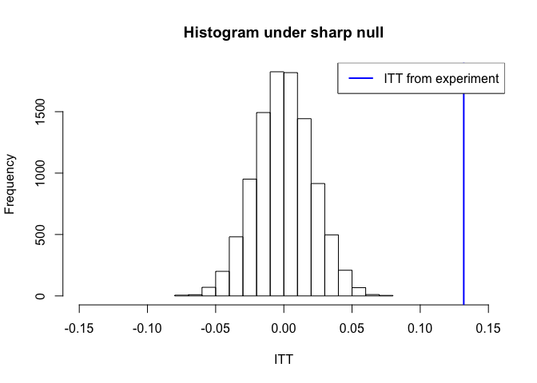

Problem Set \#4
================
Anup Jha

``` r
# load packages 
library(foreign)
library(data.table)
library(knitr)
library(sandwich)
library(lmtest)
```

    ## Loading required package: zoo

    ## 
    ## Attaching package: 'zoo'

    ## The following objects are masked from 'package:base':
    ## 
    ##     as.Date, as.Date.numeric

``` r
library(AER)
```

    ## Loading required package: car

    ## Loading required package: carData

    ## Loading required package: survival

``` r
library(stargazer)
```

    ## 
    ## Please cite as:

    ##  Hlavac, Marek (2018). stargazer: Well-Formatted Regression and Summary Statistics Tables.

    ##  R package version 5.2.2. https://CRAN.R-project.org/package=stargazer

# 1\. Potential Outcomes

Consider the following hypothetical schedule of potential outcomes.

  - Amy, Brian, and Chris are *compliers*. This means they actually get
    the treatment if they are assigned to the treatment group. Their
    potential outcomes in the untreated state of the world are 11, 10,
    and 11 respectively.

  - David, Erin, and Felipe are never-takers. (I.e. they do not get the
    treatment even if they are assigned to the treatment group.) Their
    potential outcomes in the untreated state of the world is 3, 2, and
    4 respectively.

<!-- end list -->

1.  Make up a set of potential outcomes in the treated state of the
    world (i.e. \(Y_{i}(1)\) for each of the individuals listed above)
    that would make both the ATE and the CACE positive.  
    **Ans: To make the ATE positive we can make the **\(Y_{i}(1)\) **for
    each of the subject more than their ** \(Y_{i}(0)\) **this will also
    make the CACE positive as we have positive ATE for the compliers too
    **

<!-- end list -->

``` r
d <- data.table(id = c('Amy','Brian','Chris','David','Erin','Felipe'),
                y0 = c(11,10,11,3,2,4),
                y1 = c(13,12,13,5,4,6),
                status =c('compliers','compliers','compliers','noncompliers','noncompliers','noncompliers'))
knitr::kable(d)
```

| id     | y0 | y1 | status       |
| :----- | -: | -: | :----------- |
| Amy    | 11 | 13 | compliers    |
| Brian  | 10 | 12 | compliers    |
| Chris  | 11 | 13 | compliers    |
| David  |  3 |  5 | noncompliers |
| Erin   |  2 |  4 | noncompliers |
| Felipe |  4 |  6 | noncompliers |

``` r
ATE <- d[,mean(y1-y0)]
paste('ATE = ',ATE)
```

    ## [1] "ATE =  2"

``` r
CACE <- d[status=='compliers',mean(y1-y0)]
paste('CACE = ',CACE)
```

    ## [1] "CACE =  2"

2.  Make up a set of potential outcomes in the treated state of the
    world that would make the ATE positive but the CACE *negative*.  
    **Ans: To make the ATE positive but the CACE negative we can make
    the **\(Y_{i}(1)\)**for the compliers less than their **\(Y_{i}(0)\)
    **while making **\(Y_{i}(1)\) **greater than
    their**\(Y_{i}(0)\)**for the never takers**

<!-- end list -->

``` r
d <- data.table(id = c('Amy','Brian','Chris','David','Erin','Felipe'),
                y0 = c(11,10,11,3,2,4),
                y1 = c(10,9,10,5,4,6),
                status =c('compliers','compliers','compliers','noncompliers','noncompliers','noncompliers'))
knitr::kable(d)
```

| id     | y0 | y1 | status       |
| :----- | -: | -: | :----------- |
| Amy    | 11 | 10 | compliers    |
| Brian  | 10 |  9 | compliers    |
| Chris  | 11 | 10 | compliers    |
| David  |  3 |  5 | noncompliers |
| Erin   |  2 |  4 | noncompliers |
| Felipe |  4 |  6 | noncompliers |

``` r
ATE <- d[,mean(y1-y0)]
paste('ATE = ',ATE)
```

    ## [1] "ATE =  0.5"

``` r
CACE <- d[status=='compliers',mean(y1-y0)]
paste('CACE = ',CACE)
```

    ## [1] "CACE =  -1"

3.  Suppose that you are conducting a trial for a new feature to be
    released in a product. From a limited point of view, if you are the
    person who wrote the *creative* content that is in the new feature,
    do you care more about the CACE or the ATE?  
    **Ans: If I am the creative content writer then I would be
    interested in CACE as I would be interested to know what is the true
    effect of the creative content on subjects who actually were
    treated. Or in other words what is the causal effect of the creative
    content when its delivered as treatment which will be the testament
    for the creative content’s efficacy.**

4.  Suppose that you are conducting a trial for a new feature to be
    released in the same product. From a limited point of view, compared
    to when you wrote the creative, if you are the product manager, do
    you care relatively **more** about the CACE or the ATE than
    before?  
    **Ans: If I am the product manager then I would be more interested
    in ATE as I would be interested in knowing the treatment effect of
    the new feature on average in general overall on the audience rather
    than just on the compliers. I would be interested to know what will
    be the overall effect on audience when the product is rolled out.
    More than ATE I would be looking at ITT. **

# 2\. Noncompliance in Recycling Experiment

Suppose that you want to conduct a study of recycling behavior. A number
of undergraduate students are hired to walk door to door and provide
information about the benefits of recycling to people in the treatment
group. 1,500 households are assigned to the treatment group. The
undergrads tell you that they successfully managed to contact 700
households. The control group had 3,000 households (not contacted by any
undergraduate students). The subsequent recycling rates (i.e. the
outcome variable) are computed and you find that 500 households in the
treatment group recycled. In the control group, 600 households recycled.

1.  What is the ITT?  
    **Ans: ITT is defined as the intent to treat effect. It is the mean
    of the difference between the outcomes of the treatment and control
    groups disregarding the fact if the treatment was actually delivered
    to treatment group. In other words ITT is the ATE calculation
    diregarding the non compliance. **

<!-- end list -->

``` r
 treatment_group_outcome <- 500/1500 
 control_group_outcome <- 600/3000
 ITT <- treatment_group_outcome - control_group_outcome 
 paste('ITT is =',ITT)
```

    ## [1] "ITT is = 0.133333333333333"

**ITT is 0.1333333 which is 13.33% **  
2\. What is the CACE? **Ans: CACE is defined as the treatment effects
among the compliers. Which means comparing the potential outcome of the
compliers in the treatment group with compliers in the control group.
Without placebo design the compliers in the control group is just
estimated from the control group. The formula for for calculating the
CACE in one sided non-compliance is CACE = ITT/ITTd where ITTd is the
proportion of compliers in the treatment group and ITT is the intent to
treat effect which is the mean of the difference of potential outcome of
treatment and control group disregarding the non-compliance issue **

``` r
 treatment_group_outcome <- 500/1500 
 control_group_outcome <- 600/3000
 ITT <- treatment_group_outcome - control_group_outcome 
 ITTd <- 700/1500
 CACE <- ITT/ITTd
 paste(' CACE is =',CACE)
```

    ## [1] " CACE is = 0.285714285714286"

**CACE is 0.2857143 which 28.57% **

3.  There appear to be some inconsistencies regarding how the
    undergraduates actually carried out the instructions they were
    given. One of the students, Mike, tells you that they actually lied
    about the the number of contacted treatment households. The true
    number was 500. Another student, Andy, tells you that the true
    number was actually 600.

<!-- end list -->

1.  What is the CACE if Mike is correct?  
    **Ans: Mike tells that actual number of treated household were 500
    instead of 700 which will decrease the ITTd and hence increase the
    CACE as CACE = ITT/ITTd**

<!-- end list -->

``` r
treatment_group_outcome <- 500/1500 
control_group_outcome <- 600/3000
ITT <- treatment_group_outcome - control_group_outcome 
ITTd <- 500/1500
CACE <- ITT/ITTd
paste('CACE if Mike is correct  =',CACE)
```

    ## [1] "CACE if Mike is correct  = 0.4"

2.  What is the CACE if Andy is correct?  
    **Ans: Andy tells that actual number of treated household were 600
    instead of 700 which will decrease the ITTd and hence increase the
    CACE as CACE = ITT/ITTd but this CACE would be less than Mike’s as
    Mike’s ITTd is less than Andy’s ITTd**

<!-- end list -->

``` r
treatment_group_outcome <- 500/1500 
control_group_outcome <- 600/3000
ITT <- treatment_group_outcome - control_group_outcome 
ITTd <- 600/1500
CACE <- ITT/ITTd
paste('CACE if Andy is correct  =',CACE)
```

    ## [1] "CACE if Andy is correct  = 0.333333333333333"

4.  Suppose that Mike is correct.

<!-- end list -->

1.  What was the impact of the undergraduates’s false reporting on our
    estimates of the treatment’s effectiveness?  
    **Ans: If Mike was correct then that would mean that proportion of
    subjects who got treated would be lesser and so the CACE would be
    higher as CACE = ITT/ITTd. **

<!-- end list -->

``` r
treatment_group_outcome <- 500/1500 
control_group_outcome <- 600/3000
ITT <- treatment_group_outcome - control_group_outcome 
ITTd <- 700/1500
ITTd_Mike <- 500/1500 
CACE <- ITT/ITTd
CACE_Mike <- ITT/ITTd_Mike 
paste('Difference in CACE if Mike is correct=',CACE_Mike - CACE)
```

    ## [1] "Difference in CACE if Mike is correct= 0.114285714285714"

2.  Does your answer change depending on whether you choose to focus on
    the ITT or the CACE? **Ans:If we focus on ITT then there is no
    change to ITT if Mike is correct or wrong as ITT doesn’t depend on
    the ratio of number of compliers to total number of subjects in
    treatment group. CACE changes if the ratio of number of compliers to
    total number of subjects in treatment group changes**

# 3\. Fun with the placebo

The table below summarizes the data from a political science experiment
on voting behavior. Subjects were randomized into three groups: a
baseline control group (not contacted by canvassers), a treatment group
(canvassers attempted to deliver an encouragement to vote), and a
placebo group (canvassers attempted to deliver a message unrelated to
voting or politics).

| Assignment | Treated? |    N | Turnout |
| :--------- | :------- | ---: | ------: |
| Baseline   | No       | 2463 |  0.3008 |
| Treatment  | Yes      |  512 |  0.3890 |
| Treatment  | No       | 1898 |  0.3160 |
| Placebo    | Yes      |  476 |  0.3002 |
| Placebo    | No       | 2108 |  0.3145 |

1.  Construct a data set that would reproduce the table.  
    **Ans: To construct the dataset representing the aggregate as above
    we would need to create rows for each assignment status respecting
    the number of rows and proportion of the turnout. We would create a
    new variable voted which will be 0 or 1 if the subject didn’t vote
    or voted respectively **

<!-- end list -->

``` r
df <- data.frame(matrix(ncol = 3, nrow = 0))
x <- c("Assignment", "Treated","Voted")
colnames(df) <- x
for (i in 1:nrow(d)){
  assignment_list <- rep(d[i,'Assignment'],d[i,'N'])
  treated_list <- rep(ifelse(d[i,'Treated?']=='No',0,1),d[i,'N'])
  voted_vector <- sample(x=c(rep(1,round(d[i,'N']*d[i,'Turnout'])),
                           rep(0, d[i,'N']-round(d[i,'N']*d[i,'Turnout'])))
                        )
  df_temp <- data.frame(unlist(assignment_list),unlist(treated_list),voted_vector)
  colnames(df_temp) <- x
  df <- rbind(df,df_temp)
}

dataset_turnout <- data.table(df)
#check the summary matches with original summary or not
dataset_turnout[,.(mean(Voted),.N),by=.(Assignment,Treated)]
```

    ##    Assignment Treated        V1    N
    ## 1:   Baseline       0 0.3008526 2463
    ## 2:  Treatment       1 0.3886719  512
    ## 3:  Treatment       0 0.3161222 1898
    ## 4:    Placebo       1 0.3004202  476
    ## 5:    Placebo       0 0.3145161 2108

2.  Estimate the proportion of compliers by using the data on the
    treatment
group.

<!-- end list -->

``` r
(Complier_ratio_treatment_grp <- dataset_turnout[Assignment=='Treatment' & Treated ==1,.N] / dataset_turnout[Assignment=='Treatment',.N])
```

    ## [1] 0.2124481

**Ans: The proportion of compliers in the treatment group is 0.2124481
**

3.  Estimate the proportion of compliers by using the data on the
    placebo
group.

<!-- end list -->

``` r
(Complier_ratio_placebo_grp <- dataset_turnout[Assignment=='Placebo' & Treated ==1,.N] / dataset_turnout[Assignment=='Placebo',.N])
```

    ## [1] 0.1842105

**Ans: The proportion of compliers in the Placebo group is 0.1842105 **

4.  Are the proportions in parts (1) and (2) statistically significantly
    different from each other? Provide *a test* and an description about
    why you chose that particular test, and why you chose that
    particular set of data.  
    **Ans: The proportions in (1) and (2) are different. To test if they
    are statistically different or not we can do chi
    square(**\(\chi^2\)**) test of independence. Chi-Squared test tests
    if the categorical variables are independent of each other. We want
    to test if the treated proportions is independent of group
    (treatment or placebo) . So we take a contingency frquency table of
    the dataset which lists the frequency of treatment (yes or no )
    tabulated for Treatment and Placebo group and then run the
    chisq.test on this contigency table **

<!-- end list -->

``` r
(test_table <- table(dataset_turnout$Assignment,
                    dataset_turnout$Treated)[2:3,1:2])
```

    ##            
    ##                0    1
    ##   Treatment 1898  512
    ##   Placebo   2108  476

``` r
chisq.test(test_table)
```

    ## 
    ##  Pearson's Chi-squared test with Yates' continuity correction
    ## 
    ## data:  test_table
    ## X-squared = 6.0887, df = 1, p-value = 0.0136

**We see that the p-value is 0.0136 which means that we can reject the
null hypothesis of treatment proportion being independent of the group.
So the complier proportions are statistically different between
treatment and placebo group**  
e. What critical assumption does this comparison of the two groups’
compliance rates test?  
**Ans: This comaprison tests the assumption that proportions of
compliers is same in the treatment and placebo group given the
randomization is followed to place some one in treatment or placebo
group. From the above test we can conclude that in this particular
experiment it doesn’t seem to obey theis assumption as the chi-square
test rejects the null hypothesis of independence. **

6.  Estimate the CACE of receiving the placebo. Is the estimate
    consistent with the assumption that the placebo has no effect on
    turnout?  
    **Ans:To estimate the CACE of receiving the placebo we will use 2SLS
    on the data set including the baseline and placebo group. We will
    then check if coefficient of treated variable is statistically
    significant or not.
**

<!-- end list -->

``` r
lm_model <- dataset_turnout[Assignment!='Treatment',ivreg(Voted~Treated,~Assignment)]
coeftest(lm_model,vcovHC(lm_model))
```

    ## 
    ## t test of coefficients:
    ## 
    ##             Estimate Std. Error t value Pr(>|t|)    
    ## (Intercept) 0.300853   0.009245 32.5423   <2e-16 ***
    ## Treated     0.060077   0.070551  0.8515   0.3945    
    ## ---
    ## Signif. codes:  0 '***' 0.001 '**' 0.01 '*' 0.05 '.' 0.1 ' ' 1

``` r
stargazer(lm_model,se=list(sqrt(diag(vcovHC(lm_model)))),type='text',header=F)
```

    ## 
    ## ===============================================
    ##                         Dependent variable:    
    ##                     ---------------------------
    ##                                Voted           
    ## -----------------------------------------------
    ## Treated                        0.060           
    ##                               (0.071)          
    ##                                                
    ## Constant                     0.301***          
    ##                               (0.009)          
    ##                                                
    ## -----------------------------------------------
    ## Observations                   5,047           
    ## R2                            -0.002           
    ## Adjusted R2                   -0.002           
    ## Residual Std. Error      0.462 (df = 5045)     
    ## ===============================================
    ## Note:               *p<0.1; **p<0.05; ***p<0.01

**We see from the 2SLS that the CACE of the reciving placebo is .060077
with Std Error of 0.070551 and p value of 0.3945 which means that it is
not statistically significant and hence the assumption that placebo has
no affect on turnout cannot be rejected. **

7.  Estimate the CACE by first estimating the ITT and then dividing by
    \(ITT_{D}\).

<!-- end list -->

``` r
ITT <- dataset_turnout[Assignment=='Treatment',mean(Voted)]-dataset_turnout[Assignment=='Baseline',mean(Voted)]
ITTd <- dataset_turnout[Assignment=='Treatment' & Treated == 1,.N]/dataset_turnout[Assignment=='Treatment',.N]

(CACE_using_ITT <- ITT/ITTd)
```

    ## [1] 0.1444242

**Ans: We see that CACE using the complier proportion from Treatment
group and comparing treatment potential outcome to baseline potential
outcome is 0.1444242 **  
h. Estimate the CACE by comparing the turnout rates among the compliers
in both the treatment and placebo groups. Interpret the
results.

``` r
(CACE_using_placebo <- dataset_turnout[Assignment=='Treatment' & Treated == 1,mean(Voted)] - dataset_turnout[Assignment=='Placebo' & Treated == 1,mean(Voted)])
```

    ## [1] 0.08825171

**Ans: We see that the CACE by using the palcebo design is different
from baseline design using ITT/ITTd this might be because the
proportions of the compliers is different in treatment and placebo group
as we saw earlier.**  
i. In class we discussed that the rate of compliance determines whether
one or another design is more efficient. (You can review the paper
[here](https://github.com/UCB-MIDS/experiments-causality/blob/master/readings/GerberGreenKaplanKern.2010.pdf)).
Given the compliance rate in this study, which design *should* provide a
more efficient estimate of the treatment effect?  
**Ans: Given the fact that the compliance rate is less than 0.5 the
placebo design would provide more efficient estimate of the treatment
effect**

10. Does it?  
    **Ans: To answer this let us do a 2SLS estimation of treatment
    effect to get CACE and Std Error and then another linear regression
    model only considering the treated rows for placebo and treatment
    group and check the Std error for the coefficient of the group .
**

<!-- end list -->

``` r
lm_model2 <- dataset_turnout[Assignment!='Placebo',ivreg(Voted~Treated,~Assignment)]
(lm_model2.coeftest <- coeftest(lm_model2,vcovHC(lm_model2)))
```

    ## 
    ## t test of coefficients:
    ## 
    ##             Estimate Std. Error t value Pr(>|t|)    
    ## (Intercept) 0.300853   0.009245  32.542  < 2e-16 ***
    ## Treated     0.144424   0.062712   2.303  0.02132 *  
    ## ---
    ## Signif. codes:  0 '***' 0.001 '**' 0.01 '*' 0.05 '.' 0.1 ' ' 1

``` r
lm_model3 <- dataset_turnout[Treated==1,lm(Voted~Assignment)]
(lm_model3.coeftest <- coeftest(lm_model3,vcovHC(lm_model3)))
```

    ## 
    ## t test of coefficients:
    ## 
    ##                    Estimate Std. Error t value  Pr(>|t|)    
    ## (Intercept)        0.388672   0.021585 18.0070 < 2.2e-16 ***
    ## AssignmentPlacebo -0.088252   0.030154 -2.9267  0.003505 ** 
    ## ---
    ## Signif. codes:  0 '***' 0.001 '**' 0.01 '*' 0.05 '.' 0.1 ' ' 1

**Ans: We do see that the Std Error of the placebo design estimate is
lesser than that of considering the estimate using ITT/ITT\_d and hence
it is more efficient. We see that the std error when using ITT/ITTd is
0.0627121 while the std error when using placebo design is 0.0301543.
The placebo design has half the std error. As we saw in previous
question that the proprtion of compliers and never takers are
statistically different among placebo and treatment group the CACE
calculated through ITT/ITTd and comparing placebo to treated gives
different treatment effect estimate**

# 4\. Turnout in Dorms

Guan and Green report the results of a canvassing experiment conduced in
Beijing on the eve of a local election. Students on the campus of Peking
University were randomly assigned to treatment or control groups.
Canvassers attempted to contact students in their dorm rooms and
encourage them to vote. No contact with the control group was attempted.
Of the 2,688 students assigned to the treatment group, 2,380 were
contacted. A total of 2,152 students in the treatment group voted; of
the 1,334 students assigned to the control group, 892 voted. One aspect
of this experiment threatens to violate the exclusion restriction. At
every dorm room they visited, even those where no one answered,
canvassers left a leaflet encouraging students to vote.

``` r
d <- fread('./data/Guan_Green_CPS_2006.csv')
d
```

    ##       turnout treated   dormid treatment_group
    ##    1:       0       0  1010101               0
    ##    2:       0       0  1010101               0
    ##    3:       0       0  1010101               0
    ##    4:       0       0  1010102               0
    ##    5:       0       0  1010102               0
    ##   ---                                         
    ## 4020:       1       1 24033067               1
    ## 4021:       1       1 24033068               1
    ## 4022:       1       1 24033068               1
    ## 4023:       1       1 24033068               1
    ## 4024:       1       1 24033068               1

Here’s what is in that data:

  - `turnout` did the person turn out to vote?
  - `treated` did someone at the dorm open the door?
  - `dormid` a unique ID for the door of the dorm
  - `treatment_group` whether the dorm door was assigned to be treated
    or not

<!-- end list -->

1.  Using the data set from the book’s website, estimate the ITT. First,
    estimate the ITT using the difference in two-group means. Then,
    estimate the ITT using a linear regression on the appropriate subset
    of data. *Heads up: There are two NAs in the data frame. Just
    na.omit to remove these
rows.*

<!-- end list -->

``` r
(ITT_using_group_mean <- d[treatment_group==1,mean(turnout,na.rm = T)] - d[treatment_group==0,mean(turnout,na.rm = T)])
```

    ## [1] 0.1319296

``` r
lm_model4 <- d[,lm(turnout~treatment_group,na.action=na.omit)]
coeftest(lm_model4,vcovCL(lm_model4,cluster=d[,dormid]))
```

    ## 
    ## t test of coefficients:
    ## 
    ##                 Estimate Std. Error t value  Pr(>|t|)    
    ## (Intercept)     0.668666   0.020241 33.0349 < 2.2e-16 ***
    ## treatment_group 0.131930   0.023271  5.6692 1.536e-08 ***
    ## ---
    ## Signif. codes:  0 '***' 0.001 '**' 0.01 '*' 0.05 '.' 0.1 ' ' 1

``` r
stargazer(lm_model4,se=list(sqrt(diag(vcovCL(lm_model4,cluster=d[,dormid])))),type='text',header=F)
```

    ## 
    ## ===============================================
    ##                         Dependent variable:    
    ##                     ---------------------------
    ##                               turnout          
    ## -----------------------------------------------
    ## treatment_group              0.132***          
    ##                               (0.023)          
    ##                                                
    ## Constant                     0.669***          
    ##                               (0.020)          
    ##                                                
    ## -----------------------------------------------
    ## Observations                   4,022           
    ## R2                             0.021           
    ## Adjusted R2                    0.021           
    ## Residual Std. Error      0.425 (df = 4020)     
    ## F Statistic          86.082*** (df = 1; 4020)  
    ## ===============================================
    ## Note:               *p<0.1; **p<0.05; ***p<0.01

**ITT using group means is 0.1319296 and ITT using linear regression is
0.1319296 **

2.  Use randomization inference to test the sharp null hypothesis that
    the ITT is zero for all observations, taking into account the fact
    that random assignment was clustered by dorm room. Interpret your
    results – in particular, are you surprised at your result when you
    compare it to the p-value in part (1)? (This is a 2 point question,
    because there’s quite a bit of work here.)

<!-- end list -->

``` r
#get the unique clusters i.e. dormids
unique_dormids <- d[,unique(dormid)]
randomize_clustered <- function(){
                                  treat_dormids <- sample(x = unique_dormids, 
                                                         size = length(unique_dormids)/2, 
                                                         replace = FALSE) 
                                  return(as.numeric(d$dormid %in% treat_dormids))
                                  }
#function for estimated ITT
est_ate <- function(outcome, treat) { 
  mean(outcome[treat==1],na.rm = T) - mean(outcome[treat==0],na.rm = T)
}
(ITT <- est_ate(d$turnout,d$treatment_group))
```

    ## [1] 0.1319296

``` r
distribution_under_sharp_null <- replicate(10000, est_ate(d$turnout, randomize_clustered()))

hist(distribution_under_sharp_null,
     main='Histogram under sharp null',
     xlab= 'ITT',
     xlim=c(-.15,.15))
abline(v=ITT, lwd = 2, col = "blue")
legend("topright", legend = "ITT from experiment", 
       lwd = 2, lty = 1, col = "blue")
```

<!-- -->

``` r
#calculate P vaue 
(p_val <- mean(distribution_under_sharp_null>ATE))
```

    ## [1] 0

**Ans: We see that we can reject the sharp null hypothesis of no
treatment effect using randomization inference. We see for the ITT:
0.1319296 we get pval as: 0 . This confirms that we get the same results
from linear regression model and randomization ineference. The
randomization inference is underlying model free. **

3.  Assume that the leaflet had no effect on turnout. Estimate the CACE.
    Do this in two ways:

<!-- end list -->

1.  First, estimate the CACE using
means.

<!-- end list -->

``` r
(ITT_using_mean <- d[treatment_group==1,mean(turnout,na.rm=T)] - d[treatment_group==0,mean(turnout,na.rm=T)])
```

    ## [1] 0.1319296

``` r
(ITTd <- d[treatment_group==1 & treated==1 & !is.na(turnout),.N]/d[treatment_group==1 & !is.na(turnout),.N])
```

    ## [1] 0.8857887

``` r
(CACE <- ITT_using_mean / ITTd)
```

    ## [1] 0.1489402

2.  Second, use some form of linear model to estimate this as well. If
    you use a 2SLS, then report the standard errors and draw inference
    about whether contact had any causal effect among compliers.

<!-- end list -->

``` r
lm_model5 <- d[,ivreg(turnout~treated,~treatment_group)]
coeftest(lm_model5,vcovCL(lm_model5,cluster=d[,dormid]))
```

    ## 
    ## t test of coefficients:
    ## 
    ##             Estimate Std. Error t value  Pr(>|t|)    
    ## (Intercept) 0.668666   0.020239 33.0390 < 2.2e-16 ***
    ## treated     0.148940   0.026308  5.6614 1.607e-08 ***
    ## ---
    ## Signif. codes:  0 '***' 0.001 '**' 0.01 '*' 0.05 '.' 0.1 ' ' 1

``` r
stargazer(lm_model5,se=list(sqrt(diag(vcovCL(lm_model5,cluster=d[,dormid])))),type='text',header=F)
```

    ## 
    ## ===============================================
    ##                         Dependent variable:    
    ##                     ---------------------------
    ##                               turnout          
    ## -----------------------------------------------
    ## treated                      0.149***          
    ##                               (0.026)          
    ##                                                
    ## Constant                     0.669***          
    ##                               (0.020)          
    ##                                                
    ## -----------------------------------------------
    ## Observations                   4,022           
    ## R2                             0.016           
    ## Adjusted R2                    0.016           
    ## Residual Std. Error      0.426 (df = 4020)     
    ## ===============================================
    ## Note:               *p<0.1; **p<0.05; ***p<0.01

**Ans: We see from the coeftest that Estimate of CACE is .148940 with
std Error as 0.026308 with p value as 1.607e-08 . The standard errors
are calculated using clustered std error on dormid using vcovCL
function. 2SLS (using ivreg) is used for estimating the CACE. The pvalue
is less than 0.05 which means there is evidence of causal effect of
contact on voter turnout**

# 5\. Another Turnout Question

We’re sorry; it is just that the outcome and treatment spaces are so
clear\!

Hill and Kousser (2015) report that it is possible to increase the
probability that someone votes in the California *Primary Election*
simply by sending them a letter in the mail. This is kind of surprising,
because who even reads the mail anymore anyways? (Actually, if you talk
with folks who work in the space, they’ll say, “We know that everybody
throws our mail away; we just hope they see it on the way to the
garbage.”)

Can you replicate their findings? Let’s walk through
them.

``` r
 #d <- fread('http://ischool.berkeley.edu/~d.alex.hughes/data/hill_kousser_analysisFile.csv')
 #head(d)
```

You’ll note that this takes some time to download. Probably best to save
a copy locally, and keep from reading this off the internet. In your
project structure, create a folder called `./data/raw/` and write this
file to the folder. Data that is in this raw folder *never* gets
modified; instead, any changes that you make should be reflected into
either an `./data/interim/` or `./data/analysis/` folder. You might
consider using the function `fwrite` from data.table.

``` r
#fwrite(d,"./data/raw/hill_kousser_analysisFile.csv")
d <- fread('./data/raw/hill_kousser_analysisFile.csv')
#head(d)
```

Here’s what is in that data.

  - `age.bin` a bucketed version of the `age.in.14` variable
  - `party.bin` a bucketed version of the `Party` variable
  - `in.toss.up.dist` whether the voter lives in a close race
  - `minority.dist` whether the voter lives in a majority minority
    district
  - `Gender` voter file reported gender
  - `Dist1-8` congressional and data districts
  - `reg.date.pre.08` whether the voter has been registered since before
    2008
  - `vote.xx.gen` whether the voter voted in the `xx` general election
  - `vote.xx.gen.pri` whether the voter voted in the `xx` general
    primary election
  - `vote.xx.pre.pri` whether the voter voted in the `xx` presidential
    primary election
  - `block.num` a block indicator for blocked random assignment.
  - `treatment.assign` either “Control”, “Election Info”, “Partisan
    Cue”, or “Top-Two Info”
  - `yvar` the outcome variable: did the voter vote in the 2014 primary
    election

These variable names are horrible. Do two things:

  - Rename the smallest set of variables that you think you might use to
    something more useful
  - For the variables that you think you might use; check that the data
    makes sense;

<!-- end list -->

``` r
d[,AnyLetter:= ifelse(treatment.assign == 'Control',0,1)]
d[,treatment_type:= as.factor(treatment.assign)]
d[,Control:= ifelse(treatment.assign == 'Control',1,0)]
d[,Top.two.info:= ifelse(treatment.assign == 'Top-two info',1,0)]
d[,Partisan:= ifelse(treatment.assign == 'Partisan',1,0)]
d[,Election.info:= ifelse(treatment.assign == 'Election info',1,0)]
fwrite(d,"./data/analysis/modified_hill_kousser_analysisFile.csv")
```

Then, save this data to `./data/analysis/`.

Well, while you’re at it, you might as well also modify your
`.gitignore` to ignore the data folder. Because you’re definitely going
to have the data rejected when you try to push it to github.

1.  **A Simple Treatment Effect**: Load the data from `./data/analysis/`
    and estimate a model that compares the rates of turnout in the
    control group to the rate of turnout among *anybody* who received a
    letter. Report robust standard errors.

<!-- end list -->

``` r
d <- fread('./data/analysis/modified_hill_kousser_analysisFile.csv')
head(d)
```

    ##    LocalityCode age.bin party.bin in.toss.up.dist minority.dist
    ## 1:            1       2         1               0             0
    ## 2:            1       5         3               0             0
    ## 3:            1       6         2               0             0
    ## 4:            1       5         1               1             1
    ## 5:            1       5         2               0             0
    ## 6:            1       6         3               0             0
    ##    vote.10.gen vote.08.gen Party age.in.14 Gender Dist1 Dist2 Dist3 Dist4
    ## 1:           0           0   REP        32      F CG015 SA020 SE002 SS010
    ## 2:           0           1   NPP        61      F CG013 SA018 SE002 SS009
    ## 3:           0           1   DEM        77      M CG013 SA015 SE002 SS009
    ## 4:           0           1   REP        62      M CG017 SA025 SE002 SS010
    ## 5:           1           1   DEM        60      M CG015 SA020 SE002 SS010
    ## 6:           1           1   NPP        81        CG015 SA020 SE002 SS010
    ##    Dist5 Dist6 Dist7 Dist8 reg.date.pre.08 reg.date.pre.10 vote.12.gen
    ## 1:    NA    NA    NA    NA               1               1           1
    ## 2:    NA    NA    NA    NA               0               0           1
    ## 3:    NA    NA    NA    NA               1               1           1
    ## 4:    NA    NA    NA    NA               0               0           1
    ## 5:    NA    NA    NA    NA               1               1           1
    ## 6:    NA    NA    NA    NA               1               1           1
    ##    vote.12.pre.pri vote.10.gen.pri vote.08.pre.pri vote.08.gen.pri
    ## 1:               0               0               0               0
    ## 2:               0               0               0               0
    ## 3:               0               0               0               0
    ## 4:               0               0               0               0
    ## 5:               0               0               0               0
    ## 6:               0               0               0               0
    ##    block.num leftover.case treatment.assign yvar matched.to.post
    ## 1:        91             0          Control    0               1
    ## 2:       316             0          Control    0               1
    ## 3:       364             0          Control    1               1
    ## 4:       296             0          Control    0               1
    ## 5:       302             0          Control    0               1
    ## 6:       382             0          Control    0               1
    ##    vote.14.gen AnyLetter treatment_type Control Top.two.info Partisan
    ## 1:           0         0        Control       1            0        0
    ## 2:           0         0        Control       1            0        0
    ## 3:           1         0        Control       1            0        0
    ## 4:           0         0        Control       1            0        0
    ## 5:           1         0        Control       1            0        0
    ## 6:           0         0        Control       1            0        0
    ##    Election.info
    ## 1:             0
    ## 2:             0
    ## 3:             0
    ## 4:             0
    ## 5:             0
    ## 6:             0

``` r
lm_model6 <- d[,lm(yvar~AnyLetter)]
(coeftest.model <- coeftest(lm_model6,vcovHC(lm_model6)))
```

    ## 
    ## t test of coefficients:
    ## 
    ##               Estimate Std. Error  t value  Pr(>|t|)    
    ## (Intercept) 0.09312478 0.00015062 618.2813 < 2.2e-16 ***
    ## AnyLetter   0.00489923 0.00078340   6.2538 4.007e-10 ***
    ## ---
    ## Signif. codes:  0 '***' 0.001 '**' 0.01 '*' 0.05 '.' 0.1 ' ' 1

``` r
stargazer(lm_model6,se=list(sqrt(diag(vcovHC(lm_model6)))),type='text',header=F)
```

    ## 
    ## ===============================================
    ##                         Dependent variable:    
    ##                     ---------------------------
    ##                                yvar            
    ## -----------------------------------------------
    ## AnyLetter                    0.005***          
    ##                               (0.001)          
    ##                                                
    ## Constant                     0.093***          
    ##                              (0.0002)          
    ##                                                
    ## -----------------------------------------------
    ## Observations                 3,872,268         
    ## R2                            0.00001          
    ## Adjusted R2                   0.00001          
    ## Residual Std. Error    0.291 (df = 3872266)    
    ## F Statistic         40.801*** (df = 1; 3872266)
    ## ===============================================
    ## Note:               *p<0.1; **p<0.05; ***p<0.01

**Ans: We see that the rate of turnout difference between control and
anybody who received letter is 0.0048992 . The robust std error is
7.834035510^{-4} **

2.  **Specific Treatment Effects**: Suppose that you want to know
    whether different letters have different effects. To begin, what are
    the effects of each of the letters, as compared to control? Report
    robust standard errors on a linear model.

<!-- end list -->

``` r
lm_model7 <- d[,lm(yvar~treatment_type)]
(coeftest.model <- coeftest(lm_model7,vcovHC(lm_model7)))
```

    ## 
    ## t test of coefficients:
    ## 
    ##                               Estimate Std. Error  t value  Pr(>|t|)    
    ## (Intercept)                 0.09312478 0.00015062 618.2813 < 2.2e-16 ***
    ## treatment_typeElection info 0.00498464 0.00172734   2.8857 0.0039050 ** 
    ## treatment_typePartisan      0.00525971 0.00122666   4.2878 1.804e-05 ***
    ## treatment_typeTop-two info  0.00449610 0.00122250   3.6778 0.0002353 ***
    ## ---
    ## Signif. codes:  0 '***' 0.001 '**' 0.01 '*' 0.05 '.' 0.1 ' ' 1

``` r
stargazer(lm_model7,se=list(sqrt(diag(vcovHC(lm_model7)))),type='text',header=F)
```

    ## 
    ## =======================================================
    ##                                 Dependent variable:    
    ##                             ---------------------------
    ##                                        yvar            
    ## -------------------------------------------------------
    ## treatment_typeElection info          0.005***          
    ##                                       (0.002)          
    ##                                                        
    ## treatment_typePartisan               0.005***          
    ##                                       (0.001)          
    ##                                                        
    ## treatment_typeTop-two info           0.004***          
    ##                                       (0.001)          
    ##                                                        
    ## Constant                             0.093***          
    ##                                      (0.0002)          
    ##                                                        
    ## -------------------------------------------------------
    ## Observations                         3,872,268         
    ## R2                                    0.00001          
    ## Adjusted R2                           0.00001          
    ## Residual Std. Error            0.291 (df = 3872264)    
    ## F Statistic                 13.670*** (df = 3; 3872264)
    ## =======================================================
    ## Note:                       *p<0.1; **p<0.05; ***p<0.01

**Ans: We see the different letters do have different treatment effects
as they have different coefficients and each of the coeffcient are
statistically significant with robust std errors being used to report
the p value **

3.  Then, test, using an F-test, whether the increased flexibility of
    the model estimated in part (2) has improved the performance of the
    model over that estimated in part (1). What does the evidence
    suggest?

<!-- end list -->

``` r
( anova_test_report <- anova(lm_model6,lm_model7,test='F') )
```

    ## Analysis of Variance Table
    ## 
    ## Model 1: yvar ~ AnyLetter
    ## Model 2: yvar ~ treatment_type
    ##    Res.Df    RSS Df Sum of Sq      F Pr(>F)
    ## 1 3872266 327616                           
    ## 2 3872264 327616  2  0.017723 0.1047 0.9006

**Ans: We see from the anova test when comparing the more flexible model
which have different treatment levels with the less flexible model which
clubs all treatments into one group that the F ststistics is not
significant. We get the F stats pvalue as 0.9005593 . So this added
flexibility doesn’t increase the performance of the causal model. **  
4\. **More Specific Treatment Effects** Is one message more effective
than the others? The authors have drawn up this design as a
full-factorial design. Write a *specific* test for the difference
between the *Partisan* message and the *Election Info* message. Write a
*specific* test for the difference between *Top-Two Info* and the
*Election Info* message. Report robust standard errors on both
tests.

``` r
lm_model_partisan_election <- d[treatment.assign %in%c('Control','Partisan','Election info'),lm(yvar~AnyLetter+Partisan)]
(partisan_elec_test <- coeftest(lm_model_partisan_election,vcovHC(lm_model_partisan_election)))
```

    ## 
    ## t test of coefficients:
    ## 
    ##               Estimate Std. Error  t value  Pr(>|t|)    
    ## (Intercept) 0.09312478 0.00015062 618.2813 < 2.2e-16 ***
    ## AnyLetter   0.00498464 0.00172734   2.8857  0.003905 ** 
    ## Partisan    0.00027506 0.00210785   0.1305  0.896175    
    ## ---
    ## Signif. codes:  0 '***' 0.001 '**' 0.01 '*' 0.05 '.' 0.1 ' ' 1

``` r
lm_model_toptwo_election <- d[treatment.assign %in%c('Control','Top-two info','Election info'),lm(yvar~AnyLetter+Top.two.info)]
(top_two_elec_test <- coeftest(lm_model_toptwo_election,vcovHC(lm_model_toptwo_election)))
```

    ## 
    ## t test of coefficients:
    ## 
    ##                 Estimate  Std. Error  t value  Pr(>|t|)    
    ## (Intercept)   0.09312478  0.00015062 618.2813 < 2.2e-16 ***
    ## AnyLetter     0.00498464  0.00172734   2.8857  0.003905 ** 
    ## Top.two.info -0.00048854  0.00210543  -0.2320  0.816508    
    ## ---
    ## Signif. codes:  0 '***' 0.001 '**' 0.01 '*' 0.05 '.' 0.1 ' ' 1

``` r
stargazer(lm_model_partisan_election,lm_model_toptwo_election,se=list(sqrt(diag(vcovHC(lm_model_partisan_election))),sqrt(diag(vcovHC(lm_model_toptwo_election)))),type='text',header=F)
```

    ## 
    ## ===========================================================================
    ##                                       Dependent variable:                  
    ##                     -------------------------------------------------------
    ##                                              yvar                          
    ##                                 (1)                         (2)            
    ## ---------------------------------------------------------------------------
    ## AnyLetter                    0.005***                    0.005***          
    ##                               (0.002)                     (0.002)          
    ##                                                                            
    ## Partisan                      0.0003                                       
    ##                               (0.002)                                      
    ##                                                                            
    ## Top.two.info                                              -0.0005          
    ##                                                           (0.002)          
    ##                                                                            
    ## Constant                     0.093***                    0.093***          
    ##                              (0.0002)                    (0.0002)          
    ##                                                                            
    ## ---------------------------------------------------------------------------
    ## Observations                 3,812,414                   3,812,411         
    ## R2                            0.00001                     0.00001          
    ## Adjusted R2                   0.00001                     0.00001          
    ## Residual Std. Error    0.291 (df = 3812411)        0.291 (df = 3812408)    
    ## F Statistic         13.850*** (df = 2; 3812411) 11.276*** (df = 2; 3812408)
    ## ===========================================================================
    ## Note:                                           *p<0.1; **p<0.05; ***p<0.01

**Ans: To test the hypothesis that different treatment types have
different treatment effect we would run the linear regression model on
subset of data including the control and treatments of interest. In the
linear model we would include the AnyLetter and one of the treatment
variable. If the coefficient of the treatment variable comes out to be
non 0 and statistically significant then we can conclude that there is
different treatment affect between the treatment type of interest. For
the first one we will have model as Yvar ~ AnyLetter + Partisan for the
subset of data including control,Partisan and Election info. If the
coefficient of Partisan comes different than 0 and if its statistically
significant then we can conclude that the treatment effect is different
for Partisan and Election Info . We find that the estimate of the
difference between the treatment effect is 2.750635810^{-4} and the
robust std error for this is 0.0021078 and the p value is 0.8961747 so
we can conclude that the difference is not statistically significant.
Similarly for testing if the Election info and Top-Two info have
different treatment effects we create a model with Yvar ~ AnyLetter +
Top.two.info . We find that the difference in treatment effect is
-4.885419710^{-4} and the robust std error for this is 0.0021054 and the
p value is 0.8165075 so we can conclude that the difference is not
statistically significant.**

5.  **Blocks?** There are a *many* of blocks in this data. How many?

<!-- end list -->

``` r
(num_blocks = length(d[,unique(block.num)]))
```

    ## [1] 382

**Ans:There are 382 blocks in this data inside which random assignment
to treatments were done**

6.  Create a new indicator that is the *average turnout within a block*
    and attach this back to the data.table. Use this new indicator in a
    regression that predicts the difference between Control and Any
    Letter. Then, using an F-test, does the increased information from
    all these blocks improve the performance of the *causal* model? Use
    an F-test to check.

<!-- end list -->

``` r
d[,avg_turn_out_block:= mean(yvar),by=block.num]
lm_shorter_model <- d[,lm(yvar~AnyLetter)]
lm_longer_model <- d[,lm(yvar~AnyLetter+avg_turn_out_block)]
se_shorter_model <- sqrt(diag(vcovHC(lm_shorter_model)))
se_longer_model <- sqrt(diag(vcovHC(lm_longer_model)))

stargazer(lm_shorter_model,lm_longer_model,se=list(se_shorter_model,se_longer_model),type='text',header=F)
```

    ## 
    ## ===============================================================================
    ##                                         Dependent variable:                    
    ##                     -----------------------------------------------------------
    ##                                                yvar                            
    ##                                 (1)                           (2)              
    ## -------------------------------------------------------------------------------
    ## AnyLetter                    0.005***                      0.005***            
    ##                               (0.001)                       (0.001)            
    ##                                                                                
    ## avg_turn_out_block                                         1.000***            
    ##                                                             (0.003)            
    ##                                                                                
    ## Constant                     0.093***                       -0.0002            
    ##                              (0.0002)                      (0.0003)            
    ##                                                                                
    ## -------------------------------------------------------------------------------
    ## Observations                 3,872,268                     3,872,268           
    ## R2                            0.00001                        0.038             
    ## Adjusted R2                   0.00001                        0.038             
    ## Residual Std. Error    0.291 (df = 3872266)          0.285 (df = 3872265)      
    ## F Statistic         40.801*** (df = 1; 3872266) 76,106.350*** (df = 2; 3872265)
    ## ===============================================================================
    ## Note:                                               *p<0.1; **p<0.05; ***p<0.01

``` r
anovatest_result <- anova(lm_shorter_model,lm_longer_model,test='F')
anovatest_result
```

    ## Analysis of Variance Table
    ## 
    ## Model 1: yvar ~ AnyLetter
    ## Model 2: yvar ~ AnyLetter + avg_turn_out_block
    ##    Res.Df    RSS Df Sum of Sq      F    Pr(>F)    
    ## 1 3872266 327616                                  
    ## 2 3872265 315228  1     12388 152170 < 2.2e-16 ***
    ## ---
    ## Signif. codes:  0 '***' 0.001 '**' 0.01 '*' 0.05 '.' 0.1 ' ' 1

**Ans: We see from the stargazer and anova test that the long form of
the model which has the average turnout per block as an extra
information do fit the data better as the adjusted R2 is higher in the
long ferm and the residual std error is less. The F statistics p value
is 0 which means that longer form is statistically significant. The
stargazer report also tells that adding the extra information doesn’t
change the estimate of treatment effect of any letter and also doesn’t
impact the standard error much **

7.  **HTES?** Do you think that there are features of the data that
    might systematically predict that people will respond strongly or
    weakly to the treatment effect? List two that you think might be
    there, in the order that you would like to test them. Then, test for
    these heterogeneities. What do you learn? What is the right way to
    adjust your p-values, given that you’re testing twice?

<!-- end list -->

``` r
#test the heterogeneity for vote.14.gen 
lm_vote.14.gen.hte <- d[,lm(yvar~AnyLetter+vote.14.gen+vote.14.gen*AnyLetter)]
lm_vote.14.gen.hte.se <- sqrt(diag(vcovHC(lm_vote.14.gen.hte)))
coeftest.lm_vote.14.gen.hte <- coeftest(lm_vote.14.gen.hte,vcovHC(lm_vote.14.gen.hte))
#test the heterogeneity for gender
d[,Female := ifelse(Gender=='F',1,0)]
lm_gender.hte <- d[,lm(yvar~AnyLetter+Female+Female*AnyLetter)]
lm_gender.hte.se <- sqrt(diag(vcovHC(lm_gender.hte)))
coeftest.lm_gender.hte <- coeftest(lm_gender.hte,vcovHC(lm_gender.hte))
stargazer(lm_vote.14.gen.hte,lm_gender.hte,se=list(lm_vote.14.gen.hte.se,lm_gender.hte.se),type='text',header=F)
```

    ## 
    ## ===============================================================
    ##                                        Dependent variable:     
    ##                                    ----------------------------
    ##                                                yvar            
    ##                                          (1)            (2)    
    ## ---------------------------------------------------------------
    ## AnyLetter                              0.002***      0.006***  
    ##                                        (0.001)        (0.001)  
    ##                                                                
    ## vote.14.gen                            0.220***                
    ##                                        (0.0004)                
    ##                                                                
    ## AnyLetter:vote.14.gen                  0.010***                
    ##                                        (0.002)                 
    ##                                                                
    ## Female                                               -0.011*** 
    ##                                                      (0.0003)  
    ##                                                                
    ## AnyLetter:Female                                      -0.002   
    ##                                                       (0.002)  
    ##                                                                
    ## Constant                               0.033***      0.097***  
    ##                                        (0.0001)      (0.0002)  
    ##                                                                
    ## ---------------------------------------------------------------
    ## Observations                          3,872,268      3,872,268 
    ## R2                                      0.114         0.0003   
    ## Adjusted R2                             0.114         0.0003   
    ## Residual Std. Error (df = 3872264)      0.274          0.291   
    ## F Statistic (df = 3; 3872264)       165,794.600***  444.227*** 
    ## ===============================================================
    ## Note:                               *p<0.1; **p<0.05; ***p<0.01

**Ans: Yes there are several features of the data such as vote.xx
features and gender which might predict treatment effect strongly or
weakly. I would like to test the features vote.14.gen and then being
Female. Since we are testing one hypothesis after the other we should
look to adjust the rejection p-value according to some family wise error
rate (FWER) such as Bonferroni in which since we are testing twice we
should reject if the p-value \< .05/2 which is p-value \< 0.025. We see
that there is a hetrogeneous effect of treatment on vote.14.gen while
there is no heterogenous effect of treatment on being Female**

8.  Summarize these results in a short paragraph that includes inline
    reports from your estimated models. (This can be integrated into
    your last response, if that works better for you.)

> The first test on treatment effect of AnyLetter we see that we have a
> positive treatment effect of 0.00489923 (about .5% increase in
> turnout) with robust std error of 0.00078340 and a p-value of
> 4.007e-10. This tells us that we indeed have a positive treatment
> effect on voter turnout. From the above tests for heterogeneous
> treatment effects we find that feature vote.14.gen has statistically
> significant heterogeneous treatment effect . The effect is 0.0095421
> and the robust std error is 0.002294 and the p-value associated is
> 3.188180710^{-5} which means that this statistically significant
> result event after Bonferroni correction to critical p-value as 0.025
> . For the heterogeneous treatment effect for Female we find that the
> heterogeneous treatment effect is not statistically significant. We
> find that the effect is -0.0019109 and the robust std error is
> 0.0016098 and the p-value associated is 0.2352197 which means its not
> statistically significant HTE.

9.  Cheating? Suppose that you didn’t write down your testing plan. How
    risky is the false discovery problem in this data set?  
    **Ans: There are many covariates in the dataset and if we don’t
    write the testing plan we will get heterogeneous effect or
    significant effect on some covariate just by random chance as we
    would be doing a fishing exercise. So we should make sure to use
    some family wise error rate correction such as Bonferroni **

<!--
These questions -- in the commented section -- are not mandatory 
but they are good to practice if you've got extra time. 

# Commented Question 1 

Determine the direction of bias in estimating the ATE for each of the following situations when we randomize at the individual level.  Do we over-estimate, or underestimate? Briefly but clearly explain your reasoning.

a. In the advertising example of Lewis and Reiley (2014), assume some treatment-group members are friends with control-group members.

b. Consider the police displacement example from the bulleted list in the introduction to FE 8, where we are estimating the effects of enforcement on crime.

c. Suppose employees work harder when you experimentally give them compensation that is more generous than they expected, that people feel resentful (and therefore work less hard) when they learn that their compensation is less than others, and that some treatment-group members talk to control group members.

d. When Olken (2007) randomly audits local Indonesian governments for evidence of corruption, suppose control-group governments learn that treatment-group governments are being randomly audited and assume they are likely to get audited too.

# Commented Question 2 
National surveys indicate that college roommates tend to have correlated weight. The more one roommate weights at the end of the freshman year, the more the other freshman roommate weights. On the other hand, researchers studying housing arrangements in which roommates are randomly paired together find no correlation between two roommates' weights at the end of their freshman year. *Explain how these two facts can be reconciled.*

# Commented Question 3 
A doctoral student conducted an experiment in which she randomly varied whether she ran or walked 40 minutes each morning. In the middle of the afternoon over a period of 26 days she measured the following outcome variables: (1) her weight; (2) her score in Tetris; (3) her mood on a 0-5 scale; (4) her energy; and (5) whether she got a question right on the math GRE. 


```r
d <- read.dta("./data/Hough_WorkingPaper_2010.dta")
d <- data.table(d)
d
```

```
##     day run weight tetris mood energy appetite gre
##  1:   1   1     21  11092    3      3        0   1
##  2:   2   1     21  14745    3      1        2   0
##  3:   3   0     20  11558    3      3        0   1
##  4:   4   0     21  11747    3      1        1   1
##  5:   5   0     21  14319    2      3        3   1
##  6:   6   1     19   7126    3      2        0   1
##  7:   7   0     20  16067    3      4        0   0
##  8:   8   0     20   3939    3      2        0   1
##  9:   9   1     21  28230    4      2        0   0
## 10:  10   0     21  17396    4      4        1   1
## 11:  11   1     20  36152    1      4        0   0
## 12:  12   0     20  16567    4      4        1   1
## 13:  13   0     20     NA   NA     NA       NA  NA
## 14:  14   1     18  11853    4      2        0   1
## 15:  15   1     18  20433    4      2        2   1
## 16:  16   1     18  20701    3      4        0   0
## 17:  17   0     20     NA   NA     NA       NA   1
## 18:  18   1     19  17509    3      3        1   1
## 19:  19   0     21   9779    3      3        1   0
## 20:  20   0     22  18598    3      3        1   1
## 21:  21   1     20  36665    2      3        0   1
## 22:  22   0     21   8094    4      3        1   1
## 23:  23   1     19  48769    2      5        0   0
## 24:  24   1     20  22601    4      4        1   1
## 25:  25   1     19  37950    4      4        0   1
## 26:  26   1     20  56047    4      4        0   1
##     day run weight tetris mood energy appetite gre
```

a. Suppose you were seeking to estimate the average effect of running on her Tetris score. Explain the assumptions needed to identify this causal effect based on this within-subjects design. Are these assumptions plausible in this case? What special concerns arise due to the fact that the subject was conducting the study, undergoing the treatments, and measuring her own outcomes? 

b. Estimate the effect of running today on Tetris score. What is the ATE?


c. One way to lend credibility to with-subjects results is to verify the no-anticipation assumption. Construct a regression using the variable `run` to predict the `tetris` score *on the preceding day*. Presume that the randomization is fixed. Why is this a test of the no-anticipation assumption? Does a test for no-anticipation confirm this assumption? 


d. Now let's use regression to put a standard error on our ATE estimate from part (b). Regress Tetris score on the the variable `run`, this time using the current rather than the future value of `run`.  Is the impact on Tetris score statistically significant? 

e. If Tetris responds to exercise, one might suppose that energy levels and GRE scores would as well. Are these hypotheses borne out by the data?  

f. Suppose the student decides to publish her res>ults on Tetris, since she finds those most interesting.  In the paper she writes, she chooses to be concise by ignoring the data she collected on energy levels and GRE scores, since she finds those results less interesting.  How might you criticize the student's decision?  What trap may she have fallen into?

g. After submitting her paper to a journal, the student thinks of another hypothesis.  What if running has a relatively long-lasting effect on Tetris scores?  Perhaps both today's running and yesterday's running will affect Tetris scores.  Run a regression of today's Tetris score on both today's `run` variable and yesterday's `run` variable.  How does your coefficient on running today compare with what you found in part (d)?  How do you interpret this comparison?

-->
